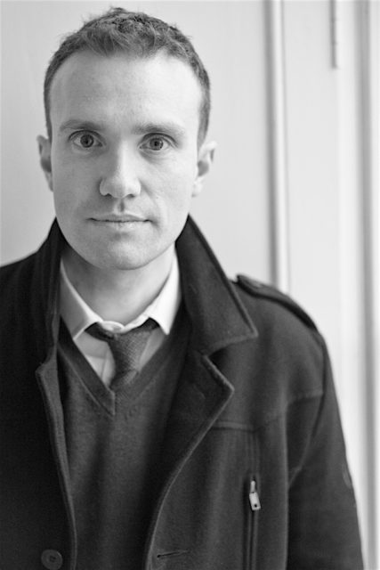

Over the last year my main project has been photographing the people involved in reconstructing the [Botanic Cottage](http://www.rbge.org.uk/the-gardens/edinburgh/the-botanic-cottage-project). This is Sutherland who is the organiser of community stuff associated with the cottage and also the catalyst for me making the photographs.

I'm getting close to finishing photographing people but still not sure how the final set of images will work out. I may even flip into colour.
