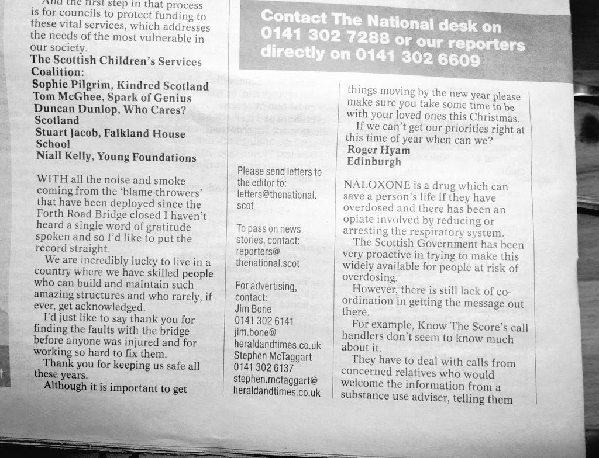

I had a letter published in [The National](http://www.thenational.scot) again today. The text I sent was:

> Sir/Madam,
> 
> With all the noise and smoke coming from the “blamethrowers" that have been deployed since the Fourth Road Bridge closed I haven’t heard a single word of gratitude spoken and so I’d like to put the record straight.
> 
> We are incredibly lucky to live in a country where we have skilled people who can build and maintain such amazing structures and who rarely, if ever, get acknowledged.
> 
> I’d just like to say thank you for finding the faults with the bridge before anyone was injured and for working so hard to fix them. Thank you for keeping us safe all these years.
> 
> Although it is important to get things moving by the New Year please make sure you take some time to be with your loved ones this Christmas. If we can’t get our priorities right at this time of year when can we?
