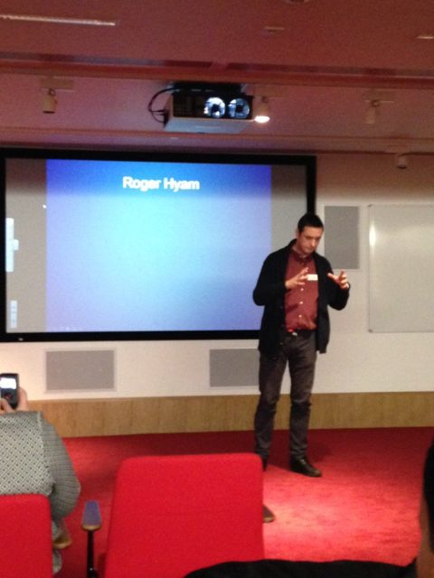

\[caption id="attachment\_3058" align="alignright" width="251"\] Throttling a cheese cake? Photo: Dawn Smith\[/caption\]

A few weeks back [Edinburgh Beltane Public Engagement Network](http://www.beltanenetwork.org) offered a free day of presentation skills training with [Mel Sherwood](http://www.grow-your-potential.com/index.php). When I say free I mean it was free to participants in [FameLab UK](http://www.cheltenhamfestivals.com/about/famelab/). Yes there was lunch and yes it was notionally a "free lunch" so I should have been a little more on my guard.

The day with Mel was really good. We did some fun acting things and I picked up useful tips and probably absorbed a load more subconsciously. The lunch was OK too.

FameLab is a competition for scientists and engineers to present ideas to a general audience in under three minutes. This should be easy and three minutes for a large jacket potato and salad seems a fair trade - but perhaps I should have cooked my own lunch that day.

I spent ages working on my talk and cutting it back and back then dutifully turned up at the University for the Edinburgh heat of the competition. The picture is me giving my talk and below is the text I tried to memorise - but wandered well off.

The sting in the tail is that the judges said we were all good and should move on to the [Scottish heat at the National Museum in January](http://www.nms.ac.uk/national-museum-of-scotland/whats-on/famelab-learn-something-amazing/) where we have to give distinctly different talks! I'm now wracking my brains to think of a new three minute pitch that will enlighten someone off the street about science. Strangely I'm starting to enjoy it.

* * *

**FameLab: Ten Breaths Project**

Let’s try an experiment. Hands up if you are breathing.

But maybe that wasn’t such an interesting question. A more interesting question is **why** you put your hands up.

There are two possible reasons:

1. You may have **thought**: I am alive I must be breathing.
2. Or you connected with the sensations of breathing and because of this **experience** you put your hand up.

These are two complementary ways of knowing:

1. Deductive reason.
2. Felt experience.

Let’s do another experiment.

Imagine the ideal **outdoor** space for relaxation. Notice both your thoughts describing what is there and **also** the feelings they evoke.

Got it?

Now - Humans are rapidly becoming an urban species. Unfortunately, when they live in built, crowded environments people get stressed and sick. We can prove this by measuring stress hormones, brain wave patterns or the correlation between visits to parks with life expectancy.

Urbanisation is also destroying the biodiversity we depend on so greening our cities should be a good thing for humans and biodiversity. **But there is a problem.** We don’t know precisely what it is that helps people relax.

I could ask you to describe the outdoor spaces you just imagined but that wouldn’t give me access to how you really felt in a real urban green space. And it is the feeling that does us good - not the thinking.

This is where my project comes in. I’m using mobile phones to log the locations of **real** connection with nature. Using this data we can discover how to get the most from the green places in our cities.

We humans are quite literally **building the future**. If we use science we can ensure we build the **utopia** we all dream of.
