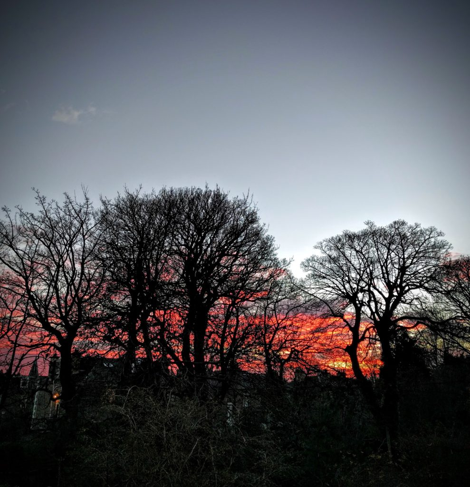

I thought it was the winter solstice this morning and my feelings were confirmed by ominous sunrise. But I was wrong. It is actually at 4:49am tomorrow morning.  It moves around between 20th and 23th apparently.
