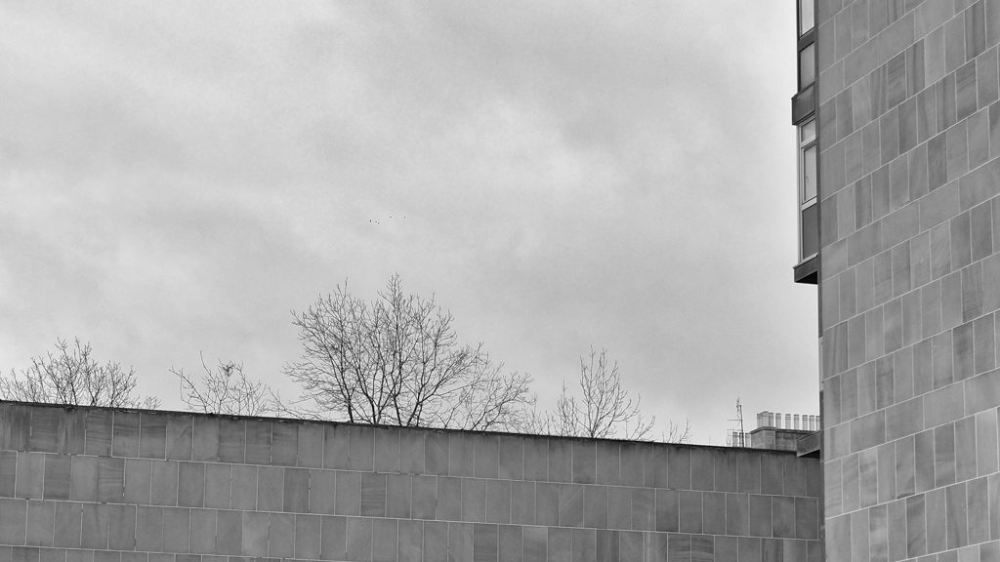
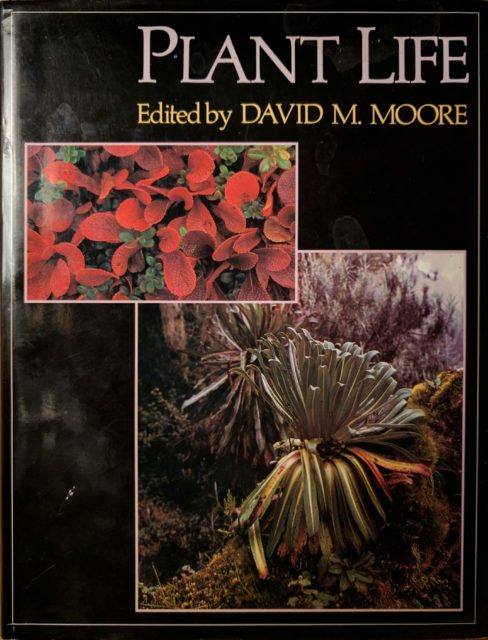
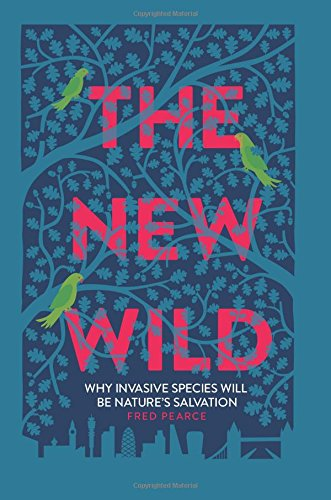

Way back in the 1980s I worked as a young researcher for [Prof David Moore](https://en.wikipedia.org/wiki/David_Moore_\(botanist_born_1933\)) at Reading University on a popular book called _Plant Life_ (OUP 1991) which I believe was also published by Equinox Books under the title _Garden Earth -_ although I struggle to find much reference to this version on the web.  Perhaps _Garden Earth_ was the working title because it is the one that sticks in my mind even though the copy on my shelf is called _Plant Life._

As my contribution was very minor I feel able to say it is a rather nice book. It is a survey of the world of plants in terms of both evolution and geography with lots of nice photographs. It very much reflects the zeitgeist of plant biodiversity studies at the time that I totally bought into. It went like this: The reader needs to be enthused about the diversity of plant life and our dependence on it principally to prevent its destruction . I saw my role as contributing in some small way to this effort. Implicit to this paradigm is the notion that we are protecting the results of someone else's action be that God or millions of years of evolution.

In the intervening twenty five years that phrase "Garden Earth" has completely changed its meaning for me.  By the mid 1990s I was living in Scotland and there is no better country to illustrate a totally modern, synthetic landscape than Scotland. The slate was pretty much wiped clean by a sheet of ice up to 12,000 years ago and [probably within a few hundred years](http://archaeologynewsnetwork.blogspot.co.uk/2015/07/human-presence-in-scotland-earlier-than.html) of the ice retreating humans had moved in along with handy recolonising species like hazel. Since then humans have been gardening the place like it was the communal drying green of an [Edinburgh tenement](https://en.wikipedia.org/wiki/Apartment#Scotland). Fashions have changed. Sheep, red grouse and deer have been _de rigueur_ in the highlands since the clearances. Sitka spruce is big but wind turbines and fish farms are also popular. The landscape is socioeconomic not natural.

But surely the **real** wild biodiversity is in the tropics? Well yes but that does mean it belongs to someone else. On the grand scale it belongs to all of us but only in the same sense that the oil in the North Sea belongs to all of humanity. The people the biodiversity belongs to are typically poorer than us and have tougher socioeconomic choices to make. Invariably, with each generation, some of that wild biodiversity goes to farmland or more grazing and we end up with nature reserves. Wilderness with a fence around it begins to resemble a garden.

Then there are global threats. They entered our guilty conscience as acid rain then ozone layer depletion and then climate change. I remember undergraduate discussion groups in the 1980s about whether it was more important to reduce carbon or sulphur dioxide emissions. For some reason it took more than a decade for me to realise what this meant. Everything, every last square metre of the planet, was managed by humans. As soon as you have global agreements on global pollutants you have effectively set up management committees for a shared garden.

This is when the word "Garden" in "Garden Earth" changed from a noun to a verb for me. The earth is no longer an Eden that we were placed in. It is now something we are making. We garden the earth just as we terraform planets in sci-fi films - only starting from the position of a working dynamical system.

Associated with my paradigm shift was a loss of meaning that lead to a brief period of middle aged [Clarksonian](https://en.wikipedia.org/wiki/Jeremy_Clarkson) cynicism  before a new motivational story kicked in. **I now see my role as helping to facilitate the dialogue on how we manage a shared garden.** It is worthy of [Pseuds Corner](https://en.wikipedia.org/wiki/List_of_regular_mini-sections_in_Private_Eye#Pseuds_Corner) and up to now anyone I mention it to just looks blank which isn't surprising.

As with all paradigm shifts it changes nothing physical only meanings. It is still important to describe and enthuse about the plant world but perhaps the emphasis shifts more to interpretation, education and even spirituality.

I was happy with my smug apparently self built world view until now. Now I have read  "_[The New Wild: Why invasive species will be nature's salvation](http://www.amazon.co.uk/dp/1848318340)_" by Fred Pearce and discovered that perhaps I didn't build it myself but have been swept along on the emerging zeitgeist. I would strongly recommend that anyone who has the faintest interest in biodiversity, ecology or conservation reads this book. Fred takes the notion of an alien species and uses it to make the case for our planet being a managed space and indeed for it having been managed for a considerable time. He shows that in order for the world to adapt to the rapid changes we are imposing on it we need to loosen up on our notions of what nature is. Fred is eloquent and the book is an enjoyable read.

In my lifetime the conversation has moved from how we conserve what we have through to choosing which bits of the pristine we can keep to discussing what we will allow to grow where. Humans always have and always will be collaborative gardeners but now instead of conversations around camp fires about grazing and burning we have the [IPCC](http://www.ipcc.ch/) . They are still effectively talking about grazing and burning but on a planetary scale.

\[Thanks to Ian Edwards for suggesting _The New Wild_ to me.\]
