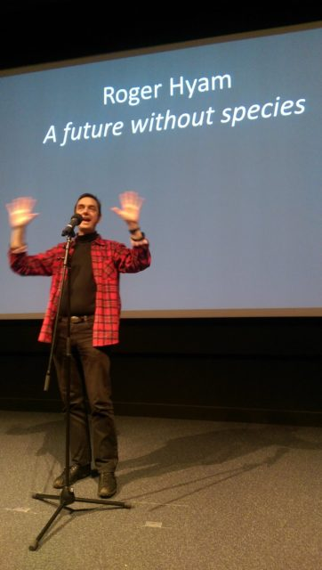

\[caption id="attachment\_3161" align="alignleft" width="362"\] Hallelujah! Photo: [@edbeltane](https://twitter.com/edbeltane)\[/caption\]

Today I gave my three minute presentation in the [FameLab](http://www.famelab.org) Scottish Final at the National Museum of Scotland in Edinburgh having got through the [Edinburgh heat](http://www.hyam.net/blog/archives/3057). Needless to say I didn't win. But reflecting on the whole experience I think it was very worthwhile.  Even after treating myself to sticky cake and a book from Blackwells to recover I can't quite bring myself to say it was 'fun'. Maybe fun like going for a run on a cold, wet, windy day is fun. Bracing. Invigorating. You know what I mean.

My plan was to use the microphone stand as an anchor. The video of my last talk showed me waddling about like a duck saying umm. Being rooted to the spot would at least prevent the waddling. Only after I finished did I find the microphone wasn't on. Apparently I was perfectly audible so it wasn't the end of the world - although it may have been the end of my hopes of winning - it did have the benefit of making the umms quieter.

My thirteen year old daughter was in the audience and she admitted that she didn't quite get what I was talking about. A better argument for not winning FameLab cannot be made.

The winner was Frank Machin ([@necrobiology](https://twitter.com/necrobiology)) and the runner up "wildcard" was Daniel Olaiya ([@DangerOlayer](https://twitter.com/DangerOlayer)) who also won the public vote. Both gave great presentations and it will be interesting to see what happens next. I liked Frank's beard reference. Daniel was talking about happiness being more that chemicals - dangerously near psychology/spirituality and [exactly where I want to head](http://www.hyam.net/blog/archives/3078). I have a theory that mainstream scientists simply don't want to look at the mind but that is the subject for a whole other blog post.

Thanks to Sarah and Liz from the [Beltane Public Engagement Network](http://www.beltanenetwork.org/) for making it all possible and the [National Museum of Scotland](http://www.nms.ac.uk/national-museum-of-scotland/) for hosting.

Here is the text of the talk I meant to give - it is about the bounding graph problem:

> Imagine a net stretched vertically between us from below the floor to high in the sky.
> 
> At each knot in the net there is a diamond like jewel.
> 
> Now imagine it stretches in 3D: to and from us filling all of space.
> 
> This net is the digital space we are modelling the real world in.
> 
> You probably think I’m talking about the internet and in a way I am.
> 
> The World Wide Web is way up there in the stratosphere.
> 
> Up there each jewel represents a web page and we surf between them.
> 
> Down here the jewels represent individual facts stored in databases around the world.
> 
> Stuff is happening down here that is changing how we think about and do science.
> 
> Traditional science is like storytelling and all stories need characters.
> 
> Of course we don’t call them stories and characters. We call them hypotheses and, in my area of science, the characters are called species.
> 
> The problem is there are no characters / no species in the information space.
> 
> Let me show you what I mean.
> 
> Take this jewel here. It is just the scientific name for common daisy - _Bellis perennis._
> 
> Through the net we can see it is connected to a lot of other facts.
> 
> - Here is the original description in 1753 by Carl Linneaus
> - Here is a re-description of the species.
> - Here it is used in an ecological study.
> - Here it labels several dozen DNA sequence fragments
> - Here it links to 100 thousand images
> 
> It is so entangled with everything else I can't tell you what _Bellis perennis_ actually **is**. It is either just a two words or everything.
> 
> When everything is connected to everything else neither humans nor computers can tell where to draw the line.
> 
> **But how can we tell stories when we don’t know what the characters are?**
> 
> In the digital space stories are made up on the fly with every question we ask.
> 
> Species become like hashtags and perhaps science becomes like twitter.
