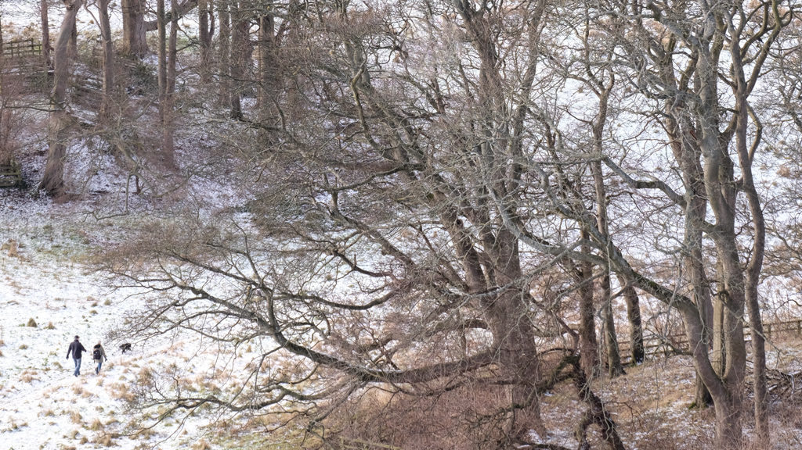
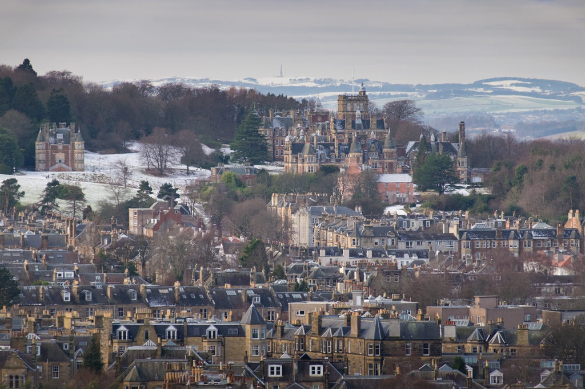
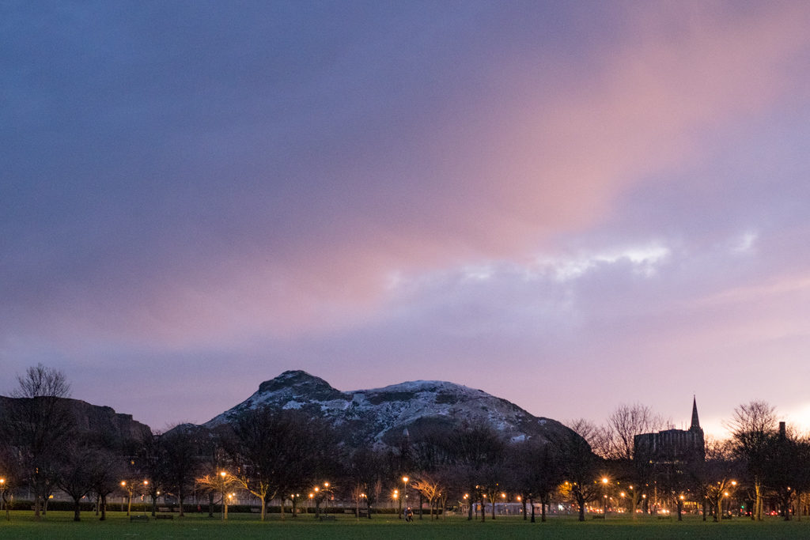
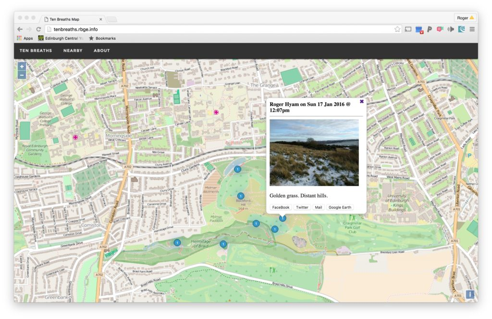

\[caption id="attachment\_3174" align="aligncenter" width="620"\] Midmar Paddock - on sale for housing\[/caption\]

Sunday evening and I'm taking the snaps off my camera. It has been dark and I've been hold up writing software for my _Ten Breaths Map_ project so there are only three shots I like but by chance there is a strong connection between the photos and the project I dedicated my Saturday to.

All three shots are of urban green space. Two of the three sites featured are threatened with development. The _Ten Breaths Map_ application that I hope to launch in the spring is all about preserving and enhancing these kinds of places for our well-being.

The first site is Midmar Paddock (pictured above). This is an area of land adjacent to  the Hermitage of Braid and Blackford Hill Local Nature Reserve and Midmar Allotments. It is privately owned but the public have had access for many years. It contains beautiful trees and rough pasture that act as a buffer for the nature reserves.  The owners are looking to sell it for housing development. The [Friends of the Hermitage of Braid and Blackford Hill](http://www.fohb.org/) are running a campaign to try and save it. Our local MP [has a petition you may like to sign](http://www.ianmurraymp.co.uk/petition).

\[caption id="attachment\_3173" align="aligncenter" width="620"\] Craig House from Blackford Hill - up for development\[/caption\]

[Craig House](https://en.wikipedia.org/wiki/Craig_House,_Edinburgh) was previously a psychiatric hospital and then a campus of [Napier University](http://www.napier.ac.uk/) and is not to be confused with [Craiglockhart House](https://en.wikipedia.org/wiki/Craiglockhart_Hydropathic) famous for being the First World War hospital associated with the poets Siegfried Sassoon and Wilfred Owen which is just the other side of the wooded hill in the photo.

Napier University vacated the Craighouse Campus in 2013 and is a partner in a firm to develop the whole site and chop down a chunk of said wooded hill. They can't touch the listed buildings but are trying to build over the surrounding green space. New build is always cheaper so developers want to do that while they let the listed buildings fall down. [Friends of Craighouse Grounds and Wood](http://friendsofcraighouse.com/) are trying to maintain the green space in the face of this particular manifestation of global capitalism.

\[caption id="attachment\_3172" align="aligncenter" width="620"\] Author's Seat from the Meadows - too steep?\[/caption\]

Thirdly we have the iconic Edinburgh green space - [Authur's Seat](https://en.wikipedia.org/wiki/Arthur%27s_Seat). Being in a royal park, a symbol of the city and very steep it is probably safe from development but here it is photographed from the Meadows and often this view isn't available because the council hire out the park for big events. And yes there is a campaign group called [Friends of the Meadows and Bruntsfield Links](http://www.fombl.org.uk/) who work to protect the park from over commercialisation.

The _[Ten Breaths Map](http://tenbreaths.rbge.info/)_ project is a work in progress. It consists of a mobile phone app and database exposed through a website. Points are added to the map by people doing a simple mindfulness practice in green spaces they find restorative when they find them restorative. In drawing the map I hope to deepen peoples' connections with nature and produce data that is useful for science and most importantly planning our green cities.

\[caption id="attachment\_3179" align="aligncenter" width="620"\] Screen shot of Ten Breaths Map in development.\[/caption\]

If my dreams come true then in a few years we will have built a system that enables people to put a "value" on green space through a deeper understanding of how people find it restorative - how it makes life worth living beyond economic goals. Campaign groups, developers and planners will have good science to call on when making decisions about development.
