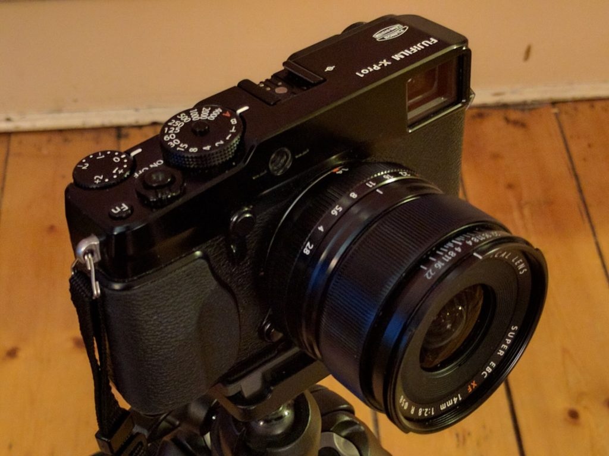
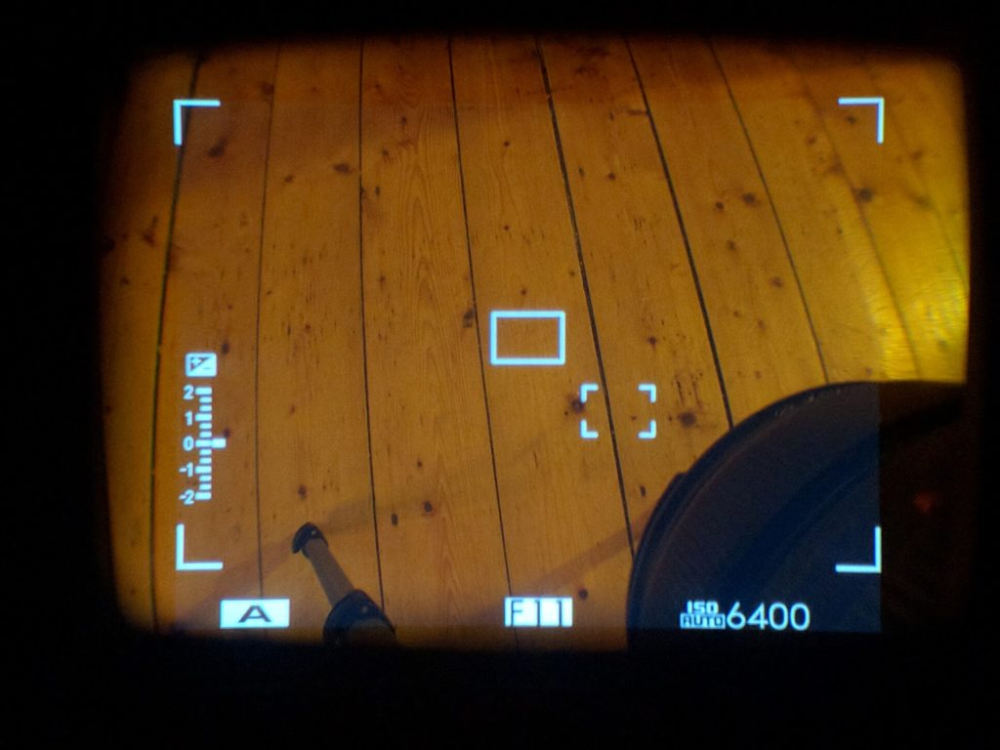

This is a quick post to host some camera phone snaps for a discussion about the new X-Pro2 and whether it has frame lines for the XF14mm f2.8 - a nifty little lens I like a lot.  It is in response to a nice [Ian MacDonald Photography review of the X-Pro2](http://ianmacdonaldphotography.com/2016/02/01/fuji-x-pro2-review-part-one-unboxing-and-first-impressions/) where he shows the viewfinder frame lines and the 14mm isn't there!

\[caption id="attachment\_3211" align="aligncenter" width="620"\] This is the XF14mm f2.8 on my X-Pro1\[/caption\]

\[caption id="attachment\_3212" align="aligncenter" width="620"\] This is the view of the floor through the viewfinder with the 14mm attached.\[/caption\]

The XF14mm was launched more or less at the same time as the X-Pro1. It is an odd focal length (21mm equivalent) and I reckon it was matched to the angle of view of the optical viewfinder (OVF). The X-Pro2 OVF has more-or-less the same magnification as the X-Pro1 if not a little wider (x0.36 vs x0.37) so it should cover the same angle. I reckon they have just left it off the focal length preview screen but they may have dropped it altogether. I'd love to know as I've put a pre-order in and had envisaged using this combination.

**Update: 17th February 2016.** I wrote to Fujifilm UK and they responded with the following:

> We can confirm, when the 14mm lens is attached to the X-Pro2 and when using OVF, frame lines are identical to the X-Pro1.

So it looks like thunderbirds are go on this one.
