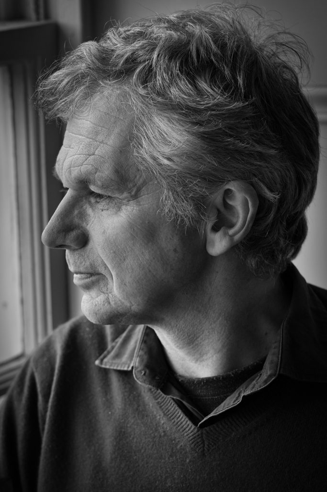

I have had an interesting evening torn between two shots I took today. Same subject and almost the same pose but one with what may be considered too shallow a depth of field but which I prefer.

\[caption id="attachment\_3217" align="aligncenter" width="620"\] Fujinon XF56mm @ f1.4 - my preferred shot\[/caption\]

It is testing my artistic integrity - pompous though it sounds.  I have "it doesn't have to be in focus" ringing in my head but I am afraid that if I release the one where the subject's nose, mouth and chin are soft people will say "ooh it is out of focus". On the other hand I know that the soft shot feels more powerful.

One of my problems is that releasing something electronically I have no idea how it will be viewed and the difference I see in the prints in front of me may not be perceived in the same way. Perhaps I should stick to physical media only.

Meanwhile you can enjoy (or not) both images here - on whatever device you are using.

\[caption id="attachment\_3216" align="aligncenter" width="620"\] Fujinon XF56mm @ f3.2 - more is sharp\[/caption\]

I file this under technolust as well as photography because of the sheer pleasure of using my Fujinon XF56mm f1.2. It is like carrying around a large glass jar of jam compared to my other lenses but so lovely to use.
