[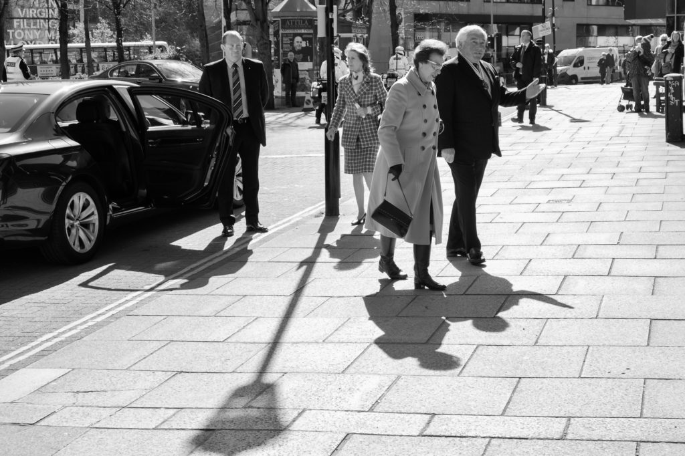](http://www.hyam.net/blog/wp-content/uploads/2016/04/20160419-DSCF4793-Edit.jpg)

Stuart Beattie, director of [Scotland's Churches Trust](https://www.scotlandschurchestrust.org.uk), liked the portrait I made of him and asked if I might photograph the visit of Her Royal Highness The Princess Royal (their patron) to a function at the [St Mary's Roman Catholic Cathedral](http://www.stmaryscathedral.co.uk/). The last royal I photographed was the queen. It was 1977. I was twelve and stood on a small wall outside a pub in Bristol. She was doing about 20mph. The wall and the road have both gone but the pub and the queen are still with us. I have no idea what happened to my photo but am not in a hurry to find it.

[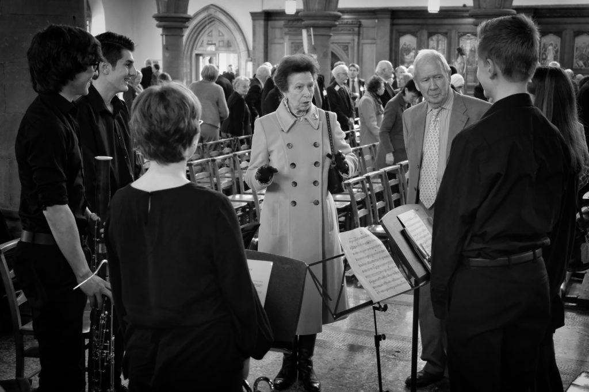](http://www.hyam.net/blog/wp-content/uploads/2016/04/20160419-DSCF4859-Edit.jpg)

The brief for this day was to get reaction shots as mementoes of the visit. "Everyone knows what the Princess looks like". I worked in colour (Astia simulation plus raw) with Fujifilm X-Pro 2 and the small 18-55mm zoom.  The idea was to keep it simple and discrete.  You can see the final collection of shots on the [Lightroom mobile gallery](http://adobe.ly/1ps16Vy). Presented here are a few of my favourites worked up in black and white from the raw files.

[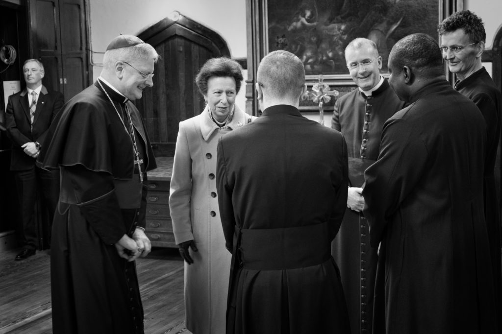](http://www.hyam.net/blog/wp-content/uploads/2016/04/20160419-DSCF4906-Edit.jpg)

[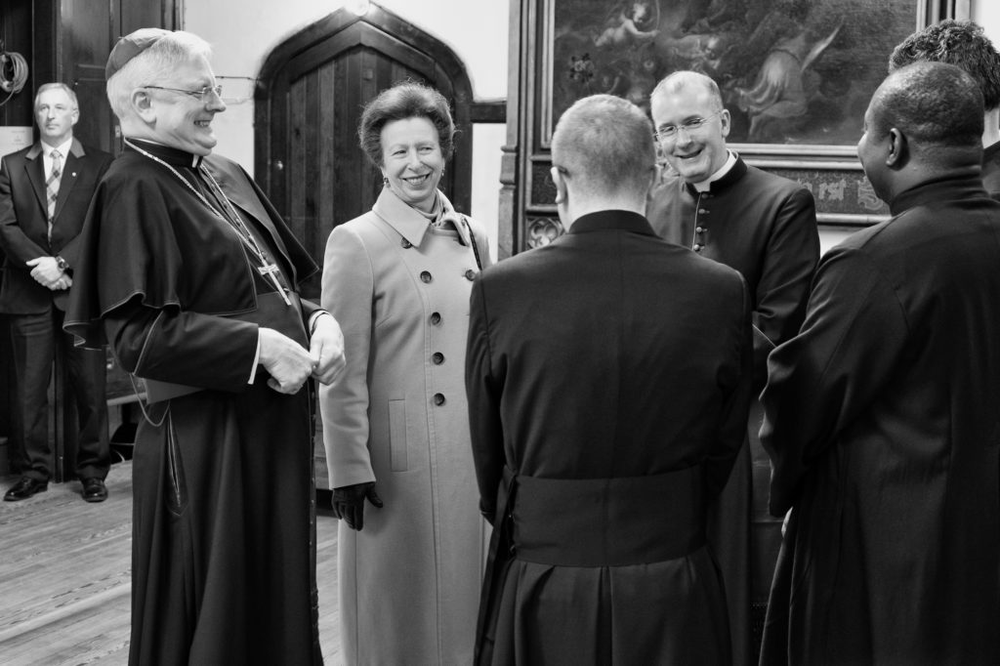](http://www.hyam.net/blog/wp-content/uploads/2016/04/20160419-DSCF4905-Edit.jpg)

[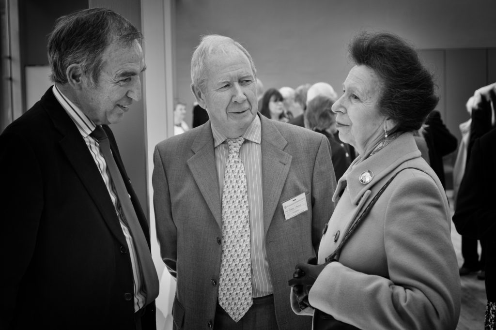](http://www.hyam.net/blog/wp-content/uploads/2016/04/20160419-DSCF5147-Edit.jpg)

[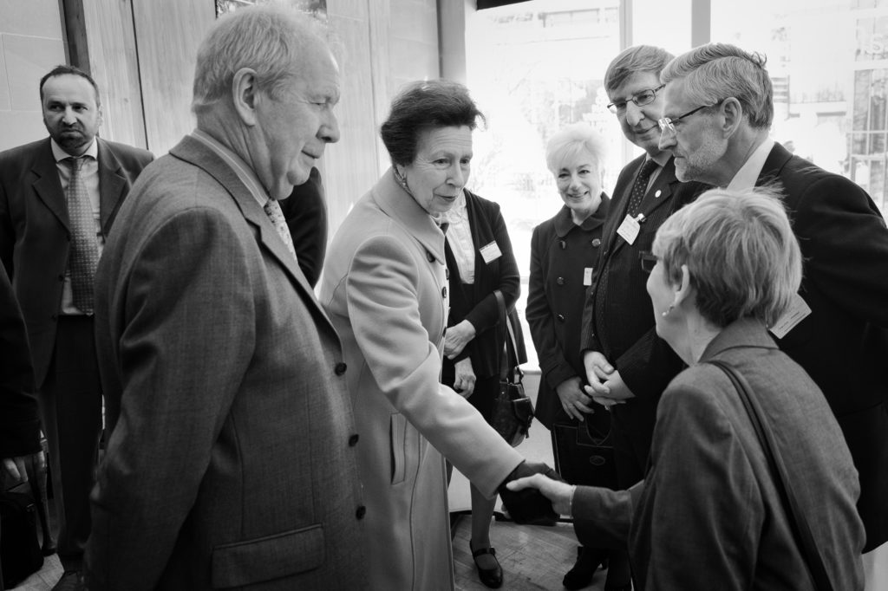](http://www.hyam.net/blog/wp-content/uploads/2016/04/20160419-DSCF5204-Edit.jpg)

[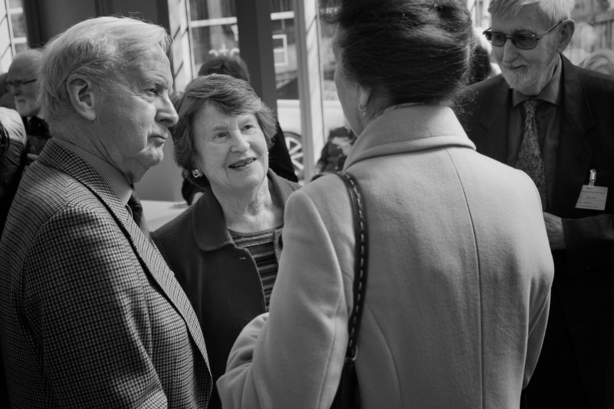](http://www.hyam.net/blog/wp-content/uploads/2016/04/20160419-DSCF5043-Edit.jpg)

[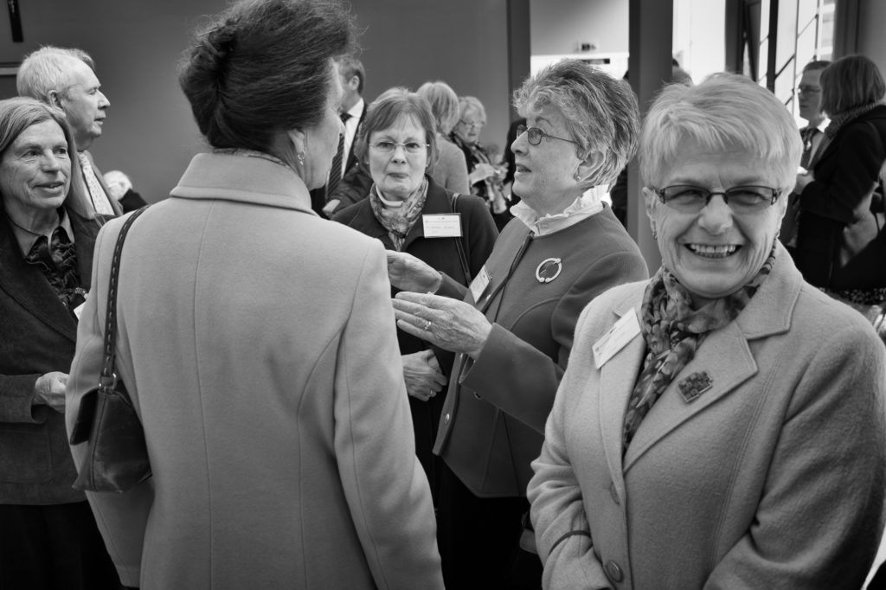](http://www.hyam.net/blog/wp-content/uploads/2016/04/20160419-DSCF5090-Edit.jpg)

[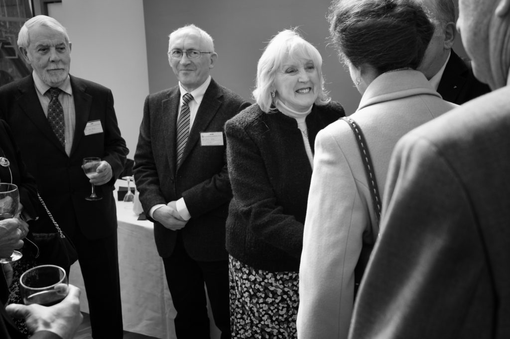](http://www.hyam.net/blog/wp-content/uploads/2016/04/20160419-DSCF5009-Edit.jpg)

[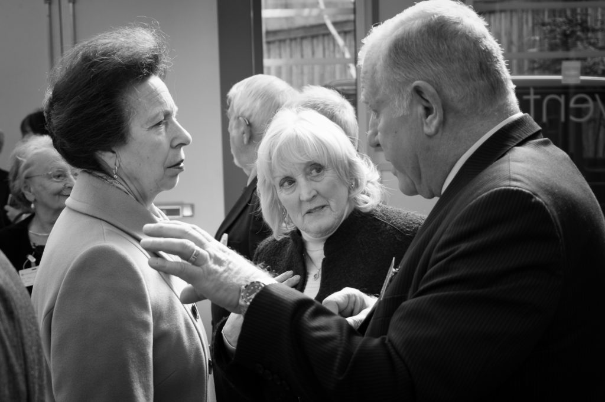](http://www.hyam.net/blog/wp-content/uploads/2016/04/20160419-DSCF5016-Edit.jpg)

[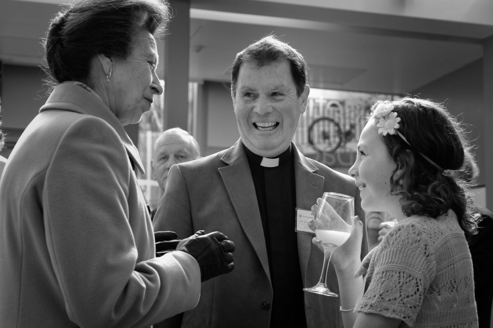](http://www.hyam.net/blog/wp-content/uploads/2016/04/20160419-DSCF4968-Edit.jpg)

[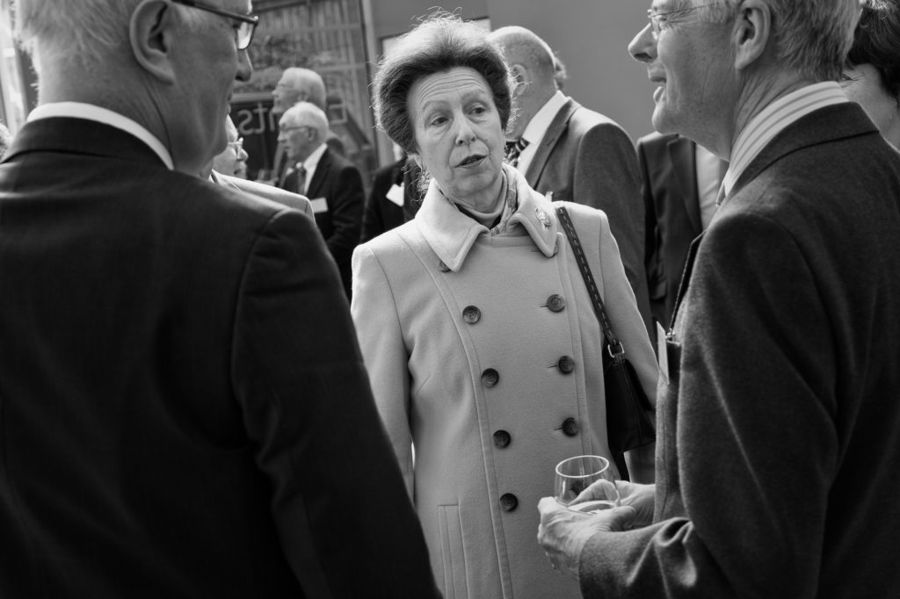](http://www.hyam.net/blog/wp-content/uploads/2016/04/20160419-DSCF4986-Edit.jpg)

[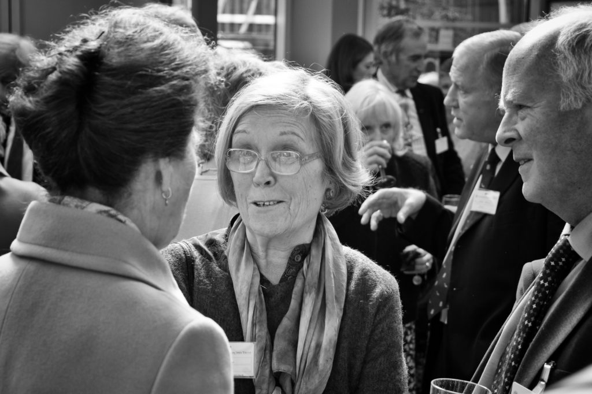](http://www.hyam.net/blog/wp-content/uploads/2016/04/20160419-DSCF4937-Edit.jpg)

[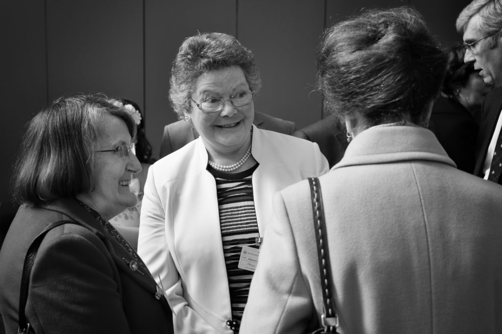](http://www.hyam.net/blog/wp-content/uploads/2016/04/20160419-DSCF4950-Edit.jpg)
