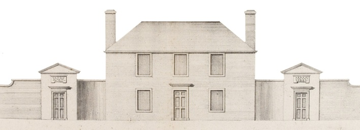
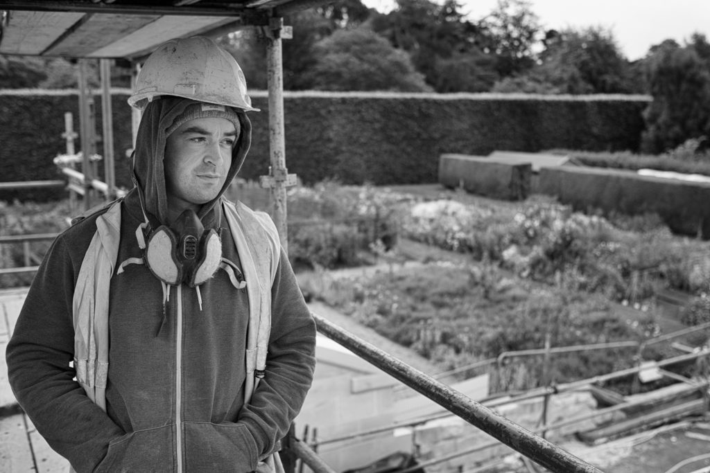
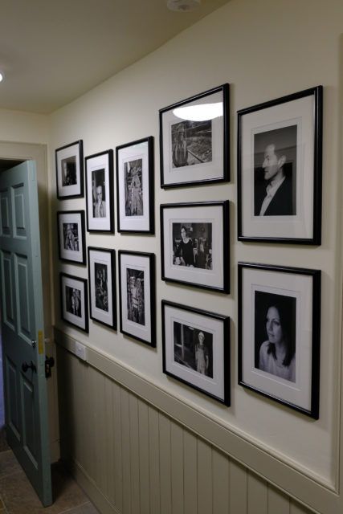
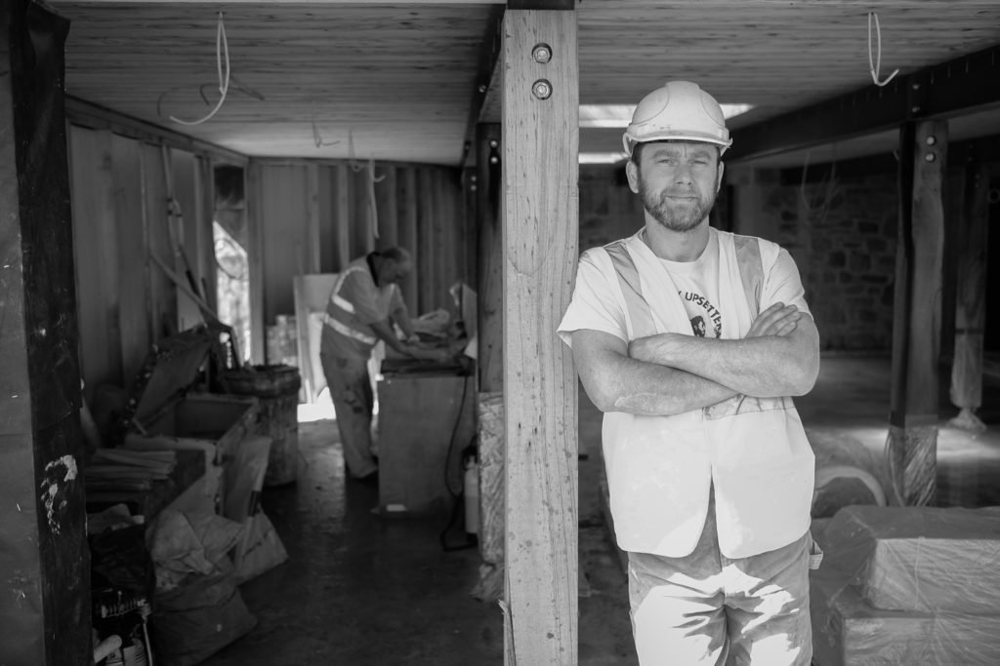
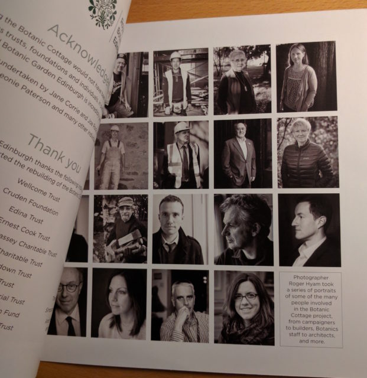
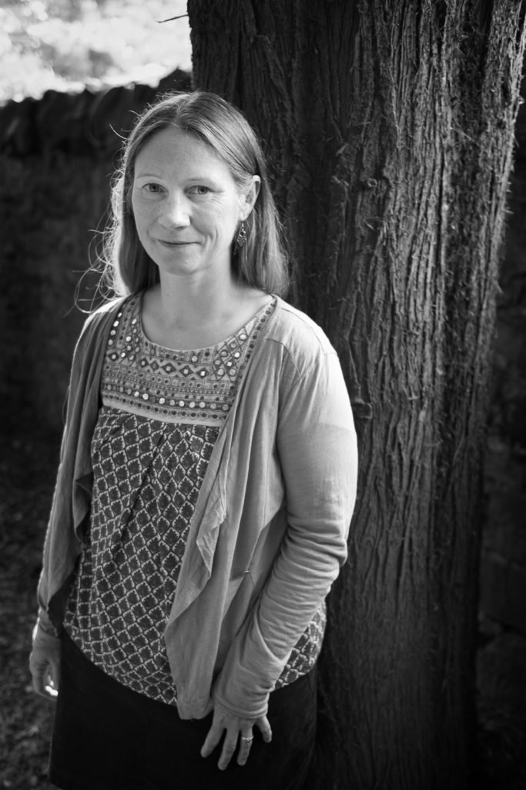
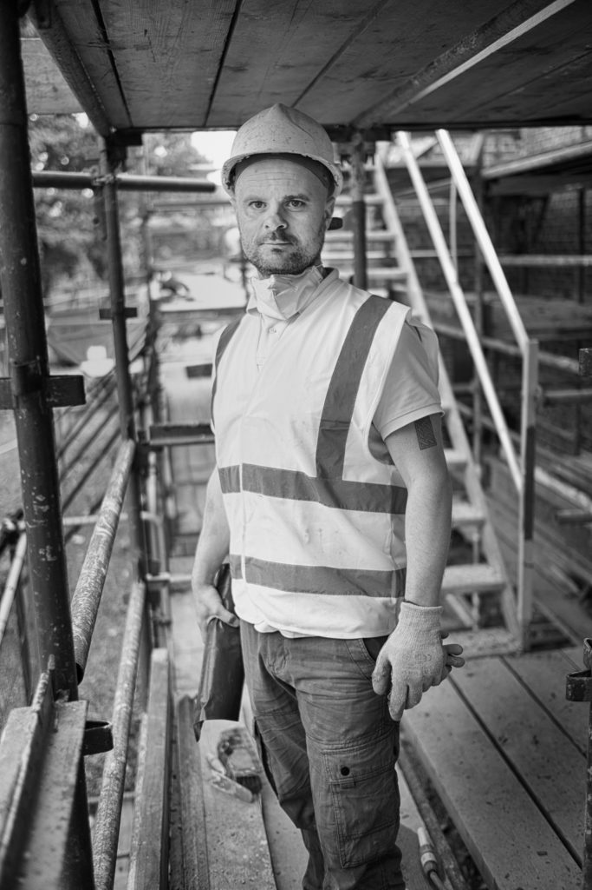
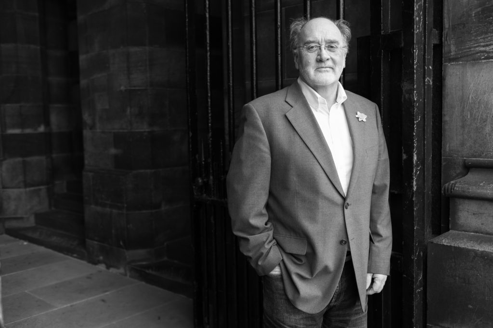
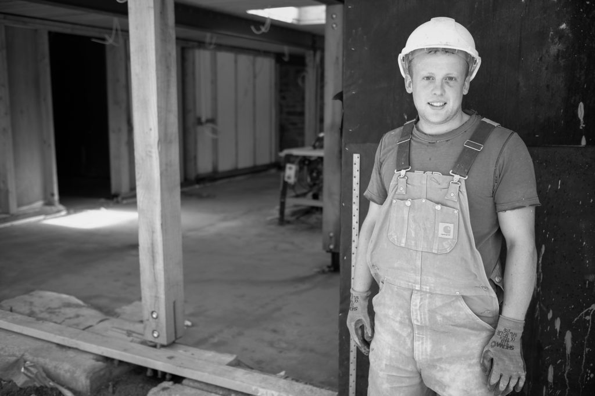
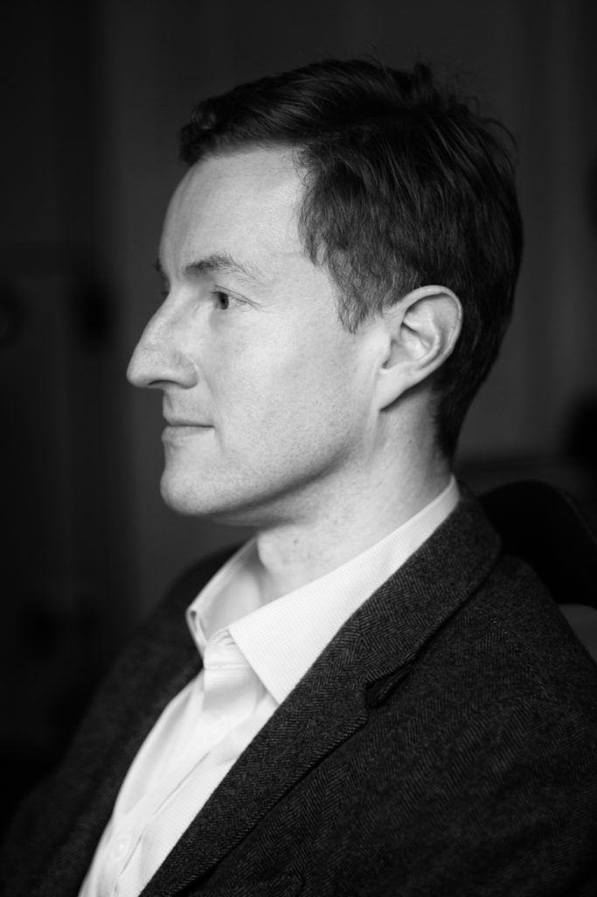

About a year a go I had committed to photograph people on their allotments as my next project when Sutherland Forsyth suggested I document the people who were involved in reconstructing the Botanic Cottage at the [Royal Botanic Garden Edinburgh](http://www.rbge.org.uk/). Needless to say the allotment project fell by the wayside as the Botanic Cottage People took over.

](http://www.hyam.net/blog/wp-content/uploads/2016/06/20150804-DSCF2570-Edit.jpg) Christi Carrick ~ Stone Mason

](http://www.hyam.net/blog/wp-content/uploads/2016/06/20160607-DSCF5351.jpg) Display at in the cottage

The Botanic Cottage is a stone by stone reconstruction of the building that stood at the entrance to the botanic gardens when they were located on Leith walk prior to their move to Inverleith in the early 19th century. It is an important building of the [Scottish Enlightenment](https://en.wikipedia.org/wiki/Scottish_Enlightenment) and great care has been put into using the original building techniques fused with modern building regulations. Its old site is now a block of flats.

](http://www.hyam.net/blog/wp-content/uploads/2016/06/20150803-DSCF2527.jpg) Don Allen Nisbet ~ Lime Render

I made a decision at the beginning that I wouldn't blog as I went along so I could keep my options open as the project developed. It has meant that I haven't been blogging here much. I don't think I'll do it with the next project.

](http://www.hyam.net/blog/wp-content/uploads/2016/06/IMG_20160622_191305.jpg) Inside cover of guide book

Over the course of the year I have photographed almost 40 people and recycled a handful of earlier portraits from by Botanics People project. A handful of them are displayed here. A selection of prints are on display in the cottage and there is an archival printed folio for the archives. They were also used in the front and back of the guide book. I'm looking into a self print book for the library.

](http://www.hyam.net/blog/wp-content/uploads/2016/06/20150730-DSCF2376-Edit.jpg) Sue Whittle ~ Architect

Lessons learned? Don't do such a big project! Aiming for a dozen portraits at the end would have been a much better project. Also something I can be getting out the door on a monthly basis would keep momentum going and allow me to change style more.

](http://www.hyam.net/blog/wp-content/uploads/2016/06/20150929-DSCF2748-Edit-2.jpg) Cath Evans ~ Teacher

](http://www.hyam.net/blog/wp-content/uploads/2016/06/20150804-DSCF2553.jpg) Brian Watters ~ Site Manager

](http://www.hyam.net/blog/wp-content/uploads/2016/06/20150804-DSCF2573-Edit.jpg) Chris McCann ~ Stone Mason

](http://www.hyam.net/blog/wp-content/uploads/2016/06/20160308-DSCF3135-Edit.jpg) Stuart Beattie ~ Trustee

](http://www.hyam.net/blog/wp-content/uploads/2016/06/20160324-DSCF4525.jpg) Lord Hope ~ Trustee

](http://www.hyam.net/blog/wp-content/uploads/2016/06/20150803-DSCF2536.jpg) Garry Woods ~ Lime Render

](http://www.hyam.net/blog/wp-content/uploads/2016/06/20160322-DSCF4490-Edit.jpg) Ed Taylor ~ Trustee
