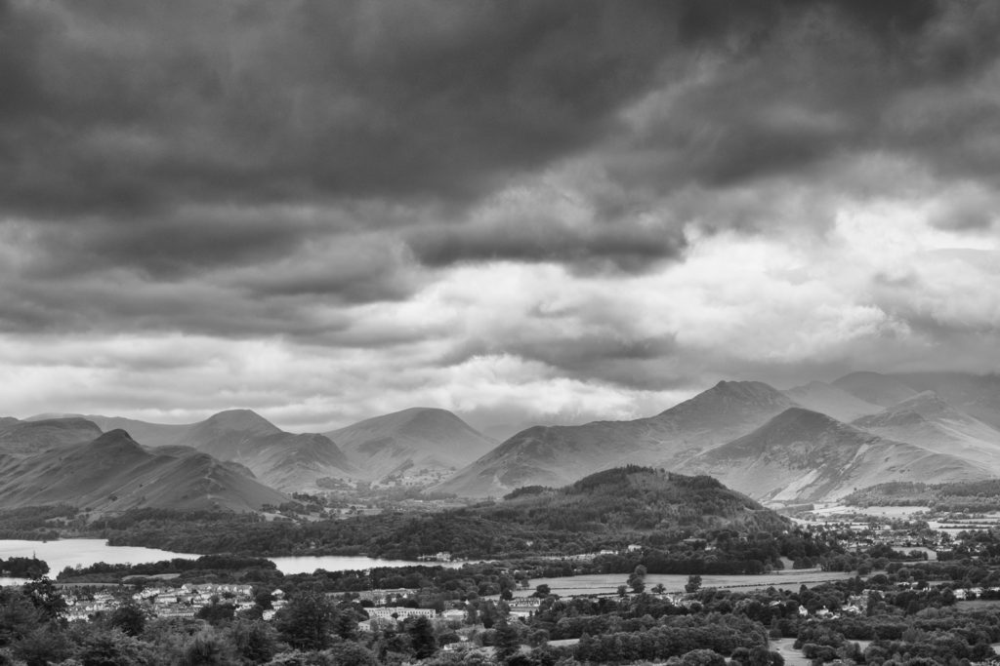
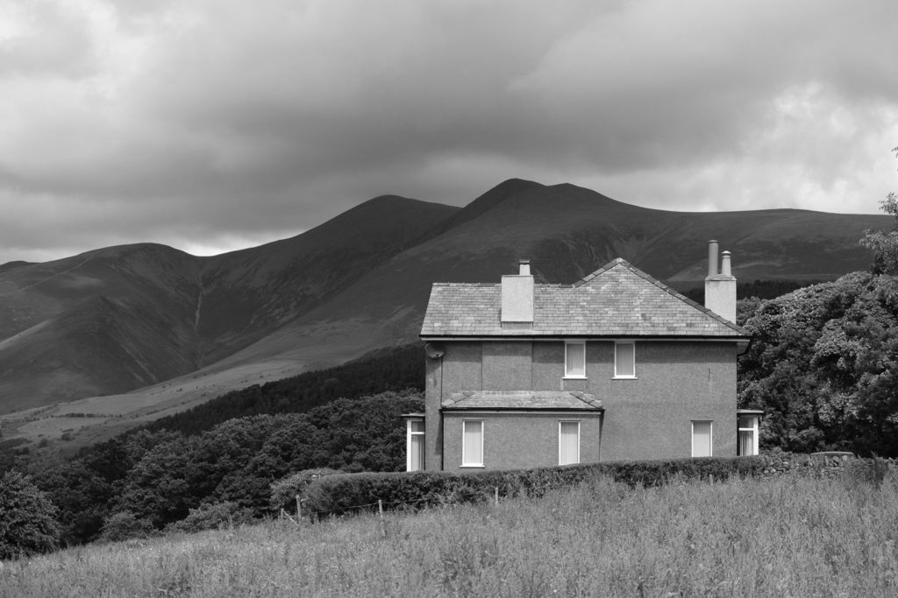
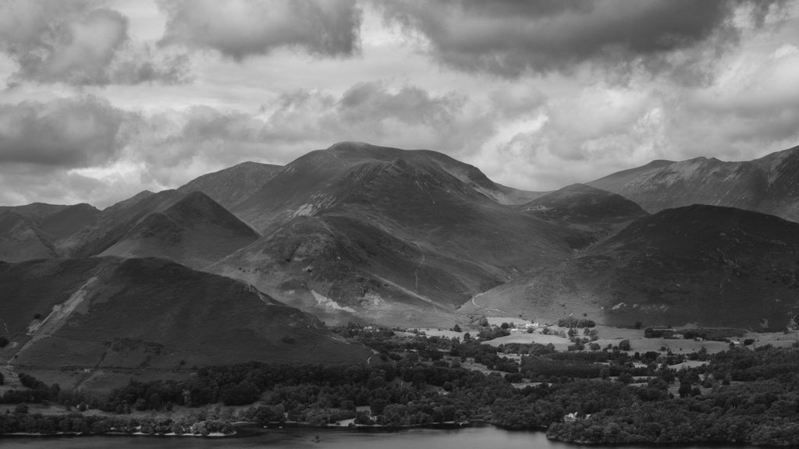
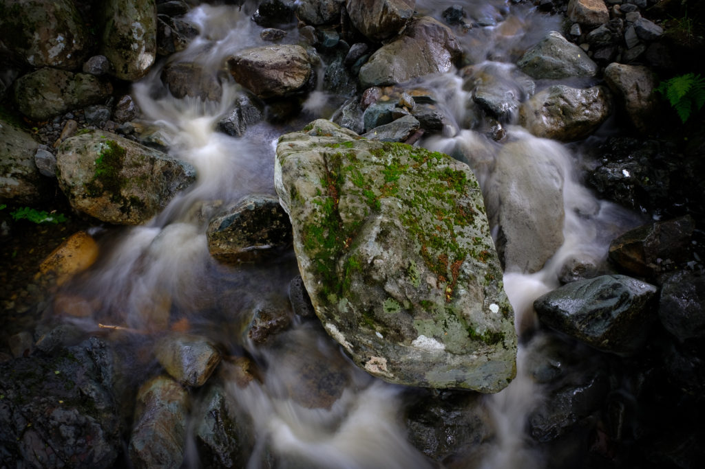
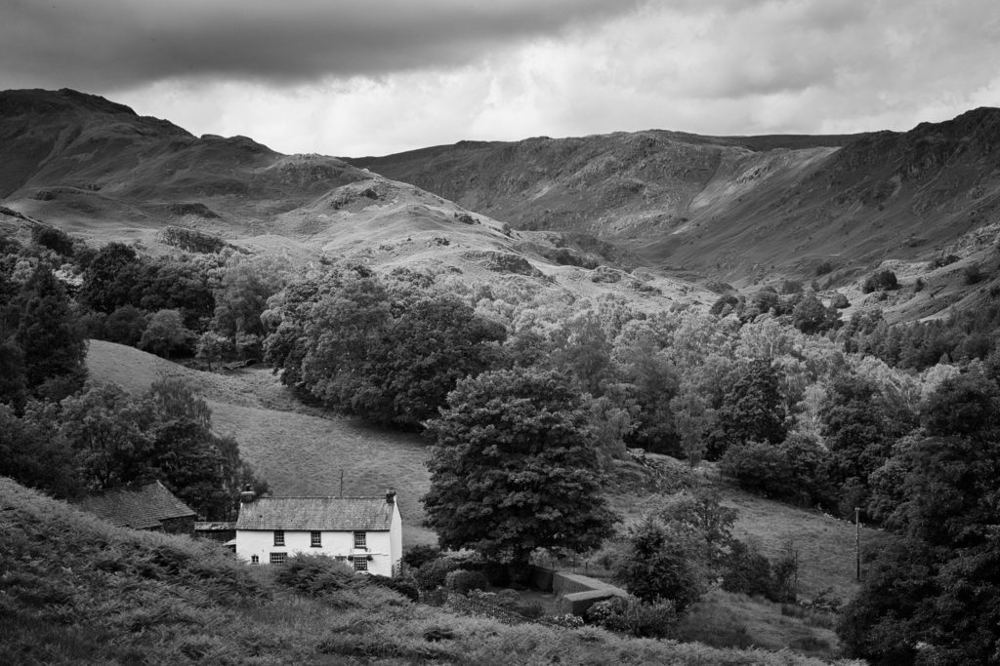
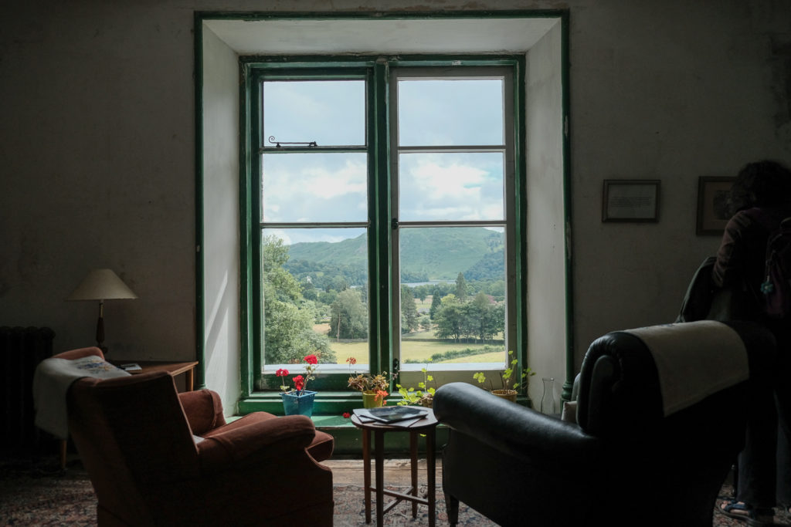
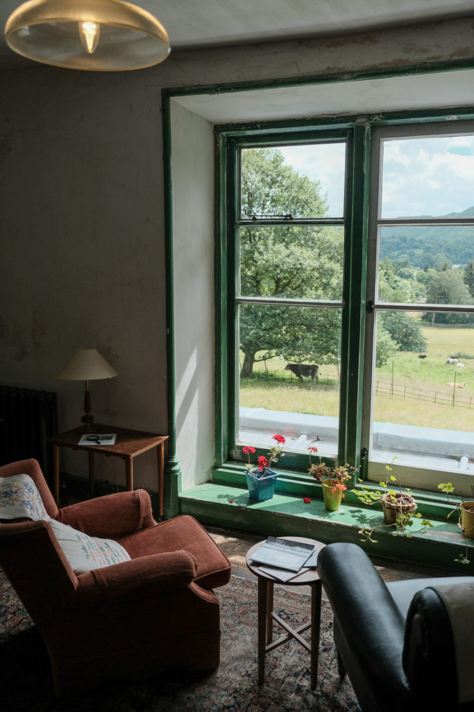

We have just had a week camping in the English Lake District. It didn't rain the whole time. Very enjoyable in a gentle family kind of way. We played rummy in the evenings.

](http://www.hyam.net/blog/wp-content/uploads/2016/07/20160706-DSCF5580-Edit.jpg) Walking up Skiddaw - we abandoned it as shortly after this we could not see that top or the bottom.

](http://www.hyam.net/blog/wp-content/uploads/2016/07/20160705-DSCF5513.jpg) A house nearly as austere as Skiddaw behind it

](http://www.hyam.net/blog/wp-content/uploads/2016/07/20160707-DSCF5588-Edit.jpg) Across Derwent Water from the Walla Crag

](http://www.hyam.net/blog/wp-content/uploads/2016/07/20160707-DSCF5594.jpg) A rock in the stream (hand held)

](http://www.hyam.net/blog/wp-content/uploads/2016/07/20160708-DSCF5659-Edit.jpg) From Allan Bank looking Northish

](http://www.hyam.net/blog/wp-content/uploads/2016/07/20160708-DSCF5627.jpg) [Allan Bank](http://www.nationaltrust.org.uk/allan-bank-and-grasmere) - perhaps our favourite National Trust property

](http://www.hyam.net/blog/wp-content/uploads/2016/07/20160708-DSCF5622.jpg) One of the few properties you feel you could live in.
