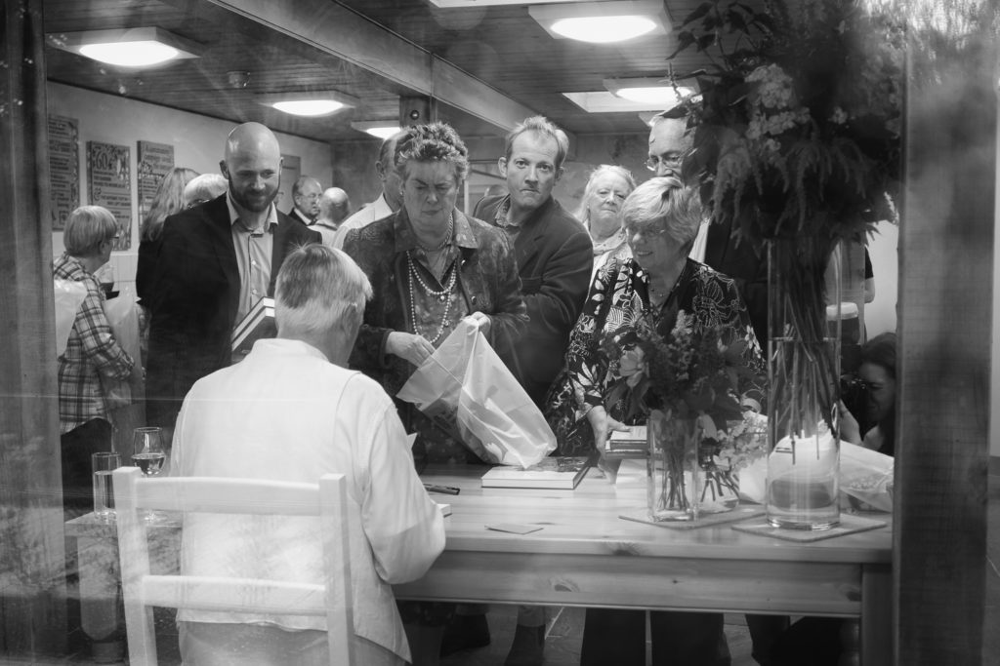

During my photo drought I have taken to having my X-Pro 1 with the 27mm pancake in my bag. Carrying but not using. At Henry's book launch this evening the official photographer was a little late but just as they asked me to help out she turned up. So I didn't need to do anything but it had planted the seed and I took a dozen shots - nothing special apart from this one that I really like.
