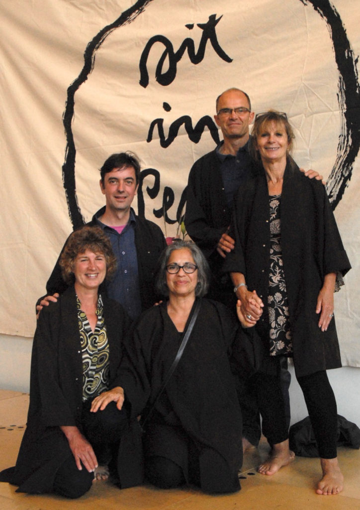

I took lay ordination into the Order of Interbeing as True Embracing Oak (Chân Sồi Bao Dung) on 28th August 2015 - a year ago today. This is my Oak Tree ordination family. From the top down Anthony Leete, Julia Claremont-Brown, Me, Margaret McClean and Patricia Diaz. We came together on that day for a significant life event and were then dispersed back across the UK. I'm sure we will bump into each other at order meetings but wonder if we will be together as a set again.

The way life throws people together in different combinations reminds me of playing Rummy with my blood family over the holidays. The cards come up in endless different combinations. Sometimes they seem significant sometimes not and sometimes you completely miss the significance till it is gone. Perhaps that is why the game appeals.
