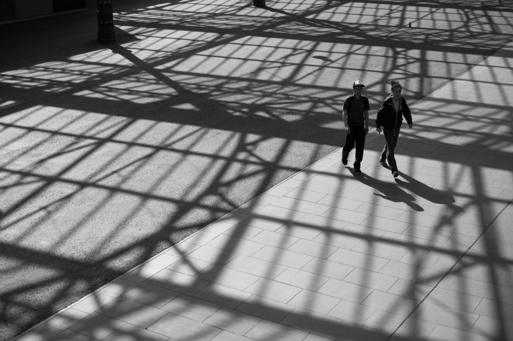
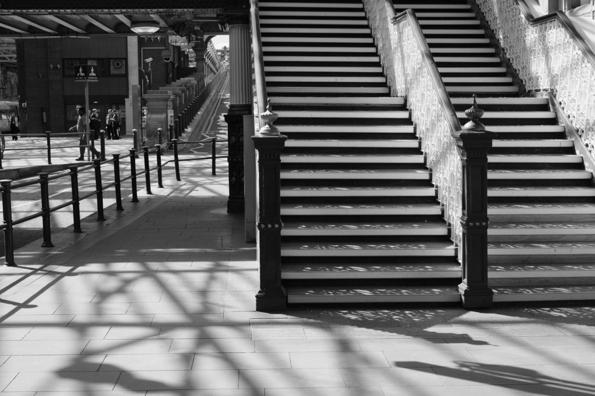
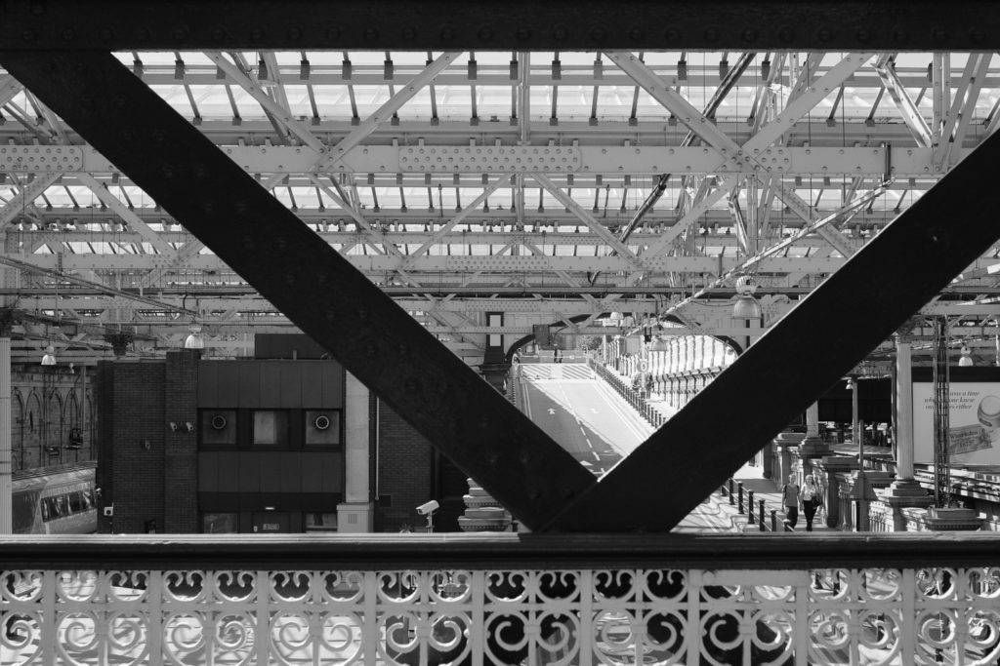
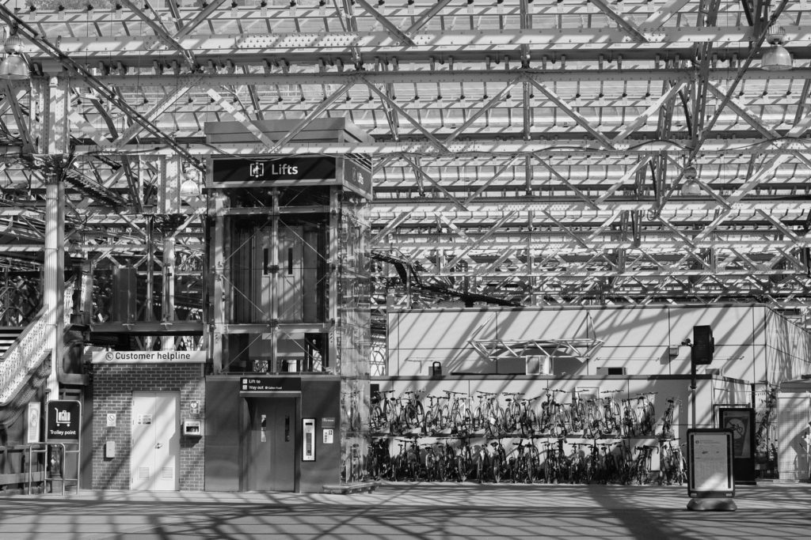
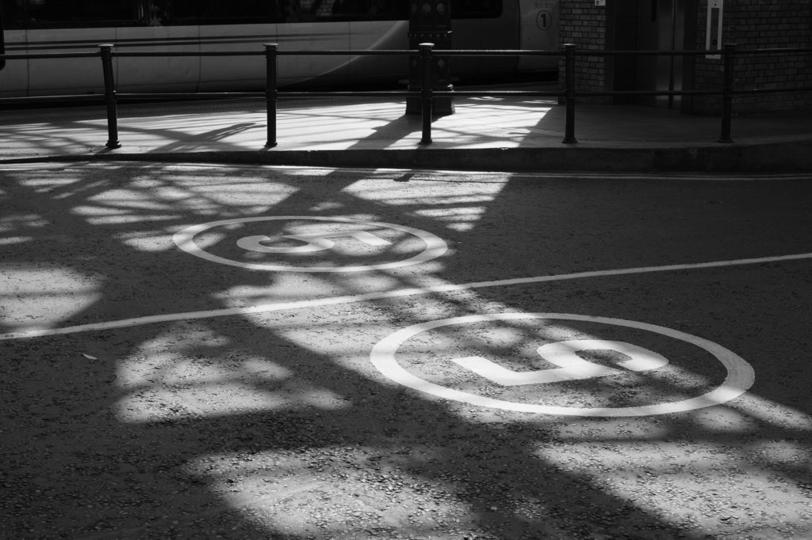

For a treat I had lunch in [Yo Sushi on Princes Street](https://yosushi.com/restaurants/edinburgh-princes-st) - and I actually felt the benefit of the air conditioning! Anyone who knows Scotland will appreciate how unusual this is. [Waverley station](https://en.wikipedia.org/wiki/Edinburgh_Waverley_railway_station) was transformed by the light. I found myself taking photos again.

