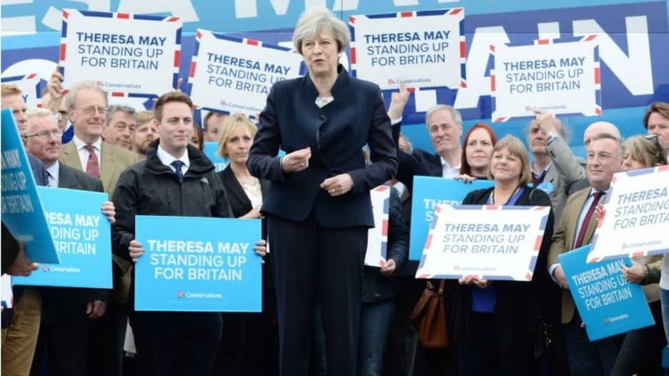
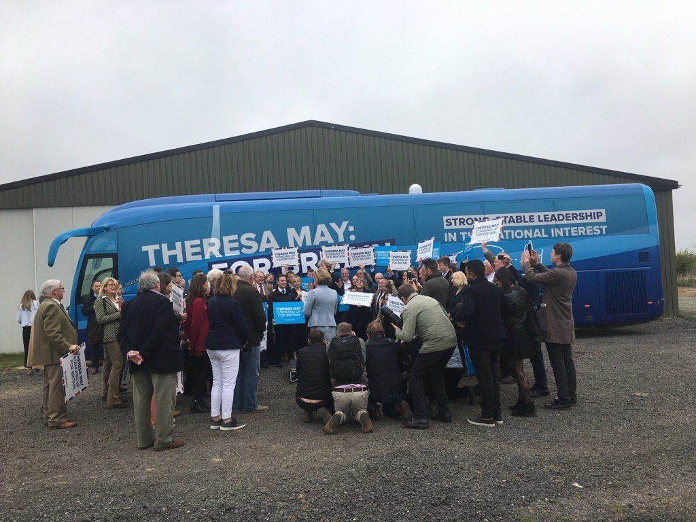
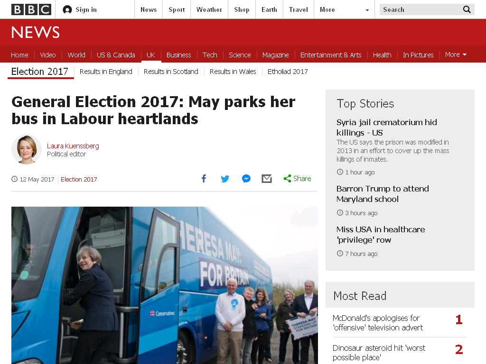

What I like about photography is it is so often about what you want to say and not what reality is. Mixing this up with my current obsession with politics and how our media portrays it I just had to put this lot together.

It starts with a [blog post moaning about BBC bias](https://markdoran.wordpress.com/2017/05/14/tory-tory-tory-3/) that contained two photos from the same event.

\[caption id="attachment\_3392" align="aligncenter" width="936"\] Popoganda\[/caption\]

\[caption id="attachment\_3393" align="aligncenter" width="620"\] Reality\[/caption\]

I'm not totally sure where the propaganda shot came from but the reality shot was [Laura Kuenssberg on Twitter I think](https://twitter.com/bbclaurak/status/863006520648368128).

Now I don't just believe everything I read on the web and the original blog looked too ardent not to bend the truth so I did some digging. Firstly the BBC did not use the propaganda shot (or at least it isn't any archived version of the page) but they didn't have the nerve to use Laura Kuenssberg's shot - they had to flatter a little.

What was interesting was doing a [Google image search for the propaganda image](https://www.google.co.uk/search?tbs=sbi:AMhZZismmskKZqic9BZ4E56YFC7StPgxhmVa6s2tEMb6IceYe9s1jqordfDlc07L6MsFQkZYXS3KLuxeKgrxgTrixueyvlbIaLNgCQR79-kuKFrRCl1UEy1z-NSSS89_1fqxH2pbFYGIsdoruLPu422fnsiiRLbhF_1irnqkA1Tt2XDFzG2cO8z_1-eEXsnLlTEf3fFerCq1_1u3VTVyuRdQkmZ0hh1417028RHk8p5f34x3P7ZETwhWpYMR7nPnsVtCR54pRZshAukA7DRP8tVzrbv8bi8KH_1Nf9JkY0D-G97j8MbIfLEiyQxQ9Sl4DApzFXh_1A_1PBWlXG3e3ptJwN37h36XmtvwTmm300I-2eVDdpefhktahf8pyfYuEaaG4MYPdioJQ-2R2mkqGDnL6kLxqHRfIlB7XPii0lvvzojp0ucAbuXdy7Pgk2v7xqMh_1TXimsfophpjfLdW9PHcJaGPnbfucAat32pBIWiOj5AxJQHuSl8nxqd9HGoKkrxst-YVCeXDtM2kToB1lICu4X_192agePc5ezZUBdPJ6bxHPJ0wLK4Io8PPzE09OLOt507L1ZbsgwJsn00xHLKOs6rwnRosdkBf11vQpwI7ym-JXOFCyaNBE1sLoivgcVZgyiHNACbuG2_1b0Y_1DOt8Uo9BxmmgjR8zJmQmrLlBL-FDWHU-g9k8je7ISW5WhI2Q20pZb4jr-Xz8jgWqWtcpkFF1C0RZZrvOU1G7ocFKiFa-gMiOQ3DIDw8q7RMUYcG6TYCDDLy-tZQNhC4_1T6XsLii0yy2L1CaMLZI6gl8QycLtns2p91f7fV5g4IhWhTv18J9j1fLRAtP73EHZkSNe9f4AYTGH-gyGOYeQOVT0mWlqPLIn-iSXkuv69ZqOz-7MoscuVxQ-Y8o8eJiPxx8b_1UnoECk97t2-Pp6p5_1_1OyPs6mDu-LLwY5lSlaDSIpThlNk1tObIItCm6okPCgc7lhuYGpyyqpHOw4yu5fydj1W_1h023joU1oSWDvfjAdeFCQGaMHOI4xM57rc9fvzNVpYMUhkyyqc-_1hewXLJVnuQOUOIqHnXbm87wLhVPJyzH6r5v970E4hbdjorWHGyxItNxCuF6-tuPy85SNtjy_1VDOtFH1rVjkbKF0qAZX_1rZLS07ZmK4A8wyFgQ5lR1aqlgCw4wSEibtyLbSQdNi1ttX7DCKteYQESvzQOCzYGc0xyrRqpOv8nZuAwyCqKt90KFS-FTctX-Co0pz7-FionlSv0rhnEJhecTA5DmYvr7hMWfCXe5iu9TpTIG2XPZDX1TM-2_1DCNgH3yhFBVmKFWwOJVdlyxqPFnaq_1kE5_1xBKPnZEGFHId3f8uxIIo9eboXUOcFknvybRfnBdVih4EUteqUZHWoDUGoqANlMMyVf3uEJFT6UpTiHDrTEfIAEWBXsBZE6rm6J-eBM_1xRNvmEvsTXy2kQP-fp5QA_1slOkZ8BUUN7NUp7Ac8559vfiwuZCIavXbAfv1be9gNphWSj7xb5bC3tyO0e1CNKN1rTq1y0Dg1K7TOistrNJkeRtXbmbF4yOLTOENQ-auYh5cKeiL1wps2h6M0B7YX6W-iFNH5hqlMwSuyQfav2FlUWgFgAYN7h2WS_1o3pGEMclpijO0sCmK5mg-mKBSXLXyk6b5VJtp1wY4dX2TJ-DxreF4f-&btnG=Search%20by%20image&hl=en-GB) to see who had used it and there were quite a few, [even the Guardian](http://archive.is/Og91L). The reason is obvious - Getty Images and Reuters. If you are a pool photographer with an agency then you can't bite the hand that feeds you so you produce promotional images - or you are literally off the bus. There are very few "real" journalists anywhere near the politicians because they either don't exist any more or they can't be trusted. The result is we get promotional images only from the professionals. For reality you need to go to social media shares.

[Embed from Getty Images](http://www.gettyimages.com/detail/682253920)

<iframe style="display: inline-block; position: absolute; top: 0; left: 0; width: 100%; height: 100%; margin: 0;" src="//embed.gettyimages.com/embed/682253920?et=2OwWRScFQTh6rMbDd1Qm6Q&amp;tld=com&amp;viewMoreLink=on&amp;sig=-jjwkMIzpm_DAEISq9b-YIYJZQOp9ynsymlFpW5On7g=&amp;caption=true" width="594" height="396" frameborder="0" scrolling="no"></iframe>

 

The point I'm making is that there are no conspirators here. Nobody is being told to do anything. The system facilitates it and those in power just need to give it a little nudge to make it work in their favour.
