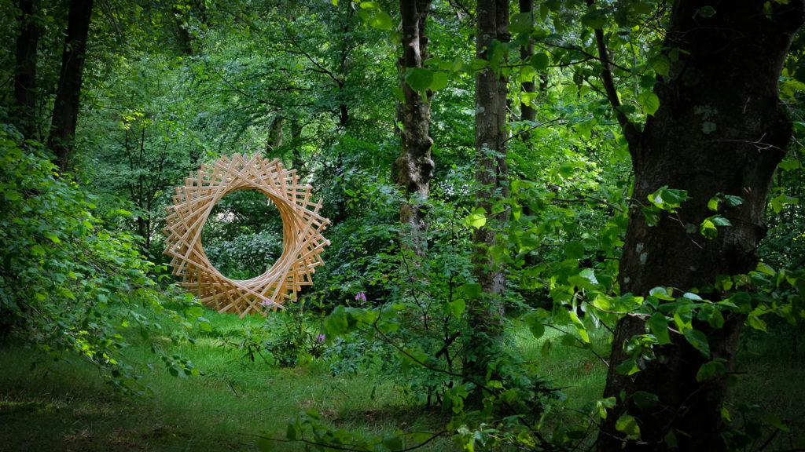
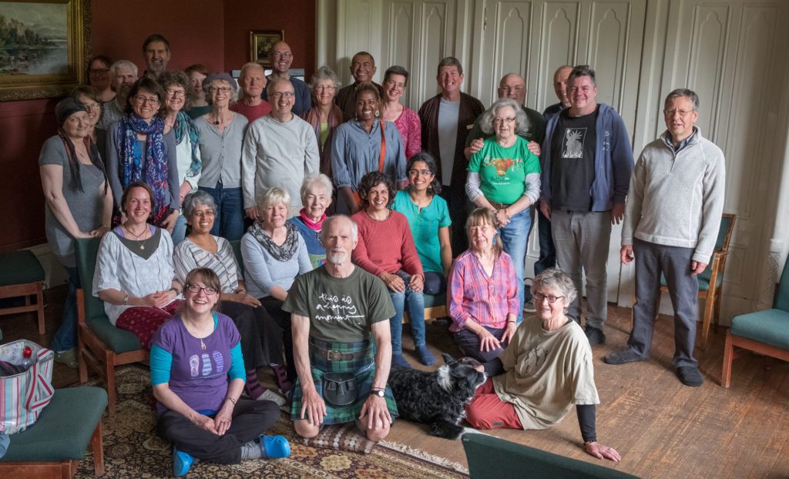
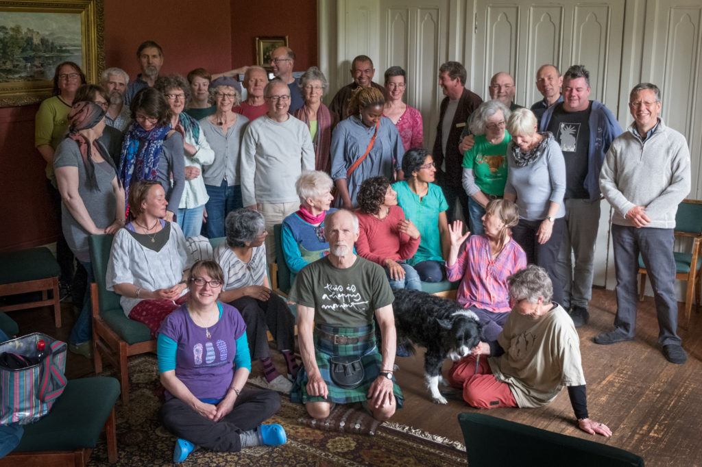
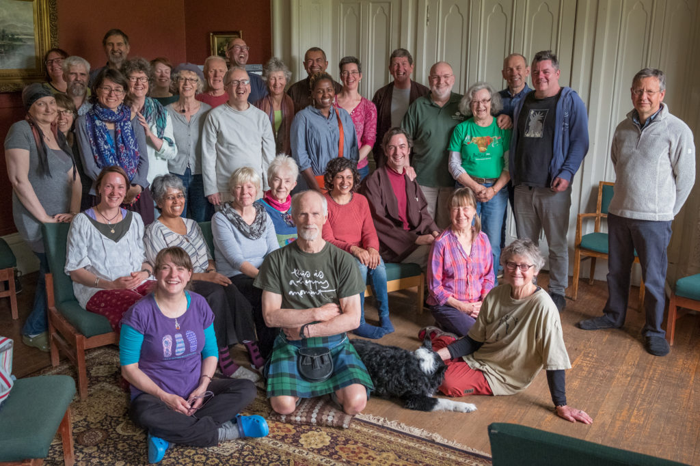

I'm just back from a four day retreat at Wiston Lodge lead by Dene Donalds that I found very powerful. My sinuses were playing up for much of it which may have added to the impact but I actually had some good sitting and walking. Often you can tell a "good retreat" from the after effects and I was definitely in a different place for a few days. Coming down again now but with plans for some changes in my routine.

We did the usual team photos at the end of the retreat and I think you can tell from the faces that it was effective. Here are three different ones.

