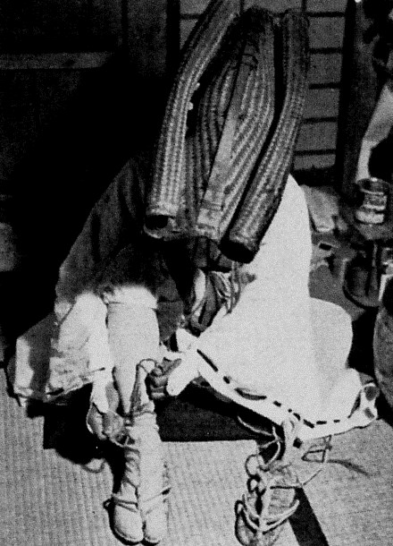

There's a great art house film called _Kumiko, the Treasure Hunter_. It is about a Japanese woman who obsessively watches a flaky video of an American thriller. Eventually she snaps and travels to the USA to dig up the money she saw being buried on screen.

https://youtu.be/8htA6LR6u-Y

I really enjoyed _Kumiko, the Treasure Hunter._ It reminded me of the fascination I have with an old, degraded quality film about Japan. I first saw it a few years ago on YouTube. It is a 1994 Channel 4 documentary about the Marathon Monks of Mount Hiei. It was significant enough for me to install special software, download a copy and then lose. Fortunately it is still available on-line and there is now a better quality, [slightly different cut with an American voice over](https://youtu.be/BM09ZvStLQA). I prefer my original find.

https://youtu.be/emE-dxCyRz4

Should I, like Kumiko, steal some money, leave my pet on a subway train and head off in search of buried treasure? Probably not. Unlike the film Kumiko watches the one that fascinates me is a documentary. These guys really exist and they do the practice of Kaihōgyō - circling the mountain. [You can read about it on Wikipedia](https://en.wikipedia.org/wiki/Kaih%C5%8Dgy%C5%8D). The ascetic practices started about millennium ago but settled down into walking various routes around Mount Hiei five hundred years back.

\[caption id="attachment\_3457" align="alignright" width="243"\] Characteristic hat and sandals of Marathon Monk\[/caption\]

For the past decade I've got up each morning and walked or cycled 2.5 miles across the centre of Edinburgh to my office at the botanic gardens returning by a slightly different route in the evening. Allowing for work trips and illness that is about 200 trips and very roughly 1,000 miles per year. At the same time I have been working to deepen my Buddhist practice. In 2013 I made the commitment to do 20 minutes formal mindful walking in the botanic garden every lunchtime I was there. I'll have done about 900 by now. Walking has become my main spiritual practice.

Often as I leave the house in the morning and bring my attention to my breath and feet, resolving to be open to but not distracted by the life of the city, I think of the monk in the documentary. I'm a Lay Pedestrian he is a Marathon Monk but we are in the same business.

I'm walking a small fraction of the distances the marathon monks do but it feels like time to looked more closely at what practices these Tendai Buddhists have developed and if any might be useful for me - especially the hat!

### Marathon Monk Posts by Date

\[catlist name="project-marathon-monk" orderby="date" order="ASC" numberposts=100  \]
