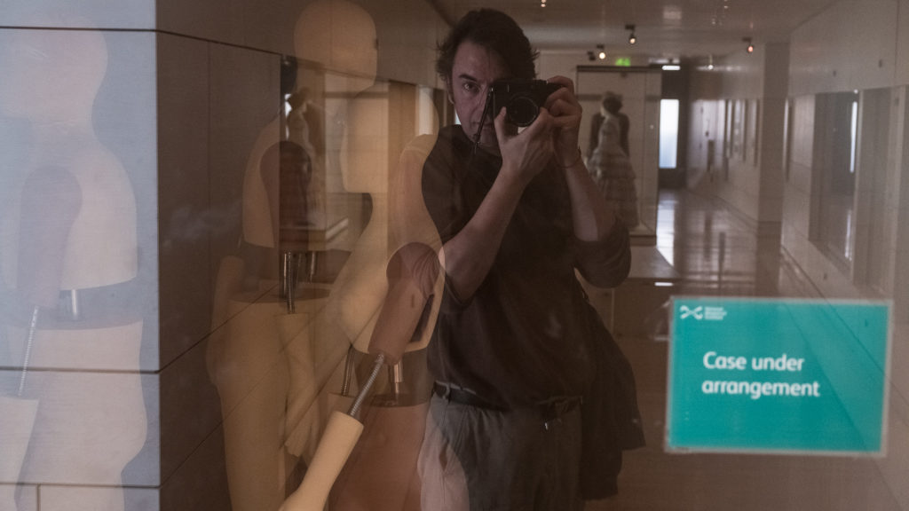
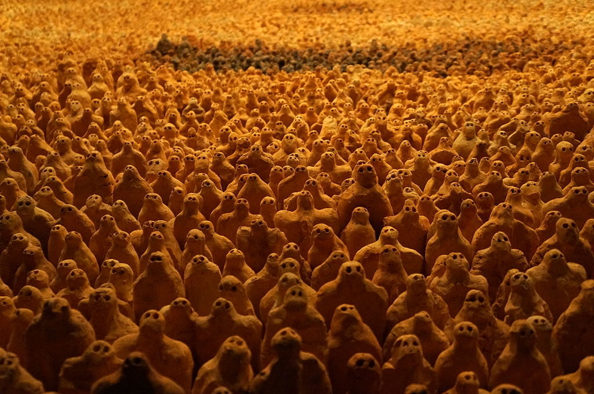

By far the most common metaphor for a life is that of a journey. After all it has a beginning, middle and end. It appears to go through different terrain, run at different paces and our paths often cross. Sometimes we leave things behind. Sometimes we can't. But we can confuse a metaphor with the thing we are describing or worse slip from metaphor to analogy. It is a mistake to assume that because we can **describe** life as  a journey it **actually is like** a journey.

What if life is a piece of clay. In every moment we work it, pull a bit off, make it into a shape and place it down. Eventually the clay is used up but hasn't gone away. It has been transformed. This can be a better way to comprehend life if we want to live mindfully. A journey has boring bits we want over. A journey can be passive. Sculpting clay is active. There is an opportunity at every moment to infuse it with love and care. There is no beginning or end, birth or death just transformation.

If a life is a lump of clay then we can commit to making something of it, producing objects in a series or to a certain theme, like Antony Gormley filling a room with wee people. That is what I'm planning here. Each day I walk to and from work. I can choose to do this differently. I can turn it into a series that has structure. I can ritualise it.

People tell me they don't like ritual. Usually they say it on retreats when we have all got up stupidly early to chant and invite bells and bow a lot. But ritual is great if used as a means to an end. Morning and evening I brush my teeth. I shake hands with new people I meet. I say thank you and sorry automatically - without thinking it through. We fill our lives with little rituals that are means to ends. Just because I ritualistically say thank you doesn't mean I'm not grateful but if I didn't have that ritual I might forget to thank and I eventually forget to be grateful and then I'd be miserable.

What if I walked to work 200 times a year for the next decade and forgot to enjoy it? What a tragedy that would be! I therefore need to build a ritual that transforms that activity into something really special. I'm going to steal that ritual from the Marathon Monks of Mount Hiei in Japan.

\[caption id="attachment\_3466" align="aligncenter" width="747"\] Photo: Leandro Neumann Ciuffo \[CC BY\] via Wikimedia Commons\[/caption\]

### Marathon Monk Posts by Date

\[catlist name="project-marathon-monk" orderby="date" order="ASC" numberposts=100  \]
