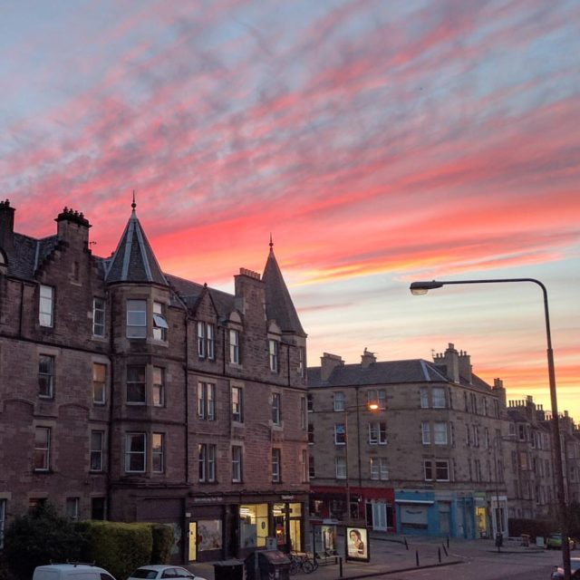

Pick a date, any date. I pick this one. A nice astronomical date. This is when the series of "marathons" begins.

### Summer Solstice 05:24 Wednesday 21st June 2017

I'm taking as my muse the Marathon Monks of Mount Hiei in Japan. I'm going to use some of their rituals to turn my journeys to and from work into a formal mindfulness practice of 100 and then up to 1,000 journeys. I'm not going to do what the monks do I'm creating an analogue of their practice. Here is my initial comparison based largely on [the Wikipedia page](https://en.wikipedia.org/wiki/Kaih%C5%8Dgy%C5%8D).

**Length of "Marathons":** For the first five years and half the seventh year the monks walk briskly 30 to 40km (18 to 25 miles) per day. In the last two years there are times when they double or nearly triple the distance. I'll be walking to work which is just under 5km (2.5ish miles depending on my route) from home then spending twenty minutes slow walking in my lunch hour and walking back by a different route. My marathons are therefore about 10km or 5-6 miles.  If I catch the bus one way then that day won't count! That is about a sixth of what the monks do. As neither I nor the monks do actual 26 miles 385 yards (42.195 km) Olympic marathons I should probably put the word marathon in quotes instead I take marathon in the sense of a long, arduous task e.g. Marathon Star Wars session.

**Frequency of Marathons:** The monks do blocks of 100 or 200 consecutive days of marathon and keep going no matter what. Then they break and go about regular monastic duties for the rest of the year. I'll be walking the majority of week days. The ones when I'm working and don't need to take my bicycle for speed. This should be around 200 times a year but we will see how it pans out.

**Number of Marathons**: Monks do 100 marathons initially then they can ask permission to continue for another 900, a total of 1,000. I'll do the same. I'm not sure who I'll ask permission from but at some point in mid winter I should hit my 100 mark and will decide whether to continue or not.

**Total Duration:** Monks have a strict seven year schedule. I think I'll do about 200 a year so may be complete in five years. If I haven't finished by my sixtieth birthday I'll consider it a failure (I'm 52).

\[caption id="attachment\_3477" align="aligncenter" width="747"\] Three Sisters "shrine" in George Square\[/caption\]

**Visiting Shrines:** There are 250 shrines on Mount Hiei that the monks visit and offer prayers to. There aren't quite that many shrines in Edinburgh but there are a number of points on my route where I will do a formal nature connection practice - the [Ten Breaths Practice](http://amzn.eu/4ghdE12). I'll write more on this as time passes.

**Formal Reporting:** Monks are under a lot of pressure because they have devotees following them and some level of fame if they get close to the goal. I imagine there is some ledger where they write down what they have done. In the documentary about them they talk of the time it takes to complete each walk. I'll use electronic gadgets some of the time but commit to a monthly blog post giving a progress report and any thoughts - so I don't lose count.

**Suicide on Failure:** Traditionally monks carry a rope and knife to kill themselves rather than fail. I'll not be doing that bit. I just commit to write a blog post about why its all become to much for me.

The monks have 1,000 years of tradition to draw on. I have a few scattered sources about what they do but am largely making up my own thing to help me develop in my practice. It will evolve but hope to stay true to the spirit of compassionate self development. If I lose that I'll quit.

### Marathon Monk Posts by Date

\[catlist name="project-marathon-monk" orderby="date" order="ASC" numberposts=100  \]
