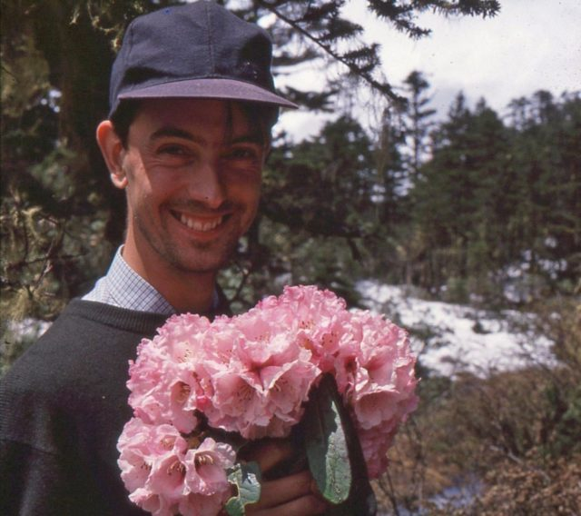
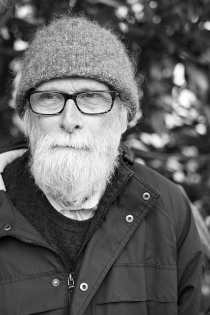
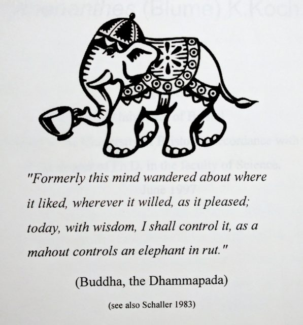
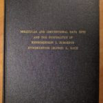

It was 20 years ago today, not that Sgt Pepper taught the band to play but that I submitted my PhD thesis. Of course that is not what they are talking about in the papers. [They are all talking about J.K. Rowling and a mildly successful tome _Harry Potter and the Philosopher’s Stone_](https://www.theguardian.com/books/2017/jun/26/twenty-years-of-harry-potter-the-20-things-we-have-learned)  that just happened to come out at the same time.

I've always had a thing about J.K. Not in the way you might think but in the fact that we live in parallel universes. We were born about 10 miles apart in the West of England and six months apart in that vintage year of 1965. My wife claims many greats were born in 1965 - in her case it was August.

\[caption id="attachment\_1924" align="alignright" width="249"\] Collecting Hairy Rhodies in China c.1995\[/caption\]

By the mid 1990s J.K. and I were both in Edinburgh working to complete our pet projects and frequenting the blooming coffee shops. My pet project was a PhD on the molecular phylogenetics of _Rhododendron_ subgenus _Hymenanthes_ (those are the hairy not scaly temperate ones). J.K. was finishing the first Harry Potter. Now I must dodge the tourists taking selfies outside the Elephant House cafe one of the "birthplaces" of Harry Potter. There is a big sign in the window proclaiming the fact but no mention of my PhD thesis even though my frontispiece credits them by stealing their logo.

We have never actually met but J.K. has always been there in the background like Jesus in the Life of Brian. I'm definitely Brian and J.K. is definitely Jesus in this metaphor.

\[caption id="attachment\_2746" align="alignright" width="149"\] David Chamberlain\[/caption\]

In the last twenty years I've had a series of jobs and am lucky enough to be back at the botanics on a persistent contract albeit with a 1% pay cap and not much chance of progression. J.K. has become a multi-millionaire. I'm not sure if she has found a religion but, as can be seen from the frontispiece, I was getting into Buddhism even back then. She wrote all those Harry Potter books. I read them. She invented Dumbledore. David Chamberlain supervised my PhD. She had kids at much the same ages as mine. Her kids go to some private school in Edinburgh, mine go to a good state school and like most kids in Edinburgh know someone who knows someone who is friends with J.K.'s kids.

I wonder what would have happened if we had chatted back in the 1990's. Would we have got on? One thing we probably would not have talked about is Scottish independence. Devolution was in the air but not a big issue. As liberal, educated types we'd have probably agreed it was a good idea on balance but it wouldn't have been a big thing. By 2014 J.K. was writing pieces in favour of the Union and I joined that SNP. We were diametrically opposed. If our places had been reversed would I have supported the Union and she joined the SNP? How much of our political position is determined by our situation. My family is very physically stuck to Scotland and Edinburgh. J.K. probably moves more internationally and could choose where to live.

Do I wish I'd written Harry Potter rather than a thesis read by about three people in all of history? Currently I enjoy walking across Edinburgh each day. I can sit in the cafés and watch the tourists and street people. I'm happy and free. J.K. can't do these things any more. She can do lots of other things I'll never get to do but are they worth the loss of simple pleasures? Of our two universes which is the magical one and which is the mundane?
