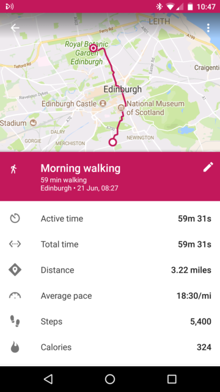

Having started on the Summer Solstice I'm going to blog each month to keep track of the progress. Sometimes this might just be posting a total of the days I've walked other times I'll reflect on how it is going.

I started by using Google Fit on my phone to deliberately measure the distance. I have it running all the time just for the interest of how many steps I'm taking with the phone in my pocket but for the first few days I tagged the walks as distinct activities to measure the distance and it appears I was wrong in my estimates. Each days walk is about 6 miles not 5. So I'm looking at a 6,000 miles of formal walking total not a 5,000 - but what is a grand here and there. This doesn't include the 20 minutes of slow walking at lunchtime.

I managed a marathon every working day to the end of June so 8 days, 48 miles to start us off.

Next month I'm on holiday for a week - walking in the Lake District so some lovely time for practice but not as part of the project.

### Marathon Monk Posts by Date

\[catlist name="project-marathon-monk" orderby="date" order="ASC" numberposts=100  \]
