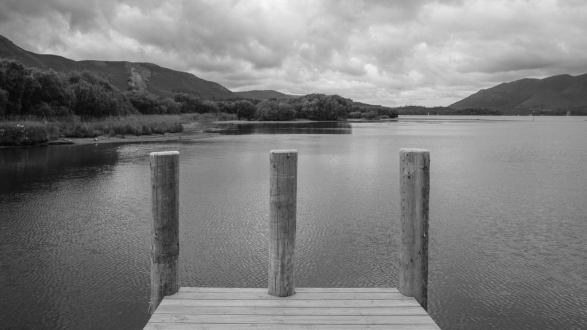
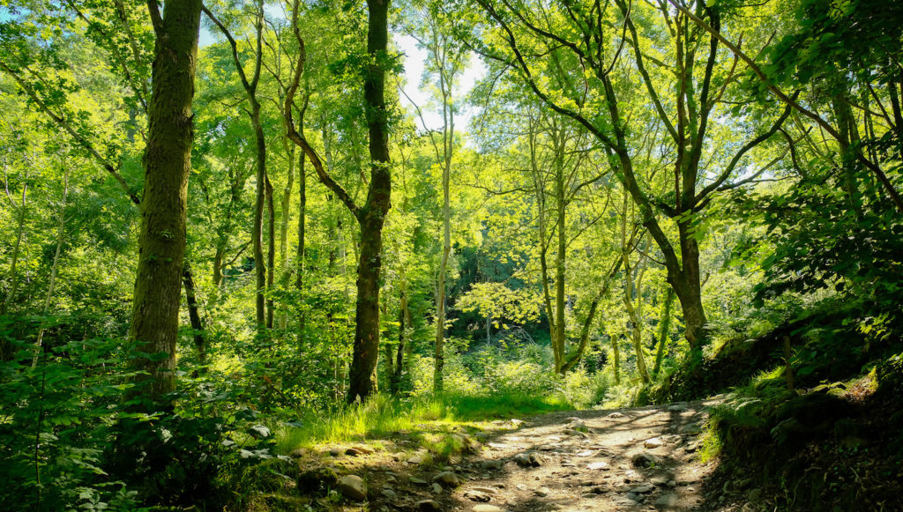

I often hear people say that there are too many people in the world or even that responsible “people” should have fewer children. There is never the opportunity to explain fully why this is such an inappropriate thing to say but now I've had a rainy day with no distractions I can share my explanation. It comes in four parts.

**Humanity.** Since the abolition of slavery it has been wrong to consider people goods and chattels - obviously it was wrong before then but it was legal. People are not products to be bought and sold. Once someone exists they can’t be counted or valued like other consumer products. A child is an equal human being. Whether they are first born or fourth born they have the same rights to love and respect. If we say it is wrong for a mother to have multiple children we are saying the n’th child is a product of a “crime” or at least an error of judgement. In some way they don’t have as much right to be here as the 1st child. This is wrong. Children happen. Educated, wealthy people can use contraception and termination to control the number of children they have but if they are coerced into that number they are not making a free choice. A woman’s right to choose goes both ways or it is no choice at all.  Having children is a biological  imperative like falling in love or feeling grief it is not a simple consumer choice like an organic cotton t-shirt vs a nylon hoody. Portraying it as such undermines both the parent’s and the child’s humanity.

\[caption id="attachment\_3533" align="aligncenter" width="747"\] "Paths are made by walking" - other people walking\[/caption\]

**Wealth & Power.** The birth rate is falling or below replacement level in all industrialised nations. There is no need to advocate that people in these countries cut the number of kids they are having as they have already done it. In fact the fastest way to cut the birthrate of a country is to educate women and increase living standards. So if you are white and/or rich (in global terms) and you say that “people” should have fewer children you really mean poor people of colour should have fewer children not people like you. This might feel a bit racist. Even if you are comfortable with saying that people in less developed countries should have fewer kids you have to admit that the best way to achieve this is not to tell them to have fewer kids (which is inhumane and doesn’t work) but to advocate for women’s empowerment.

**Gandhi.** I’m not talking about Gandhi’s attitude to sex here (which was a bit Victorian) but the rest of his lifestyle. If we all lived like Gandhi, in a commune with few possessions eating the simplest diet that could be locally produced and spinning our own yarn to make our own clothes the carrying capacity of the earth would be much higher than if we all lived like Donald Trump. The number of people the earth can support is n-billion multiplied by the lifestyle they live. Balance can be achieved by changing the population and/or the lifestyle. So when wealthy (and typically white) people like me say the earth needs fewer people what we mean is the earth needs fewer people to continue supporting our lifestyle i.e. the one we think is important. After all we are the ones with the money and power we must be right.

**Dodgy accounting.** I’ve got two kids. We stopped at two for many reasons. We were getting on. The house seemed full. It was bloody hard work. In developed countries we now have small families because, on average, we are well educated, rich and start later in life. The children are also extremely likely to survive to adulthood.  It is the norm. How is it possible for someone with 0, 1 or 2 kids to say they made that choice for environmental reasons when everyone else in their society is making exactly the same choice without thinking about the environment at all? A look at personal history helps. Most people can track their family trees to the 19th Century. How many siblings did your grand or great grandparents have? With each generation the number of siblings falls and it has nothing to do with people being environmentally aware so please don’t claim that you made your choice on this basis - you’d have had few or no kids anyway. It is just normal to have fewer kids these days. Often these claims are made to salve our consciences as if non-existent people in the future will somehow cancel out our present day debt to the planet. I can fly to the sun for a holiday because the child I didn’t have won’t be doing it. That child that wasn’t born isn’t inventing fusion energy either!

**In summary:**  We should work for a world where people feel so blessed in every other aspect of their lives they only need the blessing of (on average) one or two of their own children to feel fulfilled. We should not be telling other (usually poorer) people not to have kids or bragging about not having had kids we probably wouldn’t have had anyway.
