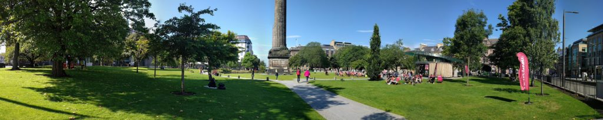
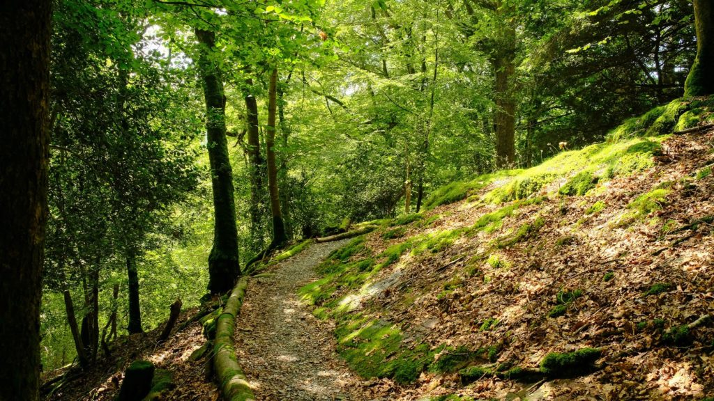
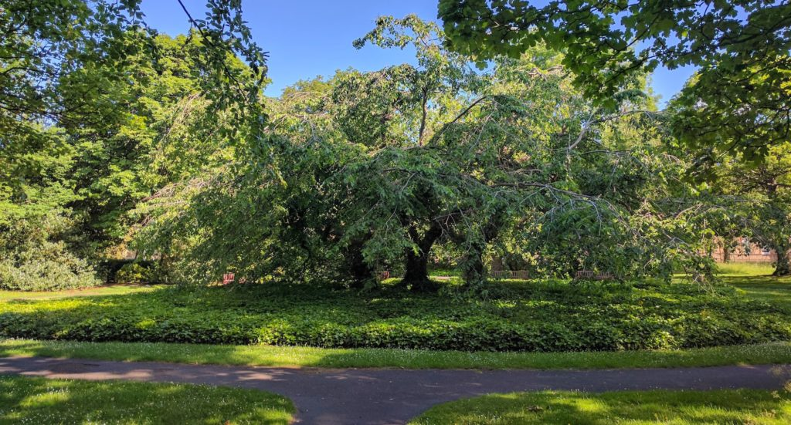
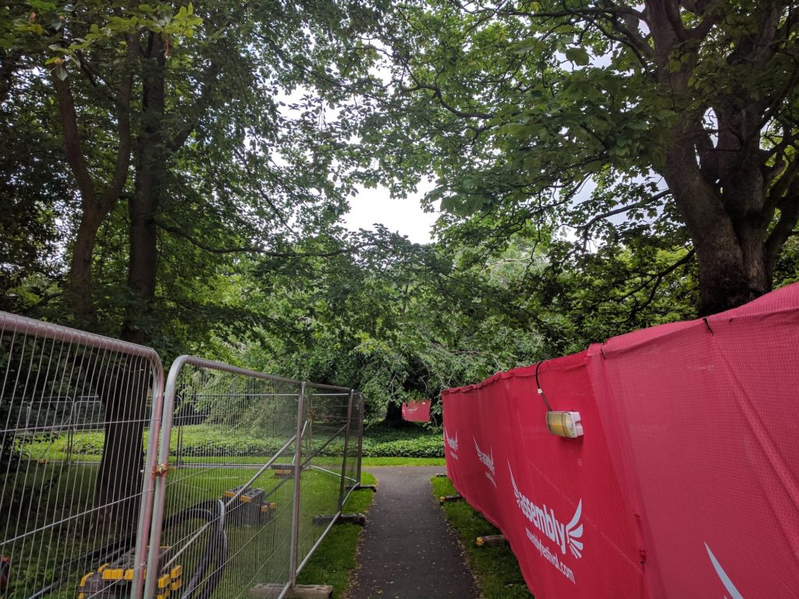
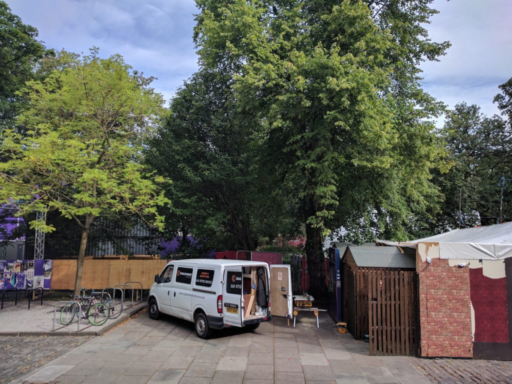
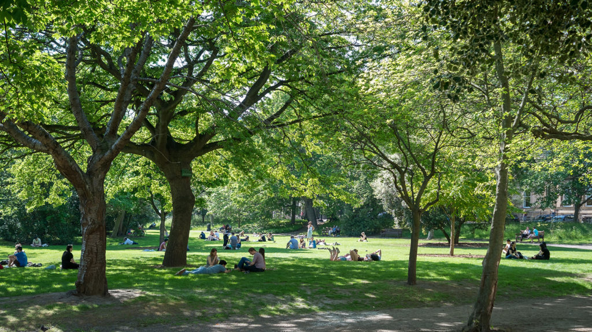

\[caption id="attachment\_3549" align="aligncenter" width="747"\] St Andrew's Square prior to festivals arriving\[/caption\]

I've completed the first full calendar month of walking with a break for a week in the English Lake district. I've walked 22 days since I started which is around 132 miles.

\[caption id="attachment\_3552" align="aligncenter" width="747"\] Path at National Trust property in the lakes - would be lovely to walk this every day.\[/caption\]

It feels like they are taking the town apart around me which increases my sense of solidity in a weird way. The Three Sisters shrine is now inaccessible. I do my practice standing outside the park.

\[caption id="attachment\_3477" align="aligncenter" width="747"\] The Three Sisters on a June morning\[/caption\]

\[caption id="attachment\_3550" align="aligncenter" width="747"\] The Assembly moves in on one side of George Square whilst the Underbelly is on the other.\[/caption\]

\[caption id="attachment\_3551" align="aligncenter" width="747"\] And the green space becomes inaccessible for the best part of two months.\[/caption\]

\[caption id="attachment\_3556" align="aligncenter" width="747"\] George Square in July. This has now been entirely paved and built on. The grass will die and be replaced. It will be mud for the rest of the summer.\[/caption\]

The cynical part of me thinks this is all just about selling more beer. The charitable part things of the culture and people interacting. But do we need more stand up comedians or more picnics?

### Marathon Monk Posts by Date

\[catlist name="project-marathon-monk" orderby="date" order="ASC" numberposts=100  \]
