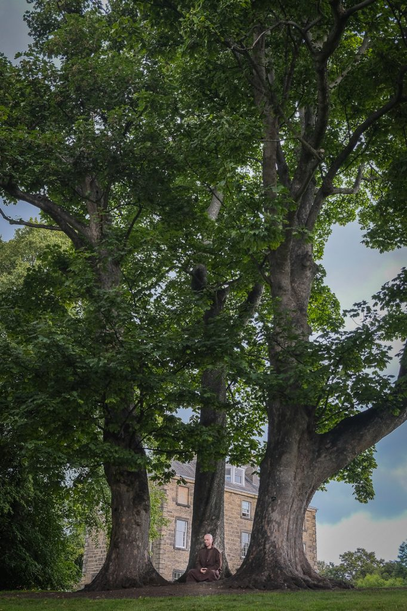

Quite a month for distractions both good and bad so I've only increased my total to **33 days** or about **198 miles** since starting on the summer solstice.

The month was always going to have the good distraction of a week in Stourbridge at the [Nourishing Happiness retreat](http://coiuk.org/events/miracle-of-mindfulness-nourishing-happiness-retreat-in-stourbridge/). Here I got to walk and practice each day but not in a way that counts towards my totals. After Stourbridge we had four monastics visiting to [give a public talk](https://wildgeesezen.org/2017/07/23/an-evening-for-the-miracle-of-mindfulness-nourishing-happiness/) on Wednesday 30th. Looking after the monastic brothers and sisters knocked another three days out of my walking schedule.

\[caption id="attachment\_3561" align="aligncenter" width="682"\] Brother Mountain chilling at the Botanics\[/caption\]

The unplanned distraction was a some dental work. I was getting pain in my teeth and had to have a wisdom tooth pulled. The following day I stayed in bed to look after my body as I was feeling rotten. Following one of Thich Nhat Hanh's classic teachings I am now enjoying my non-toothache. I wonder how long I'll remember how pleasant a neutral feeling is.

I was pleased to see that there was [no big festival event held in St Andrews square this year](http://www.scotsman.com/lifestyle/ban-on-st-andrew-square-festival-shows-for-fringe-s-70th-birthday-1-4356751).

On Monday 7th August I had another of the sights that seem to stick in my mind. Because of the crowds I vary my route and walk the road way up the Mound rather than up the [Playfair Steps](https://www.google.co.uk/maps/place/Playfair+Steps,+Edinburgh+EH2/@55.9504058,-3.1970705,17z/data=!3m1!4b1!4m5!3m4!1s0x4887c79088297f9f:0x122755b7956024bc!8m2!3d55.9504058!4d-3.1948818). Amongst the mayhem of the festival a taxi was stopped with the door open and a man was slumped inside looking, to my eyes, dead - but definitely unconscious. Two police motorcyclists had coned the taxi off. One policeman was talking to another passenger. One was on the radio. As I passed a paramedic motorcyclist turned up. The fact that no one was trying to revive or help the slumped passenger made me think they had given up on him but perhaps it was just severe heart burn and he is fine now.

This is the third of the little vignettes I have in my mind for this area of town over the last couple of years. There was the person lying in front of a bus by the old BHS shop, the person having CPR at the top of Playfair Steps and now the man in the taxi. I sometimes have the urge to sketch these little moments of stillness within the movement of the city.

September should be a more straight forward month for walking. There is the Project Soothe Exhibition launch but otherwise I'm working regular hours.

### Marathon Monk Posts by Date

\[catlist name="project-marathon-monk" orderby="date" order="ASC" numberposts=100  \]
