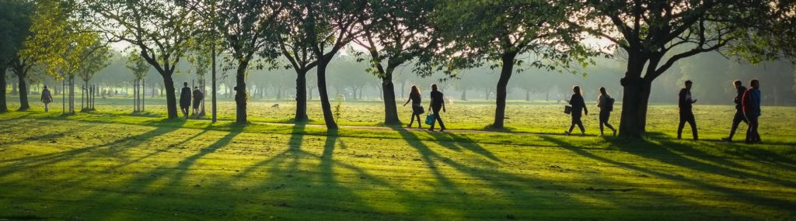
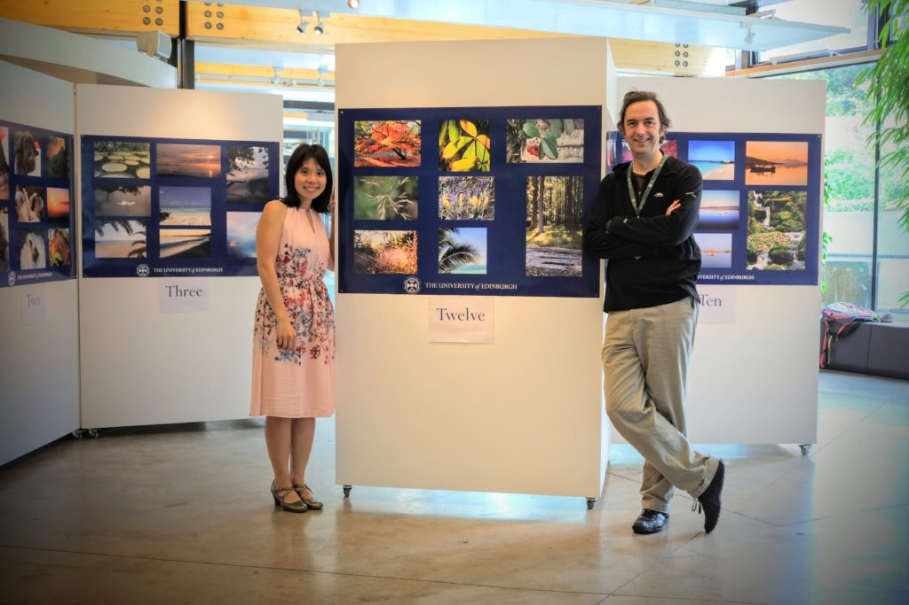
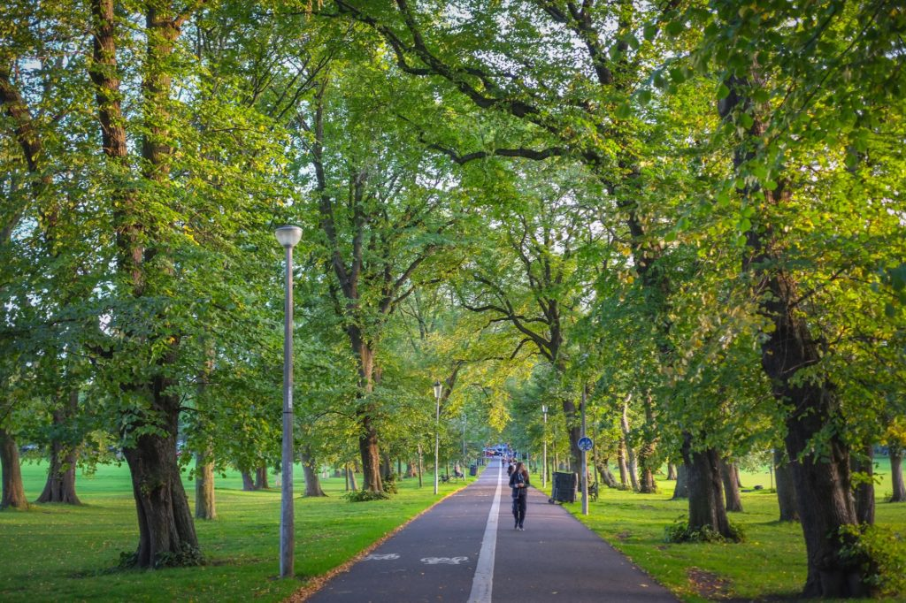

 

September has been a busy busy month with many distractions around running the [Project Soothe Exhibition](https://stories.rbge.org.uk/archives/26356). Rewarding but tiring. As I reached the end of the month the walking is getting to my physically an I miss a few days by jumping on the bus to get home.

\[caption id="attachment\_3571" align="aligncenter" width="747"\] With Stella Chan as we open Project Soothe Expo\[/caption\]

\[caption id="attachment\_3573" align="aligncenter" width="747"\] Middle Meadow walk is looking as stunning as ever.\[/caption\]

 

### Marathon Monk Posts by Date

\[catlist name="project-marathon-monk" orderby="date" order="ASC" numberposts=100  \]
