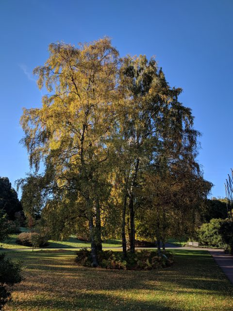
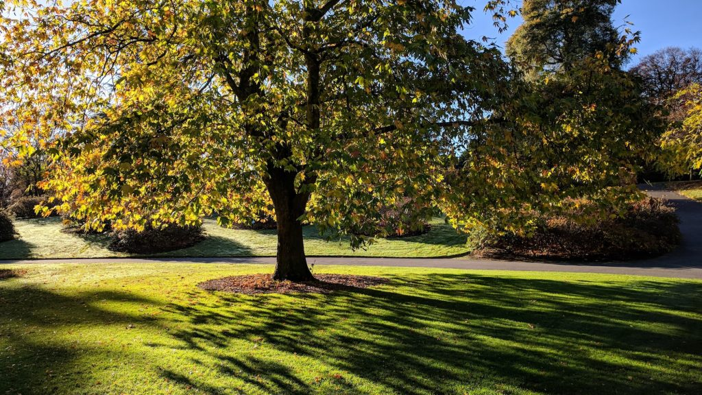
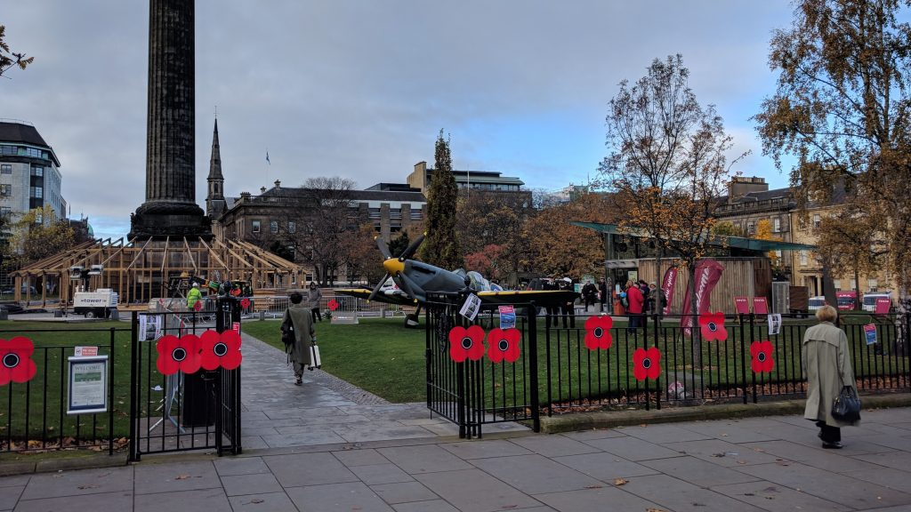

 

A bit of a wipeout month. The first few weeks I went down with a virus that made me very weak. I had my left parotid gland swell up like I had mumps. I had dreams of being a child again that I guess were linked to when I had mumps in the 1970s.  On several days I came into work but felt rubbish by the afternoon and limped home on the bus. Eventually I gave up and spent a few days just at home to get over it and by the middle of the month I was back to normal. If I were a real marathon monk I'd have maybe killed myself!

I still managed to walk in the garden each day I was at work. The autumn colours are stunning.

Meanwhile in St Andrews Square they started setting up the Christmas ice rink and at the beginning of November even had an army recruitment/remembrance event! One of my shrines almost lost. It will be good practice to try and see the trees for the beer bierkellers over the next few months.

 

 

### Marathon Monk Posts by Date

\[catlist name="project-marathon-monk" orderby="date" order="ASC" numberposts=100  \]
