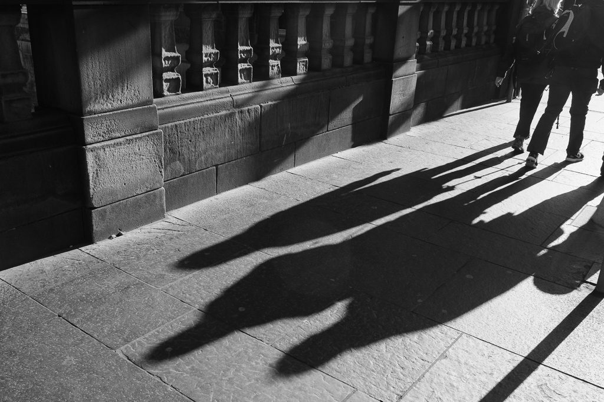
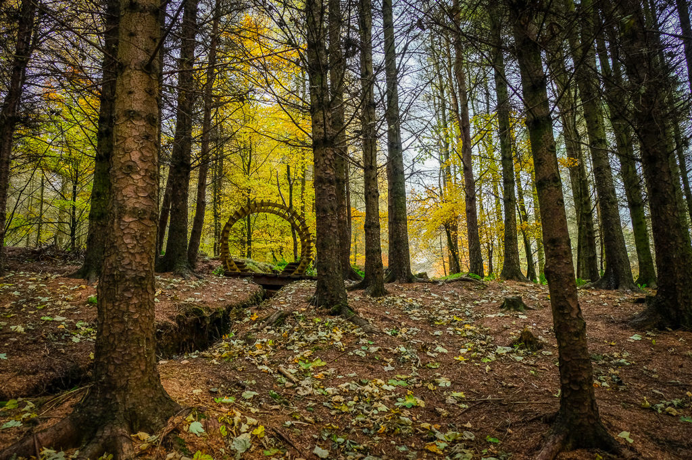
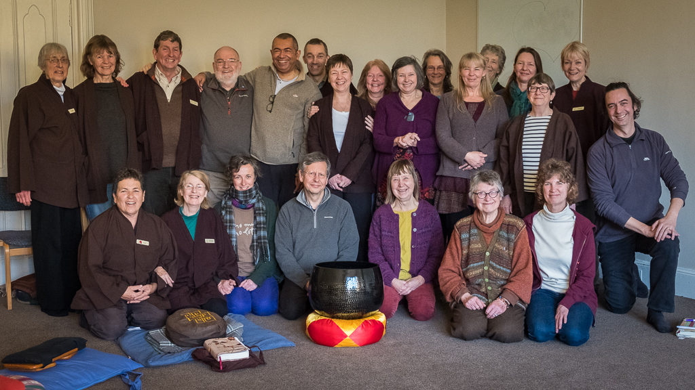
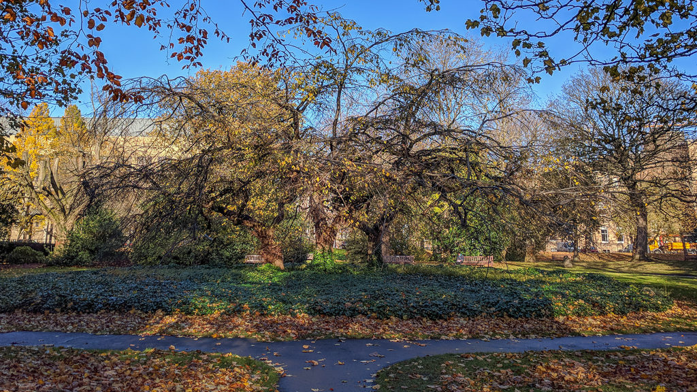
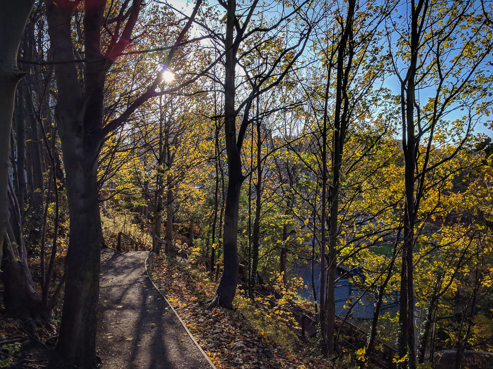
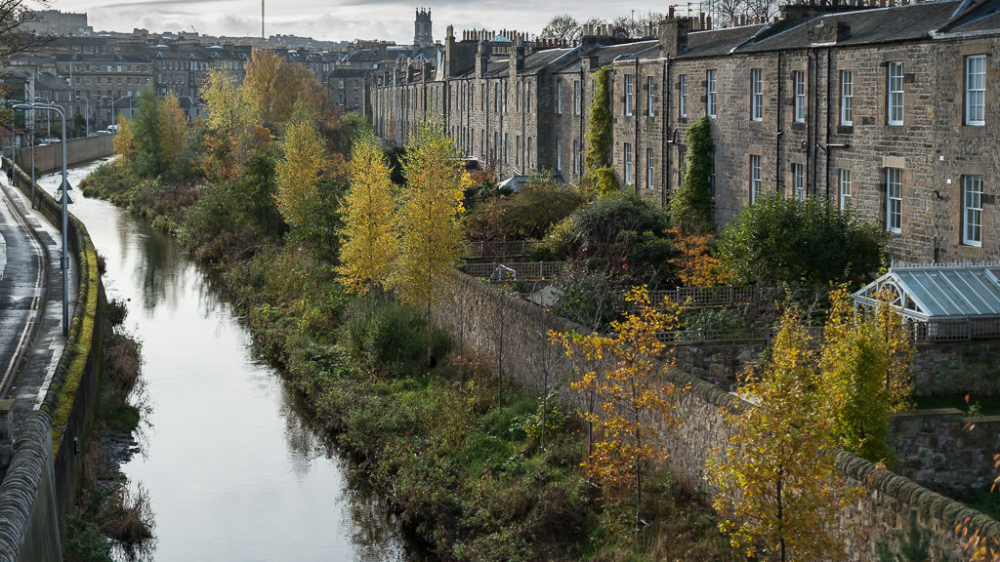
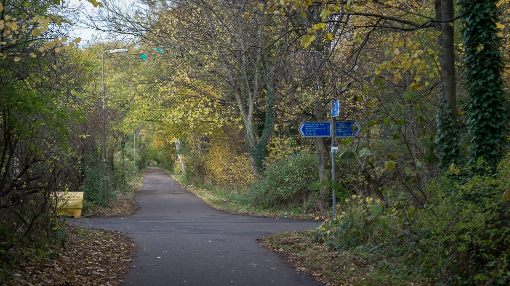

Not quite 500 miles. I had a slow week near the beginning with the virus still coming back occasionally but am now back to 100%. The stopping at shines seems to be taking a new form. I pause for longer waiting for the orange juice to clear as Thay would say. I don't count as much. The practice is changing me. Sometimes it feels like it I've been walking forever.

The projection for next month is I won't make the 100 walks and 600 miles by the Winter Solstice. If I do every week day it will be 93, or 99 if I do the weekends too. So near as damn it on target.

\[caption id="attachment\_3597" align="aligncenter" width="747"\] At the beginning of the month brother Stephen challenged me to do a black and white photo every day for a week.\[/caption\]

\[caption id="attachment\_3598" align="aligncenter" width="747"\] We had a weekend at Wiston Lodge\[/caption\]

\[caption id="attachment\_3600" align="aligncenter" width="747"\] It was an Order and Aspirant retreat lead by Dean and Susanne\[/caption\]

\[caption id="attachment\_3601" align="aligncenter" width="747"\] It was lovely to have access to the Three Sisters shrine again\[/caption\]

\[caption id="attachment\_3602" align="aligncenter" width="747"\] The light on the George V park shine was fantastic - all the leave are gone now though\[/caption\]

\[caption id="attachment\_3595" align="aligncenter" width="747"\] Water of Leith view is always changing.\[/caption\]

\[caption id="attachment\_3596" align="aligncenter" width="747"\] Where I turn off the cycle path\[/caption\]

### Marathon Monk Posts by Date

\[catlist name="project-marathon-monk" orderby="date" order="ASC" numberposts=100  \]
