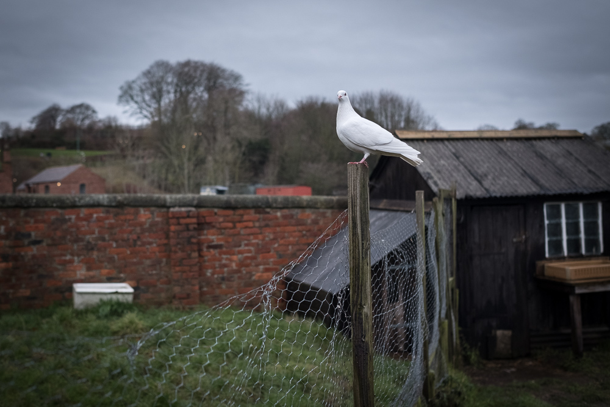
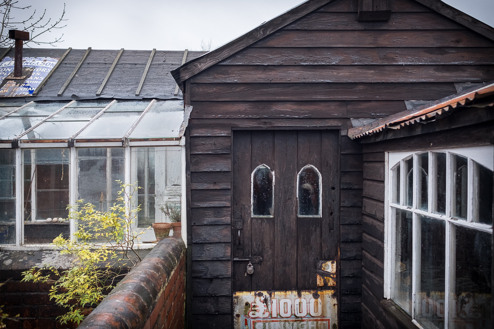

I was really losing it at work in the run up to Christmas. No motivation, just staring at the screen or surfing the web. I have a load of leave to use up and a colleague said "Just go now" so I jacked in 2017 on Wednesday 18th December and will go back to work (and to being a marathon monk) on Monday, January 8th 2018.

\[caption id="attachment\_3612" align="aligncenter" width="1000"\] Dove at Beamish outdoor museum\[/caption\]

My impression from the last few weeks has been a change in stopping at the shrines. I'm now going completely blank when I stop with no impulse to return to walking. I simply stand there like I'm growing roots and eventually remember to count my breaths or stir back into the action of walking. Maybe this is just feeling tired. It will be interesting to see if it continues when I return to work or if it moves on to something else.

I see this pattern of **Ritual** leading to **Routine** to **Habit**. If all that we are is a bundle of habit energies then it is a route to transformation. Change yourself by adding positive habits. Firstly ritualise what you need to do - bells, smells and bowing if need be. Make it a routine. Eventually it will be habitual. Repeat to keep the rituals in your life fresh. Linking each ritual to a habit that it is designed to implant.

\[caption id="attachment\_3613" align="aligncenter" width="1000"\] Doors and glasshouses that remind me of my grandfather - at Beamish Museum\[/caption\]

 

### Marathon Monk Posts by Date

\[catlist name="project-marathon-monk" orderby="date" order="ASC" numberposts=100  \]
