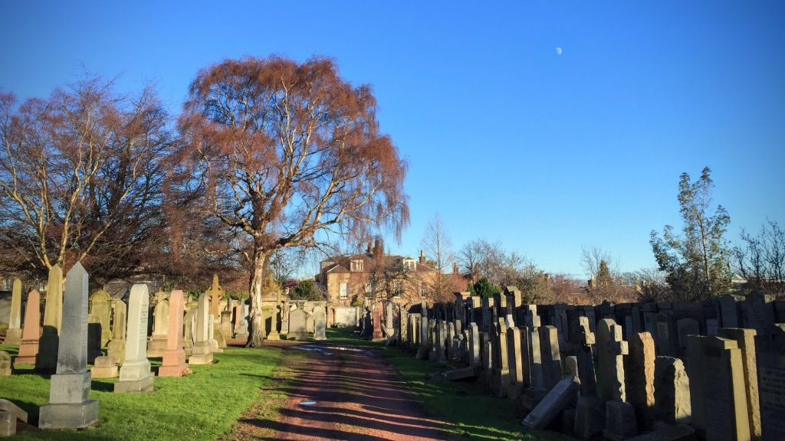
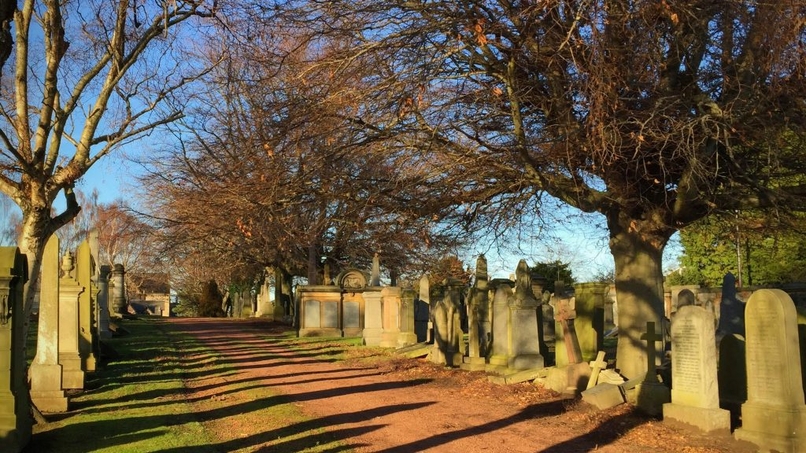

\[caption id="attachment\_3619" align="aligncenter" width="747"\] Grange Cemetery\[/caption\]

Another short month as far as marathon monking is concerned. After the Christmas and New Year break took a chunk off the start of the month I got the call to go into the Edinburgh Royal Infirmary and have my inguinal hernias fixed. This had been looming for nine months. It was an elective surgery to something that wasn't causing me pain but may have got bad in the future. NHS Scotland treatment was wonderful. It is usually done as a day surgery but I was slow to come out of the general anaesthetic so stayed overnight. I had a week moping around the house but not in any pain. Eventually I started working at home and taking  my mindful lunchtime walks in Grange Cemetery that is just around the corner. I was basically 100% back to normal in less than two weeks - but without the lump!

Next month will be more walking. I missed it.

### Marathon Monk Posts by Date

\[catlist name="project-marathon-monk" orderby="date" order="ASC" numberposts=100  \]
