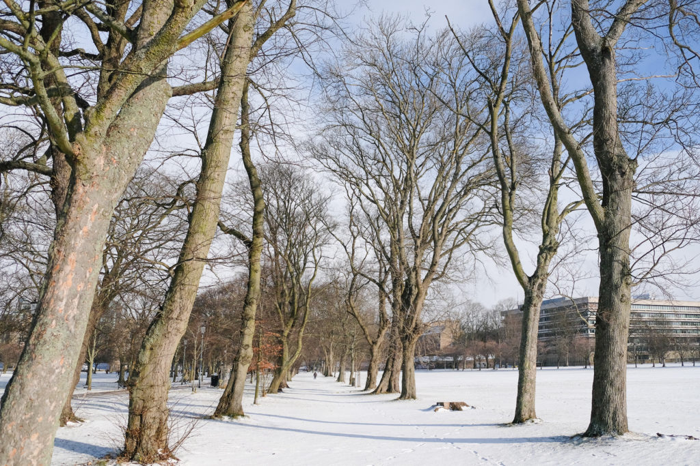
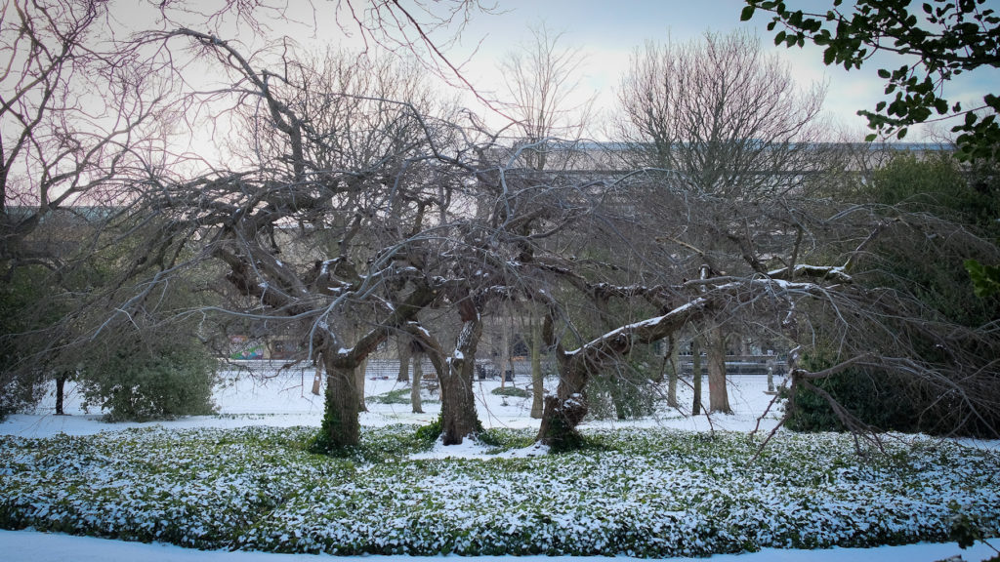
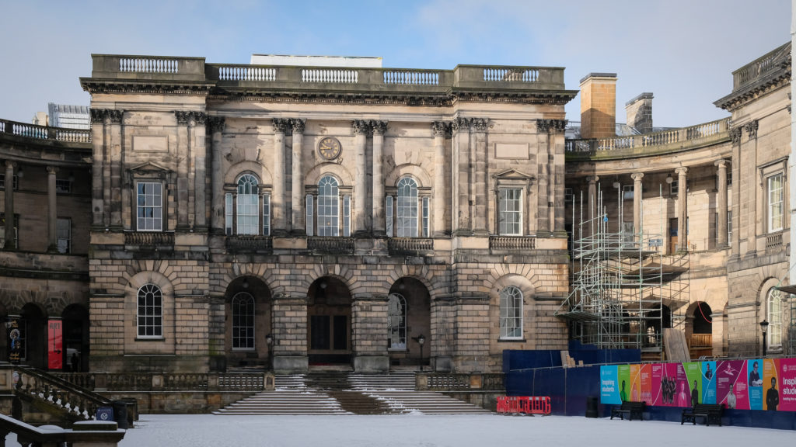
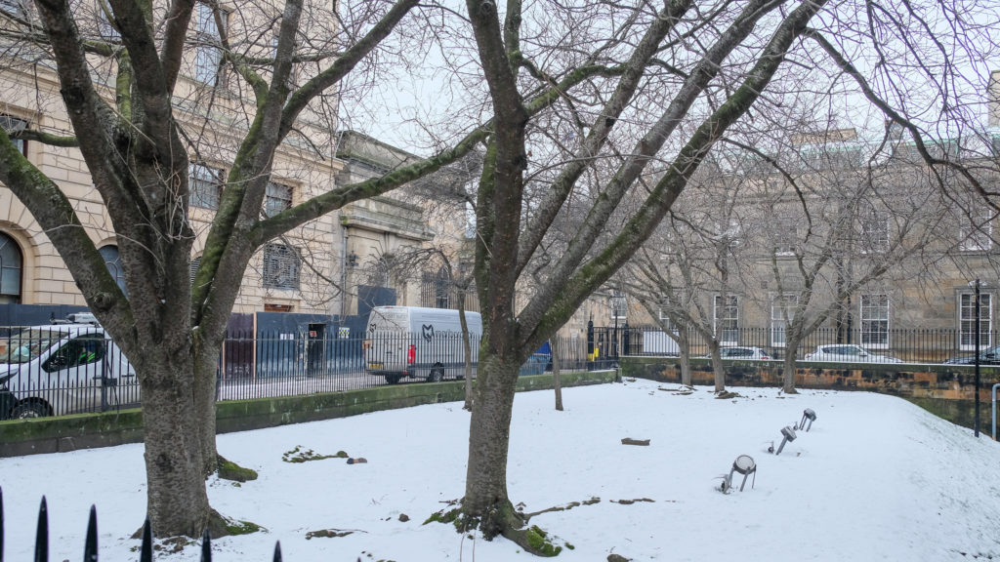
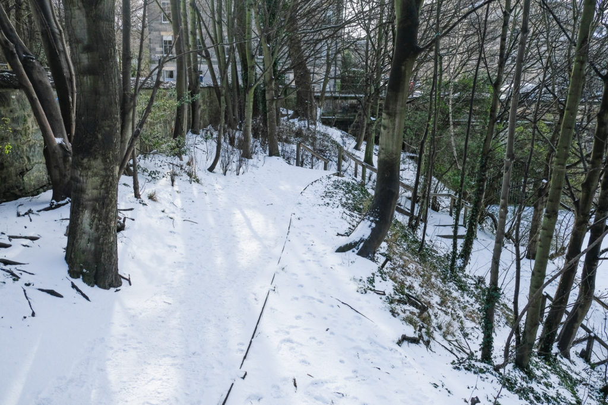
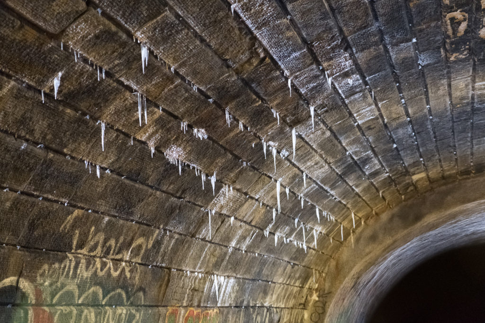
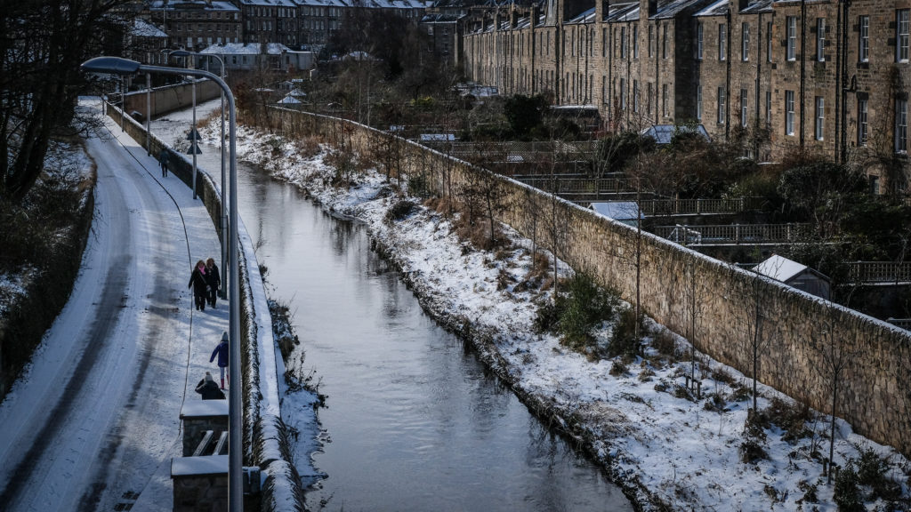
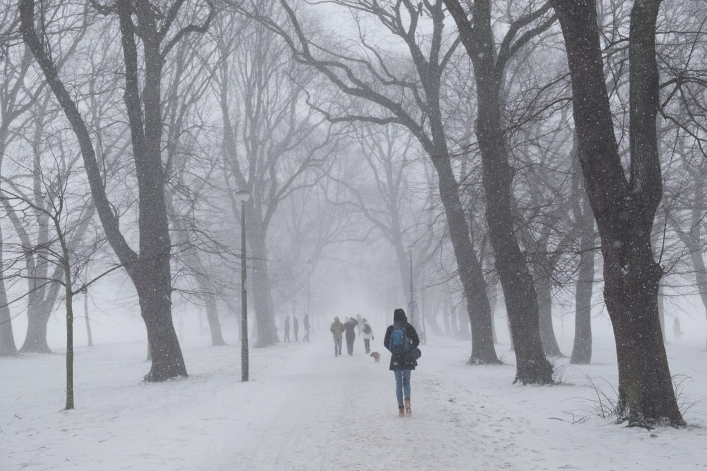

\[caption id="attachment\_3633" align="aligncenter" width="747"\] Meadows Shrine\[/caption\]

On Tuesday 6th February I passed the 100 walks mark when, if I was a real Japanese Marathon Monk, I would have asked formal permission to continue. I thought about marking the day in some special day but in the end it was just a normal walk. Perhaps I'll do more of a celebration when I pass the thousand miles in early summer.

Wednesday 28th was my 53rd birthday and also the day that the "Beast from the East" weather system arrived. I decided to mark it with a photo of each of the shines on the way to work but missed St Andrews Square. Since then the snow has got a lot deeper. I'm looking forward to the walk today (1st March) with about 15cm of snow.

\[caption id="attachment\_3632" align="aligncenter" width="747"\] Three sisters shrine in George Square\[/caption\]

\[caption id="attachment\_3628" align="aligncenter" width="747"\] War Memorial Shrine in Old College\[/caption\]

\[caption id="attachment\_3629" align="aligncenter" width="747"\] New Registry House Shrine - perpetually a building site\[/caption\]

\[caption id="attachment\_3630" align="aligncenter" width="747"\] George V Park Shrine\[/caption\]

\[caption id="attachment\_3636" align="aligncenter" width="747"\] Icicles in the old railway tunnel\[/caption\]

\[caption id="attachment\_3631" align="aligncenter" width="747"\] Water of Leith Shrine\[/caption\]

\[caption id="attachment\_3635" align="aligncenter" width="747"\] Coming home when the beast had arrived!\[/caption\]

### Marathon Monk Posts by Date

\[catlist name="project-marathon-monk" orderby="date" order="ASC" numberposts=100  \]
