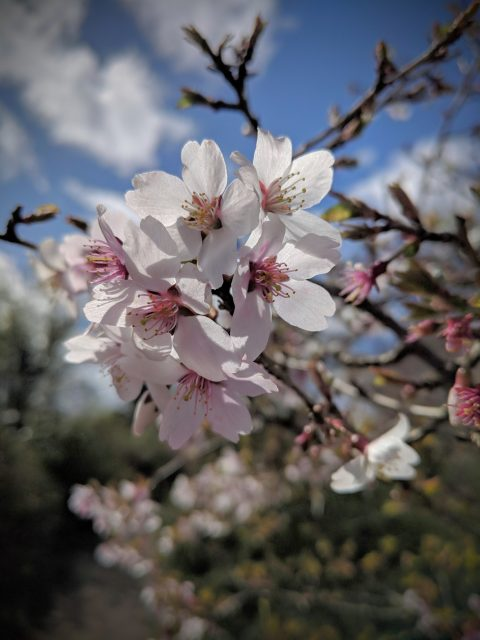
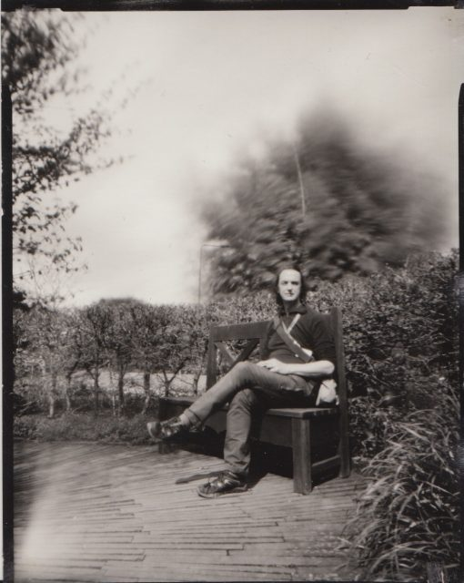
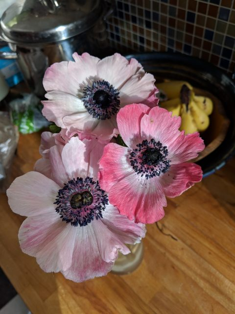

Why bark if you have a dog? We need to be reminded to let someone else take over and do a job rather than doing everything ourselves. But sometimes it isn't the right thing to do and we should get our hands dirty.

I like making images and it has become so easy today that we can all produce beautiful pictures in a matter of seconds, share them with the world and archive them for free. The image of the blossom below took me about ten seconds to make with my Pixel 2 Phone camera. I was actually on my lunchtime mindful walk! This was a brief distraction I should have resisted.

If I had made a similar image in the way I worked 30 years ago, using Fujifilm Velvia on 35mm, I'd have been over the moon. It would have taken me twenty minutes to set up. I'd probably have had to clamp the branch to stop it moving in the wind and used a reflector to reduce the contrast. I'd have spent hard earned cash and waited for development then I'd have had a single, hard to share, object. But today making the image leaves me feeling hollow.

I used to think that the hollow feeling I was getting came from the fact that it was "too easy" but I don't think that is the issue. Exercising a skill, when one is in flow, feels easy anyway, even if the task is complex. We don't dislike riding a bike because it easy.

A few weeks ago I had an exchange with a guy who talked about using analogue tape for recording dialogue. In reply I said that I occasionally thought of using film again but if I waited the urge soon passed. Digital photography has been technically "better" as a medium for over a decade now. If one wants the feel of film one can imitate it with digital to a level that many wouldn't spot - and do so much more and be so much more expressive in many ways.

But that exchange must have planted a seed because I developed a powerful urge to fish out an old Schneider Angulon 90mm, large format lens I had in my "Camera Museum" storage box - something put away to show the grandchildren one day. Before long I was manically trawling ebay and building myself a camera. The urge hadn't passed this time and today I think I know why.

I like making images but I've got myself in a situation where I have outsourced 90% or more of that process to Google and Fujifilm. They do their bit really, really well and they do leave me to work on important bits of the process, like I'm the director of a film, but it is as if the computers in my camera and phone are stealing a lot of the fun I should be having.

There is a cooking analogy. You may love cooking and find that by buying in certain ingredients you can make more and more delicious meals. Eventually you can just eat out all the time and it is a matter of simply selecting the right items from the menu to create a wonderful evening. One day you might wake up and think "I actually enjoy chopping my own carrots even if the resulting meal isn't so tasty - even if what I produce is occasionally inedible!" It doesn't mean you would never eat out again but it is the calling to go back and do what you enjoy because it is the **process** that is rewarding not the result.

Is this a common theme in our modern lives? Might it be that it is not our jobs that the robots will take but our truly fulfilling pleasures?

\[caption id="attachment\_3667" align="aligncenter" width="510"\] Pinhole self portrait. 4 minute exposure on windy day on Harman Direct Positive Paper in camera of duct tape, foam core board and a piece of Pepsi Max drinks can\[/caption\]

Of course I'm not letting go of digital. This is a photo in the kitchen this morning whilst I was waiting for the kettle to boil. Just sometimes one has to chop ones own carrots.

