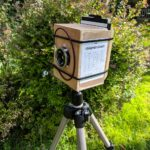
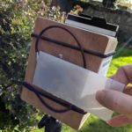
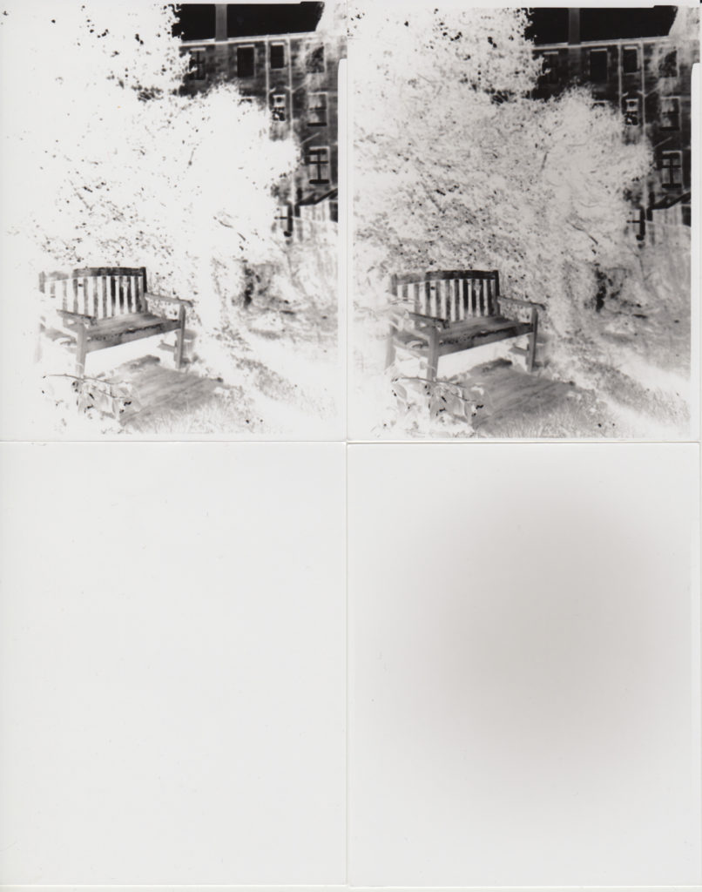
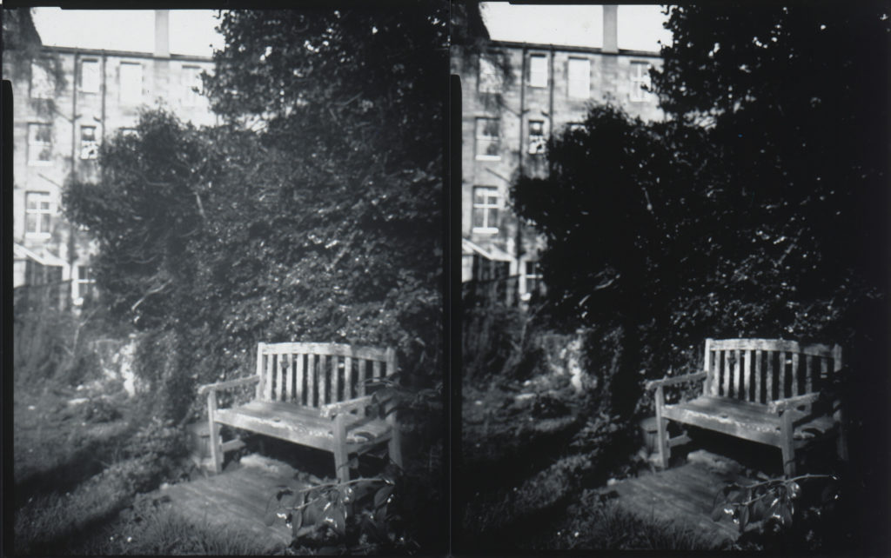
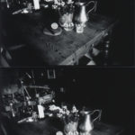
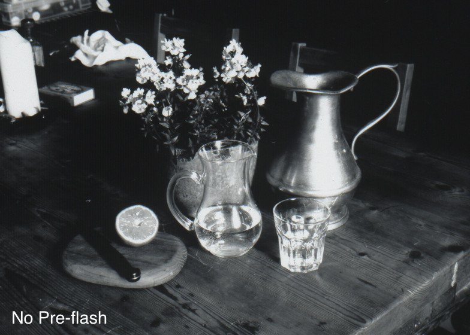
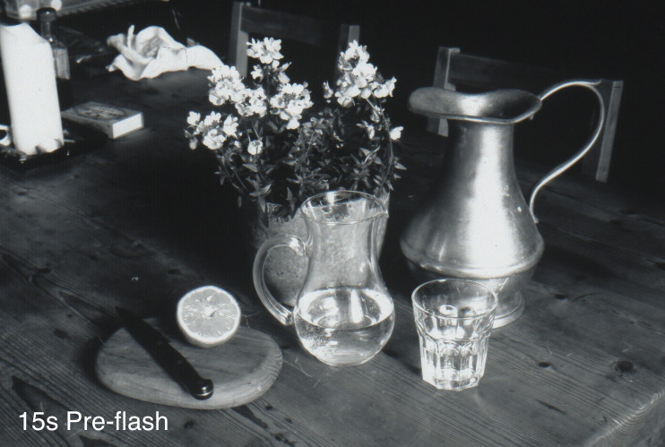
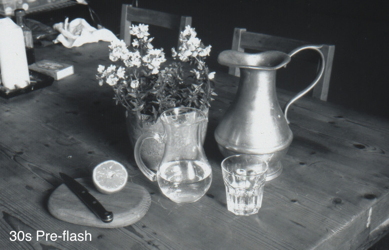

I don't have access to a darkroom at home so pre-flashing paper negatives to reduce contrast is difficult. I wondered whether using a piece of opal perspex and flashing in camera would help. These are notes on the tests I've done.

I'm using _The Anticipation Camera._ I have an _[Intrepid 4x5](https://intrepidcamera.co.uk/)_ camera on order but the lead time is 8-10 weeks and, having assembled all the other 4x5 paraphernalia, I want to start playing so I'll be able to hit the ground running when my Intrepid arrives in June.

_The Anticipation_ is a fixed focus box camera with a Angulon 90mm. I intended to have it focus at 2m so I'd hit the hyperfocal distance at f16 to f22 but partially through the level of my wood working skills and partially through not calculating where the nodal point of the lens is I ended up with a camera focused at about 1m. It means I can do landscapes at f45 - kind of one up on a pinhole. I discovered this using a focusing screen made from a sanded IKEA perspex picture frame. It explains why some of these tests are well out of focus - I didn't want to shoot everything at f45.

## Test 1: Garden Bench

I started in the garden with a scene including bright sunlight and some deep shadow. I metered the scene through the opal to get a Zone V (ISO 12) exposure of a complete sheet (f11, 1/4 sec) then I closed it down three stops to Zone II (f45, 1/4 sec) for a second sheet. Then I exposed the scene without pre-flash placing the shadow under the bench on Zone II which made the buildings in the sun fall on Zone VIII then again with a pre-flash.

\[caption id="attachment\_3678" align="aligncenter" width="806"\] Bottom left pre-flash Zone II. Bottom right pre-flash Zone V. Top left no pre-flash. Top right pre-flashed.\[/caption\]

By eye I couldn't see any tone in the brief pre-flashed sheet. The longer pre-flash was off-white but didn't look uneven as it does in the scan. Clearly the pre-flashed scene is way better than the non-pre-flashed.

\[caption id="attachment\_3679" align="aligncenter" width="1024"\] Left pre-flashed. Right not pre-flashed. Note focus OK for branch bottom right!\[/caption\]

Looking at the results I wonder whether I remembered to stop down for the pre-flash of the scene.

## Test 2: Still Life

\[caption id="attachment\_3685" align="alignright" width="150"\] No pre-flash & 7s pre-flash. Uncropped.\[/caption\]

I set up a still life on kitchen table. Placing the table, just in front of the jug, on Zone V (ISO 12) f22, 30s. I made four exposures:

1. No pre-flash - just the 30s exposure
2. 7s pre-flash through opal
3. 15s pre-flash through opal
4. 30s pre-flash through opal

Images below are crops.

 

## Conclusions

Using opal perspex filter for pre-flashing in camera is probably a viable approach and I'll try it some more with different scenes. The flash won't be totally even but it will be better than nothing. If I stop down one stop from the intended scene exposure and put the opal(which is about a stop dimmer again) in front of the lens it gives a Zone III ish flash. This seems high but looks like a good starting point. I can't rate the paper any slower than ISO 12 because the highlights are already blown.

Next I might try a similar approach with some Harman Direct Positive Paper.
