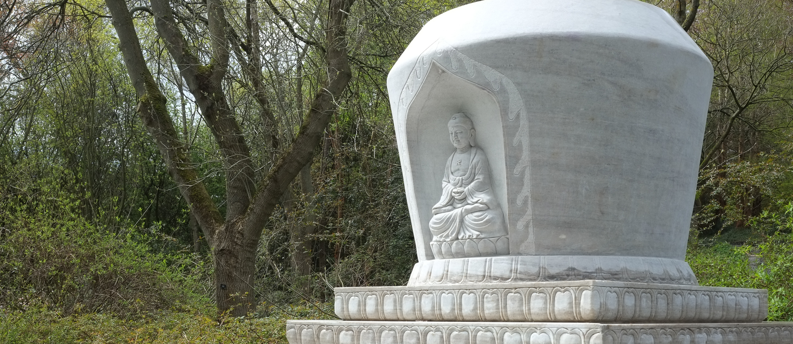
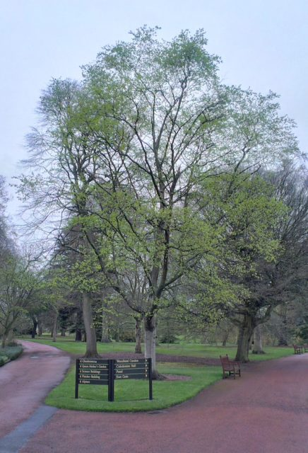
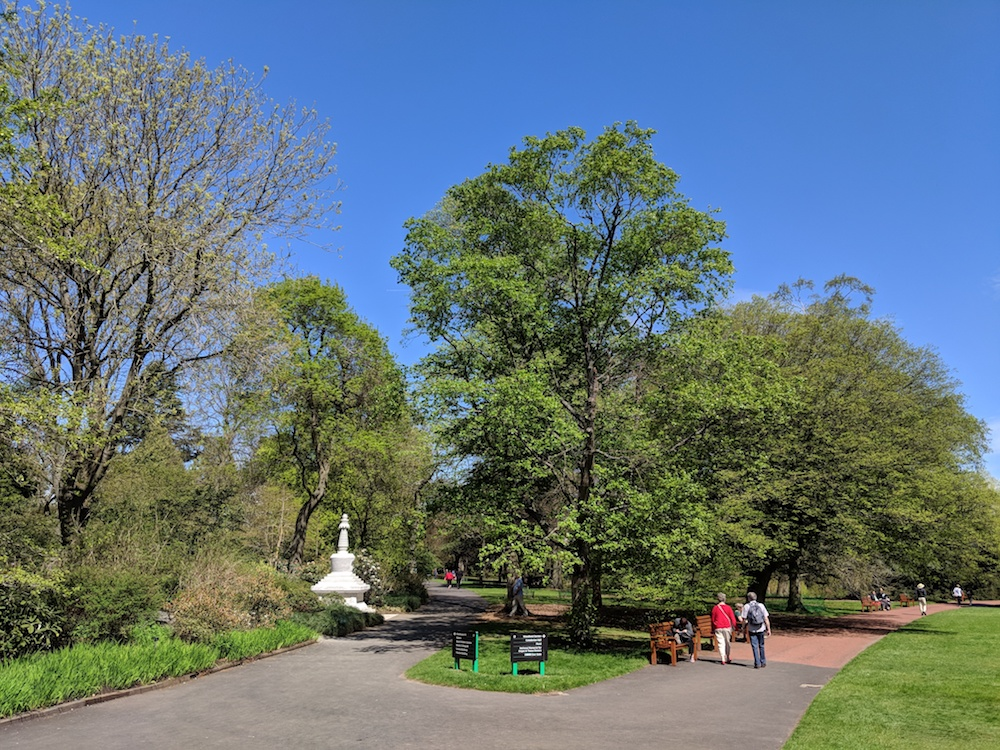

\[caption id="attachment\_3715" align="alignright" width="167"\] Photo used to show tree where I'd start walks taken on 5th May 2013\[/caption\]

Five years ago I made a commitment to do a 20 minute mindfulness walk ever day during my lunch hour at the Botanics. I put [a blog post on the Wild Geese website](https://wildgeesezen.org/2013/05/07/mindfulness-walks-thebotanics-experimental/) inviting people to join me and occasionally they have. I've managed to stick with it through all weathers although I don't always walk at exactly 1pm as I did at the beginning. I guess that I have now walked the same route a thousand times. The daily routine lead to the development of the whole Marathon Monk project and forms a big part of it now.

Back in March this year I noticed that the horticultural team had cleared a patch of ground near where I start the walk. Apparently they were going to erect a "sculpture" donated by the local Chinese community. It would be marble, 4.5m high and weigh 13 tonnes. I asked about it in the estates department and they showed me a picture of a Buddhist stupa!

At the beginning I'd thought that if I consistently practiced in one spot it would set up a kind of positive energy and maybe people would gravitate to that spot as a nice place to relax but this was a fanciful thought not a motivation. I'm a scientist after all. I chose the Chinese Hillside because it is a sheltered spot away from roads and has a bit of a Zen feel. If someone was going to build a stupa the chances they would build it where I was walking were higher than elsewhere. My science brain says the serendipity dice were loaded but it still freaks me out. Could my circumambulation cause a stupa to manifest?

\[caption id="attachment\_3716" align="alignnone" width="1000"\] Stupa appears next to "my" starting tree April 2018\[/caption\]

Adding to the freaky feeling is that Ani Lodro Maverika, a former Tibetan nun who lived next door to the Botanics and was very important to deepening my practice, used to complain about the spot I had chosen to start my walks. She said nobody would ever find it and that I should choose somewhere with a landmark. She died in 2015. I can't help but feel the stupa is part of her continuation.

I'm sure it is all just coincidence -

I'm grateful to the Chinese community for supporting my practice - even though they probably don't realise they are doing it. The stupa, and a new ting, were dedicated on 28th April 2018.

\[catlist name="project-marathon-monk" orderby="date" order="ASC" numberposts=100  \]
