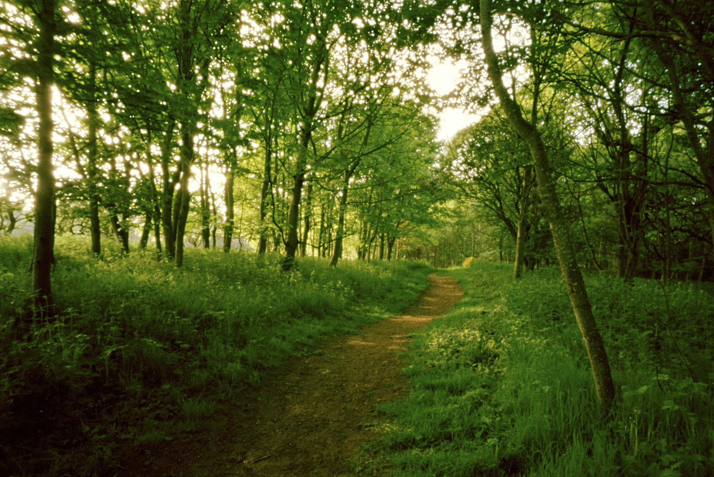

May is the month that I lead the Two Feet, One Mind walking workshops in the Botanics so, strangely, I do a few less marathon monk days. The workshops are for two hours, 6-8pm, and it is just too much to walk there and back as well as a days work so I go on my bike.

It has been a beautiful month. The trees and birds have been very welcoming. At home I've been getting my photographic mojo back and messing with pinhole photography (see above).

Next month I'll complete the first year of the project. It doesn't look like I'll have made either 200 days or 1,000 miles which was my projection for the year - but it is what it is and I can live with that. I'll be close though. If nothing unexpected happens I should pass the 1,000 mile mark before the end of June.

\[catlist name="project-marathon-monk" orderby="date" order="ASC" numberposts=100  \]
