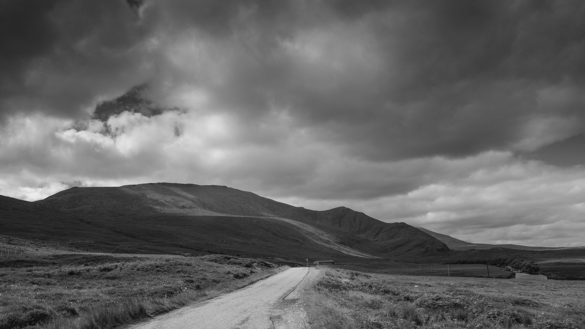

A year on the road. Not the road in the picture. That is the A383 in the Highlands.

It has been a time of reflection. The summer solstice on the 21st June marked the first year of this [Marathon Monk](http://www.hyam.net/blog/archives/3475) project and I was hoping to have completed 200 days and over a thousand miles by then. I missed both. Looking at why I didn't walk on quite as many days as I had hoped it comes down mainly to health issues. I lost fifteen days for my hernia operation and recovery. I also lost days where I was knocked out by viruses of various kinds and in the last month had toothache leading to root canal work. In addition to this I had to use an extra ten days of holidays because they changed our holiday system.

By mid June I was actually pretty depressed. Completing a standard on-line test one afternoon gave me a "moderately depressed" score and a suggestion I go and see my GP. I went to a cafe and had a slice of cake in stead! Yes I know I shouldn't bury my suffering with consumption... Doing the walks whilst in a low state was revealing. My mind would churn quite slowly and in negative ways and when I stopped at shrines I'd just be blank. The contrast with the lighter feeling I normally have was dramatic but there was also a strong desire to carry on with the routine. I never felt repulsed by the project as I was by most other things.

After a glorious sunny week camping in the Highlands with family and without midges I'm feeling much better and passed the 1,000 mile mark on my first day back at work (Monday 9th July) without realising it.

Looking to the next year I think I need to focus on my physical health. At the current rate it will take me another fiver years to complete the 1,000 walks and I'm not getting any younger. I need to look to my diet. On the solstice I was just in the overweight category with a BMI of 25.5 at 14 st 3 lbs (that is 199 lbs or 90 kg in new money) and believe me very little of that is muscle. So I'll add a little of my dietary thoughts and weight to my monthly reports form now on.

\[catlist name="project-marathon-monk" orderby="date" order="ASC" numberposts=100  \]
