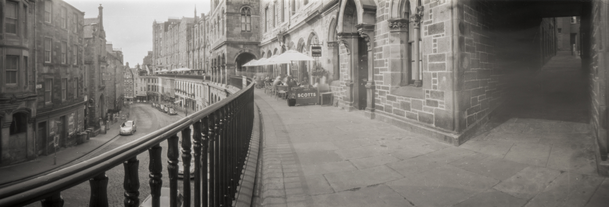
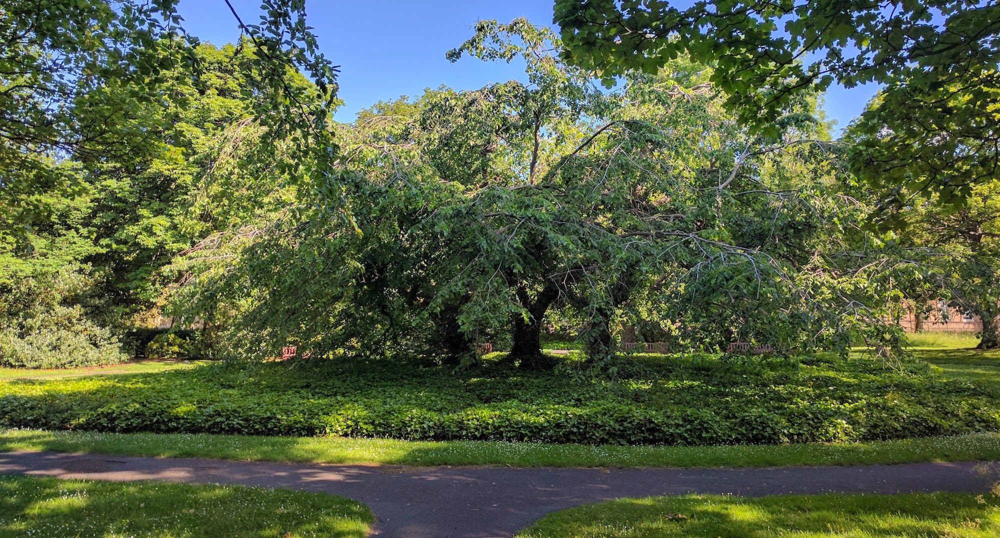
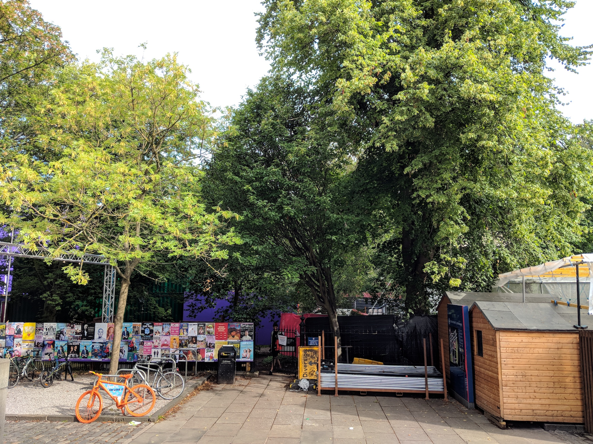

\[caption id="attachment\_3740" align="aligncenter" width="3000"\] Panoramic pinhole photo. Stuff that looks like smoke is tourists.\[/caption\]

Much more upbeat in July. Walks have been really regular and been feeling good again. First time back at yoga on 31st.

I weigh 1lb more than last month @ 14st 4lb (90.7kg). I've noticed that I have nearly exactly the same attitude to a tub of ice-cream or packet of biscuits that I used to have to a bottle of wine. Once it is opened I have to finish it. The compulsion is very strong. The only answer is to easy off these things entirely - not to pop open the tub of ice-cream in the first place. It took a year for the booze. I started in the summer with that too. Here goes.

My usual Three Sisters shrine is not accessible now. It has become a fire escape for two festival venues. The garden is filled with port-a-loos and beer kegs.

\[caption id="attachment\_3477" align="aligncenter" width="2000"\] Three Sisters in summer\[/caption\]

\[caption id="attachment\_3741" align="aligncenter" width="2000"\] Beer/Fringe festival\[/caption\]

 

\[catlist name="project-marathon-monk" orderby="date" order="ASC" numberposts=100  \]
