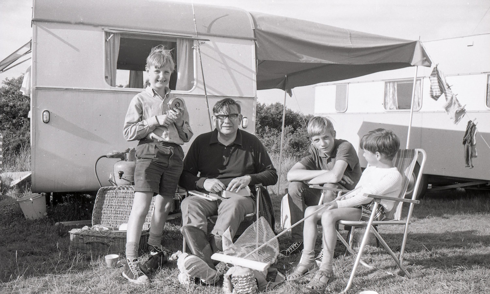
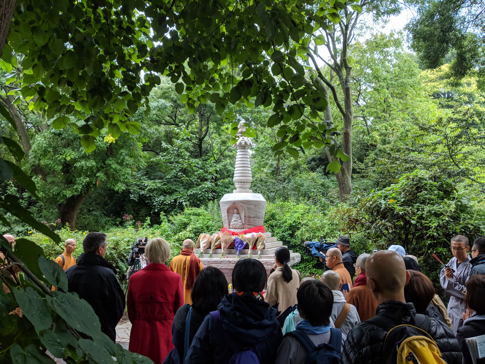

Not sure what to say this month. Not quite to 200 days - although I am on the 200th as I type. Here are two photos.

\[caption id="attachment\_3747" align="aligncenter" width="3000"\] My father, two older brothers and me circa 1970. It's one of those photos from the album that just carries meaning for me.\[/caption\]

\[caption id="attachment\_3748" align="aligncenter" width="2000"\] Blessing of the stupa in the gardens. A load of guys, from Taiwan I think, investing meaning in the stupa - official meaning that is. When I told a young guy I circumambulated the spot before the stupa manifested he said it would bring me luck to do it now.\[/caption\]

\[catlist name="project-marathon-monk" orderby="date" order="ASC" numberposts=100  \]
