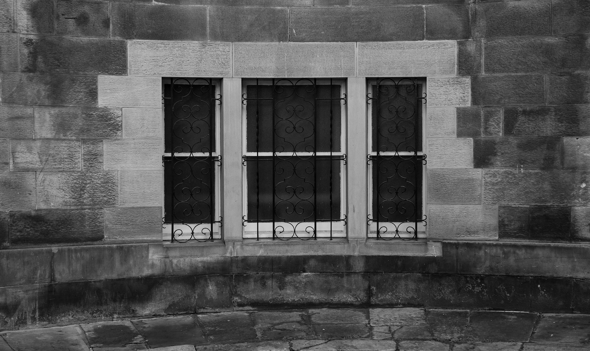

\[caption id="attachment\_3752" align="aligncenter" width="2000"\] Register Place, Edinburgh\[/caption\]

I had a interesting exchange on the way to work. I was taking this picture of a window - just interested in the symmetry and tone - and when I took my camera down a guy said “I wonder what you were finding interesting in that?” to which I spontaneously replied “I’m an artist”. He seemed very satisfied with the answer. I had a similar experience on Sunday when a woman asked if I was lost. I didn’t have my camera out but was looking for an angle. I should have said it then too. Maybe my subconscious has been working on it for the last few days.

So there you have it. If you say you are an artist people will accept you doing all sorts of weird stuff. Why didn’t I think of it before?
