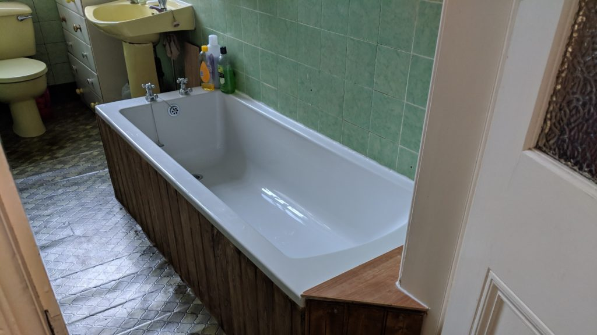

 Twelve years ago we moved into our flat in Edinburgh with our two daughters who were six and a four years old. We aren't fussy about decor but the fibreglass bath looked like it was about to crack and would have to be changed really soon. This week, just after one of those daughters has left to go to university, I finally took some time off work to fit a new bath. You can see from the picture it isn't fancy but with the wood panelling and all it took four days and lots of cursing.

[In the news this week](https://www.theguardian.com/environment/2018/oct/08/global-warming-must-not-exceed-15c-warns-landmark-un-report) was the latest announcement from the IPCC on how little time we have to act to avert climate breakdown. A hot bath a couple of times a week is my climate vice so as I filled my new bath for the first time I was feeling extra bad. Did this one seem a bit bigger than the old one? But then my rational mind kicked in and I decided to calculate just how bad for the planet this was and get my guilt in perspective.

Water coming from the rising main is 16℃. It is October and that number will be lower in the mid winter and higher in the summer but is probably about average. My piping hot bath is 42℃ and I measured it at 19cm deep giving a total volume of 136.5 litres or 136.5 kg or water. Specific heat capacity of water is 4,180 Joules per kg so it took 12,552,540 Joules to heat the water for the bath. We have a natural gas condensing boiler which is claimed 90% efficient so call it 14 Mega Joules or 0.014 Giga Joules used. From [the internet](https://www.engineeringtoolbox.com/co2-emission-fuels-d_1085.html) I learn that a GJ of methane releases 50kg of CO2 so filling a typical bath is around 0.7kg CO2.

Is that bad?

Well a litre or petrol releases 2.3 kg of CO2 so it is less than a third of a litre of petrol. The average new car in the UK burns 5.4l/100km so a bath = 5.6km or 3.5 miles. These are claimed figures so can be taken with a pinch of salt. I'd say about 3 miles which is the distance to work (but not back) - which I actually walk each day.

How about air travel? The carbon calculators all give crazy different estimates for CO2 emissions but Edinburgh to Paris economy return is about 300kg (well 235 to 412 depending who you believe) which is over 400 baths - say four years of pleasure. A transatlantic flight is measured in decades of baths. A weekend in New York would be the equivalent of 37 years at two baths a week. None of this takes into account that having a shower instead would also use energy. Would that 37 years stretch to my entire life if such things were counted?

There is a spectrum that starts at throwing yourself into a green burial pit tomorrow morning and runs all the way to living like Donald Trump. We have to live somewhere on this spectrum and make decisions about what we do day to day. The thing I find frustrating is the endless lists of little things that make virtually no difference whilst people skip the big things. We need to have actions costed a lot more clearly. A decent carbon tax would solve a lot of this.

Notes for the concerned:

- There is no shortage of water in this part of Scotland. It is largely gravity fed from the hills to the sea so although treatment will use energy it isn't an enormous component. When we have had dry weather I have taken buckets of water from the bath down to shrubs in the garden.
- We often share the water so the same water may be used two or occasionally three times. This isn't factored in to the calculations.
- We have an electric shower with curtains that are just out of shot in the picture above. This uses a lot less water and energy is on a green tariff so probably wind generated. But a bath is so nice!
- We heat by gas at the moment but could switch to electricity at some point in the future when the boiler dies and there are enough renewables to get pure carbon free power. We are on the cusp of natural gas no longer being the most sensible choice.
- You'll see we didn't change the whole bathroom suite because we like the bog and are tight and it is more environmentally friendly not to replace things that aren't broken. How many baths worth of CO2 would a matching bathroom suite have cost? That would be a difficult calculation!
- The old bath went to landfill - there is nothing you can do with a 1980s yellow fibreglass bath.

**Have I got my numbers wrong? Let me know in the comments below.**
