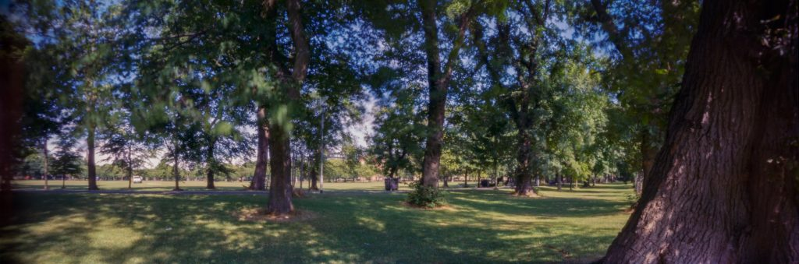
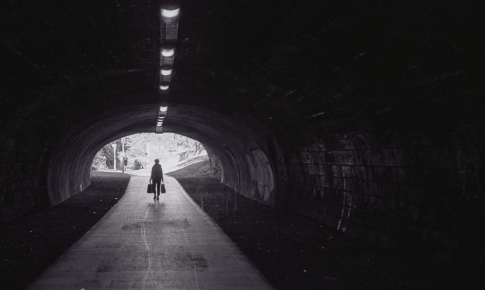
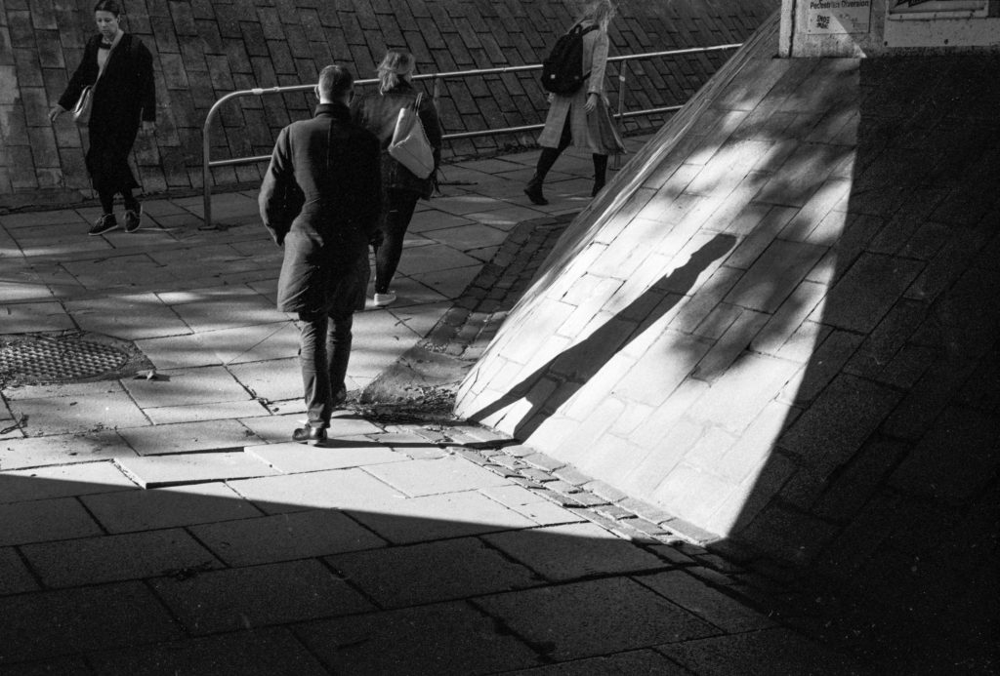

 Pinhole photo of nearby the Meadows shrine at the beginning of the month.

A quiet month again. Lost a few days to my sinuses playing up. Had to get the bus back or work at home. There is a general feeling of embeddedness. I feel the period of being really low has past. Perhaps 2018 will just be a year I remember for dipping my toe in more serious depression. I've found it useful to look at the images I make and flag some of them as Black Dog photos.

](http://www.hyam.net/blog/wp-content/uploads/2018/10/L001-035.jpg)[

 

