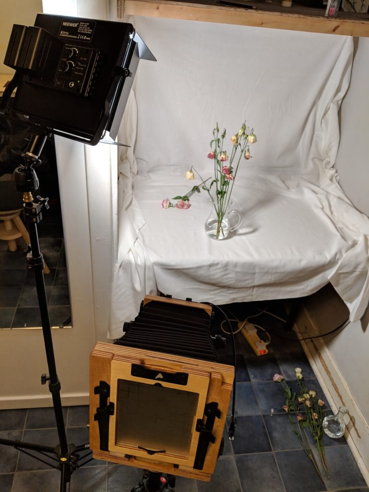
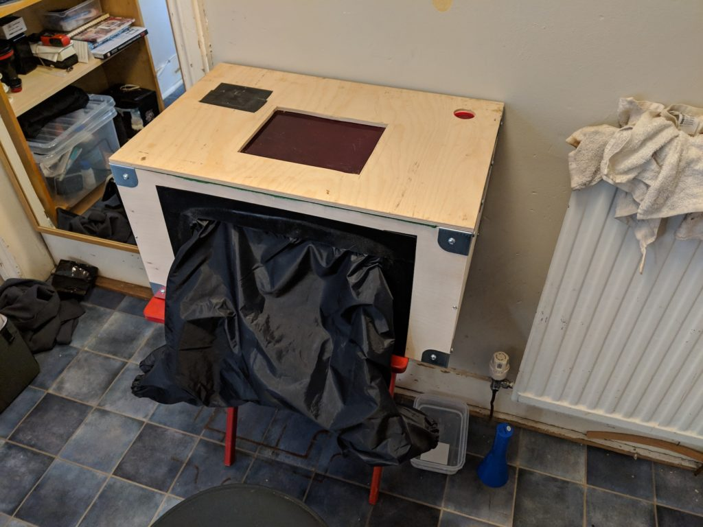
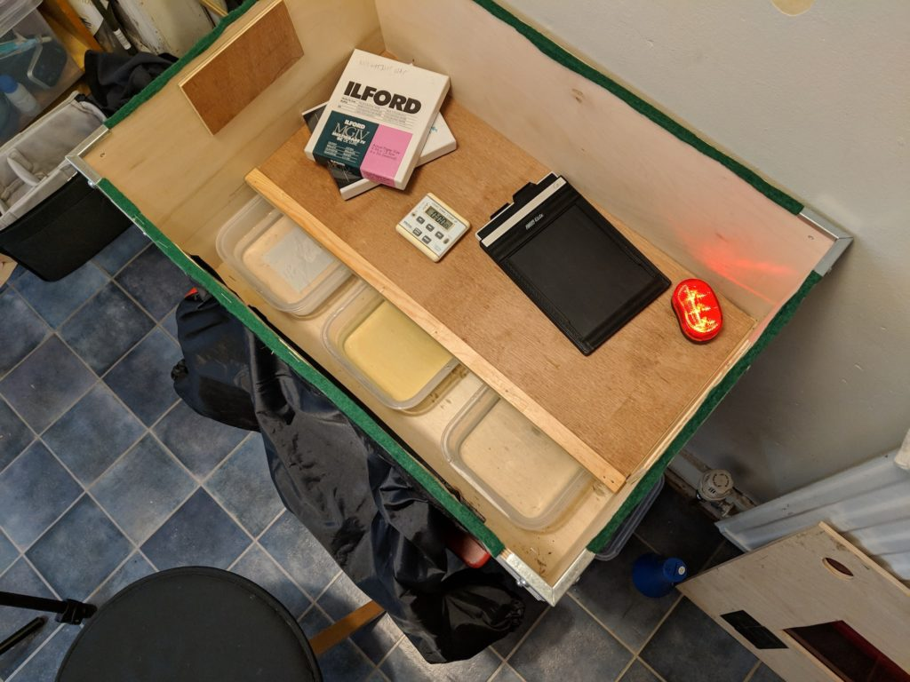

I really must stop posting things on Facebook without posting them here first. I've reverted back to my "nothing on Facebook or Twitter that isn't already somewhere else" policy.

Feeling a bit post viral a couple of weekend back I stayed indoors and had some fun with paper negatives and using my dark box for the first time. I built it months ago. I've discovered that developing Illford multigrade in Kodak Xtol 1:1 for 3 minutes gives really nice negs but ISO goes right down to nearly nothing so no good for portraits. Also it doesn't work for Harman direct positive. I guess that needs a developer with metol in it or something. I got the idea of using film developer from one of [Borut Peterlin's YouTube videos](https://www.topshitphotography.com/).

 Wilting flowers

 The set up using my new LED light source.

 The dark box - formerly an IKEA storage box.

 Inside the dark box there is a shelf of the dry area and a wet area below. Tray push underneath the shelf when not actually in use.
