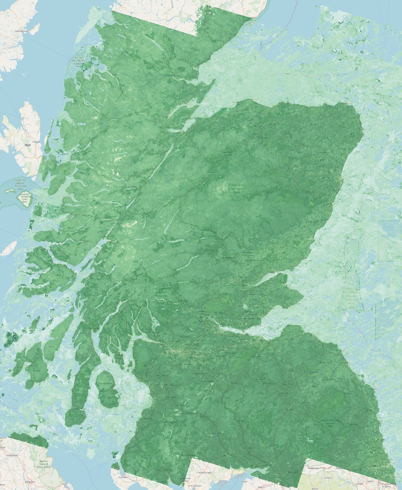
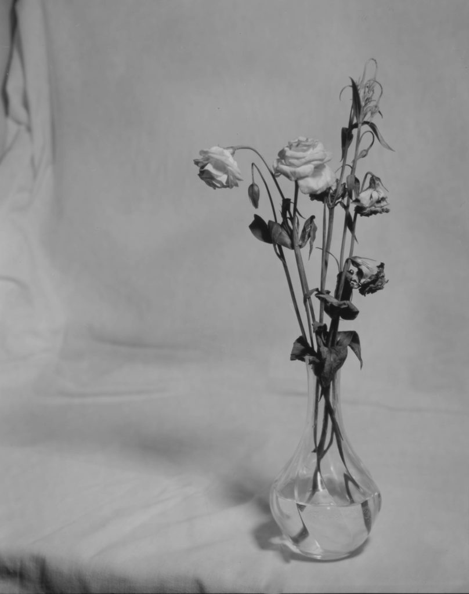
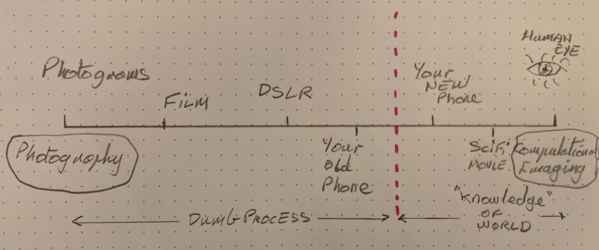

This is an image of Scotland that I created as part of my job. The green is [Normalised Difference Vegetation Index](https://en.wikipedia.org/wiki/Normalized_difference_vegetation_index) which is basically the difference between red and near infra-red light as seen by a satellite. This image is a composite of around one hundred and fifty satellite passes over three summers. The sensor on the satellite was a push-broom scanner like in a photocopier. The data is processed by USGS before people like me download it for our own analyses. The big question: Is this a photograph?

\[caption id="attachment\_3802" align="aligncenter" width="986"\] NDVI Composite satellite image over OpenStreetMap data of Scotland\[/caption\]

This is an image I created at the weekend using a large format camera, Illford printing paper as the negative then scanned into a computer. Is this a photograph?

\[caption id="attachment\_3803" align="aligncenter" width="808"\] Wilting flowers\[/caption\]

I've never really cared whether photography is art or not. The only reason anyone cares about that is if there is money it. But recently I've started to care about a difference between "real" photography and computational imaging. Check out this show reel of visual effects from [The Man in the High Castle](https://www.imdb.com/title/tt1740299/). I'm a big fan and of course knew that there were a lot of VFX but not that there was quite so much! Kudos to the actors for the green screen performances.

https://youtu.be/fPnrbD1zXIE

The way I see it is there is a spectrum that looks something like this.

On the far left of the spectrum we have raw photography. Things like photograms where there isn't even a lens involved and objects are laid directly on light sensitive paper. Then we have film photography which is followed by digital photography where the chemicals are replaced by semiconductors. But then there is a leap. Because digital sensors are capable of capturing data continuously and perceiving depth they start to sample a scene in a way that can make use of more than a simple one to one representation. Information from light can be combined with data from an accelerometer, a gyroscope, a clock and GPS.  The data is in a form that isn't necessarily understandable as a drawing but from which a drawing can be constructed based on other knowledge about other pictures that have been made of the world. In its simplest form this is using a classifier to detect faces and other objects but can and will go far beyond this.

The human eye is on the far right, computational end of the spectrum. There is so much computation between what it does and what we perceive that the resemblance to Fox Talbot's invention is minimal. For starters we have two eyes but see only one world, the eyes constantly move but the world we see is still, the retina is curved and has different sensitivities to different kinds of light in different places including none at all in our blind spots but we see a contiguous, correctly proportioned world. Signals from the eye are mixed with data from all our other senses and everything we have ever experienced in order to rendered a perceived image.

The spectrum therefore travels from a simple medium to an interpretive process. It moves from using a pencil to commissioning an artist.

It is a continuum but I think there is a red line and I think it comes when the system brings its own prior knowledge about the world to bear in creating the image. Your camera may do face recognition to focus at the correct point which, in my opinion, is to the left of the red line. But if your camera, knowing this is a face and that people in general like faces to look a certain way, smooths the skin and blurs the background to create an image that is more pleasing to you, then it has crossed the line and is doing computational imaging not photography. Sure technicians spent years perfecting colour film to give just the right skin tones but that was creating a generic material like sizing on a watercolour paper. Enhancing portraits is a specific thing that requires knowledge of the subject matter of this specific image. We are heading to a world where the systems are going to become very specific. You can already search your online images for pictures of, say, Christmas or lighthouses. At some point your camera will know not only that you are photographing a landscape but which landscape and what time of day it is and what your stylistic preferences are. In some ways this in great. In other ways it is creating a kind of memory bubble where the photographs we used to make with cameras no longer exist. All the artefacts of the process, the accidentals that only have meaning in the future, will no longer be captured.

I'm happy when my phone does clever stuff to create pleasing images of a family event for me but I think Real Photography is also important. It is a cultural activity distinct from other ways of making images and worthwhile doing for its own sake just like drawing and painting have always been. Perhaps we need a [CAMRA](http://www.camra.org.uk/home) for Real Photography.
