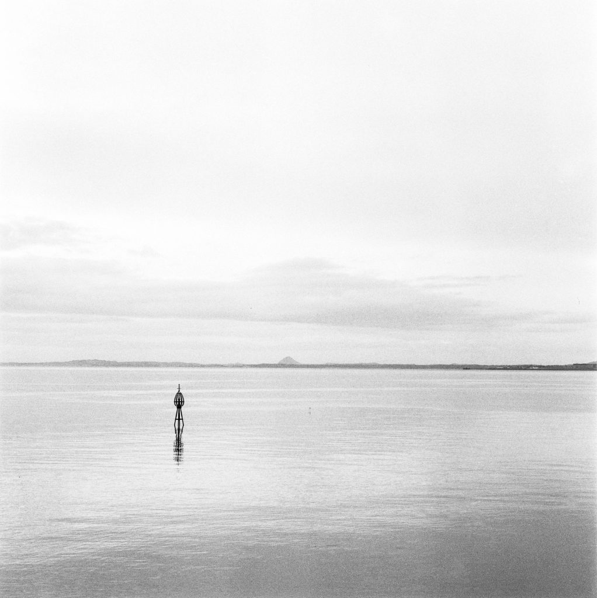

What has happened this month?

I've started to [Bullet Journal](https://bulletjournal.com/). Bought new camera bag and Hasselblads. Spending too much on camera gear but enjoying the sensations of owning in my 50s what I wanted in my 20s.

I'm calling my Sunday Anxieties FOMO now. That's what it comes down to. A list of things I could do or want to do that I can't do. It will always exist. I should breathe.

The walking continues, sometimes interrupted by circumstances. The first week of December is all workshops at the university so I am missing the walks.

\[catlist name="project-marathon-monk" orderby="date" order="ASC" numberposts=100  \]
