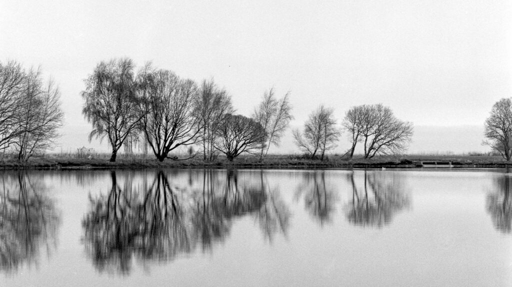

Musselburgh Lagoons

Another year over. Time of reflectance and long sleeps. Resolutions for New Year are "all of the above": diet, exercise, practice, etc, etc.

I passed the 1,500 mile mark almost at the solstice so that is sticking with the thousand miles a year average. There was a workshop at the university and I broke up early for Christmas so December was a short walking month. Back to normal on 7th January.

\[catlist name="project-marathon-monk" orderby="date" order="ASC" numberposts=100  \]
