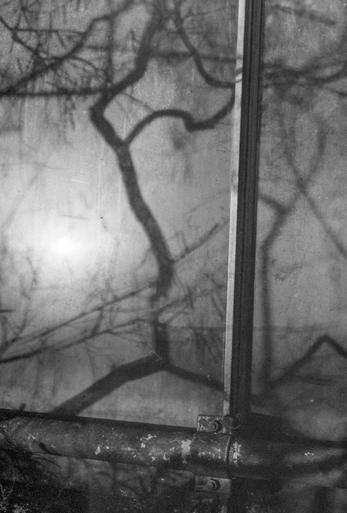

Winter sun on glass at the Botanics

I continuously wrestle with why the hell I want to make images. Sure a hell of a lot of it is a fascination with the process. I like the technology. Not the modern pixel peaking type so much as the physical side of traditional photography. But then I'm sitting at the breakfast table wondering what I'll photograph and having no inspiration having spent hours watching blokes (they are always blokes) doing landscape photography on YouTube and making what I can only think of as "product". Some of it is very beautiful. Some of it is cliché. Some cliché but very beautiful. Some just an awful technicolor yawn. And I feel I really don't want to bring more of this into the world and because I'm not authentically motivated in that direction I probably couldn't even do it if I tried.

Then I make a photo like the one above and it gives me a kick. So that is what I'm going to do.
