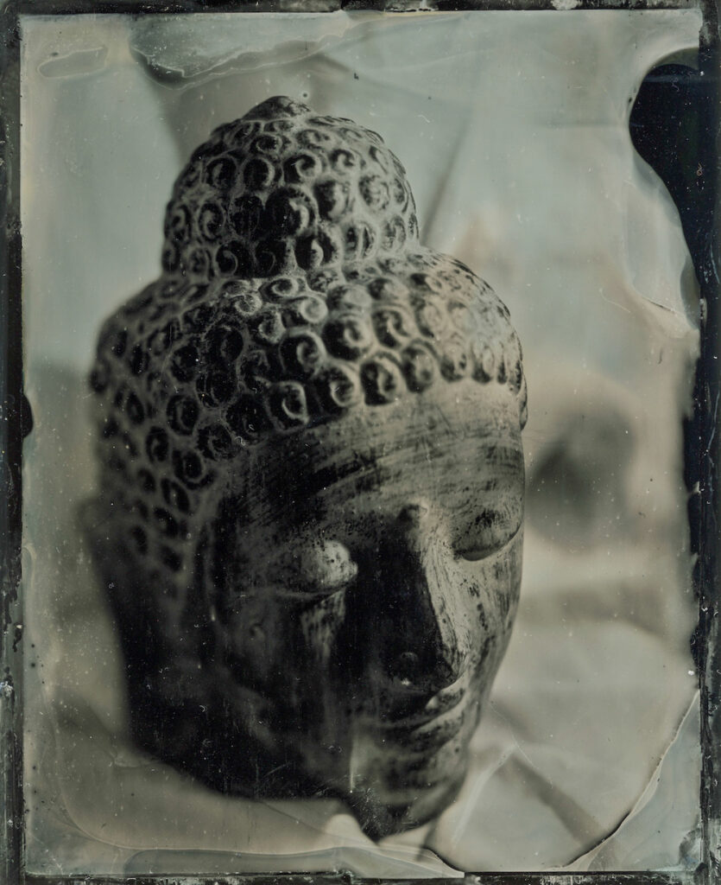

Oh great joy - I've spent ages researching this and at last I've made my first wet plate collodion image!

I tried to do a course last year which was unfortunately cancelled but as I was fantasy shopping for wet plate kit I came across someone selling "everything" on eBay. It included a silver tank, plates and some chemistry. I took a punt and when it arrived there was 100g of silver nitrate amongst the chemistry which made it a bargain. The seller had done a [John Brewer](https://johnbrewerphotography.com/) course here in the UK and bought a set of chemistry from him. But when?

So today having never poured a plate or even seen someone pour one in real life and using chemistry of dubious age I thought I'd have a go. I did a bit of a rehearsal with the silver bath activation plate and it had a feint image on it. Then I tried a couple of real ones but just got loads of scum. I read in the trouble shooting guide that it was over development so I cut the pre-mixed developer (a dark brown liquid containing?) 50:50 with tap water and bingo I get this image.

I made four more but I struggled to improve on it. Exposure times were very long, 6 to 10 minutes at f5.6 with a 1990's lens and with a 1960's lens. I used a 50w LED grow light very close to the subject. Slowness suggesting old collodion.

When I went to varnish the first of the plates the image just washed off. The trouble shooting guide again says "old collodion". So my first (and currently best) plates will have to remain unvarnished and may only survive digitally - oh the irony.

But it has been a fun day and inspired me to source some new collodion and make up some fresh developer.

Feeling inappropriately proud of a small piece of aluminium.

Thanks to [Quinn Jacobson](http://studioq.com/) for the book (I got it for Christmas) and all those people sharing knowledge on YouTube and John Brewer and all.
