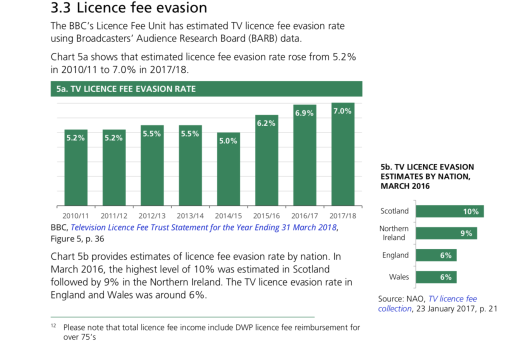
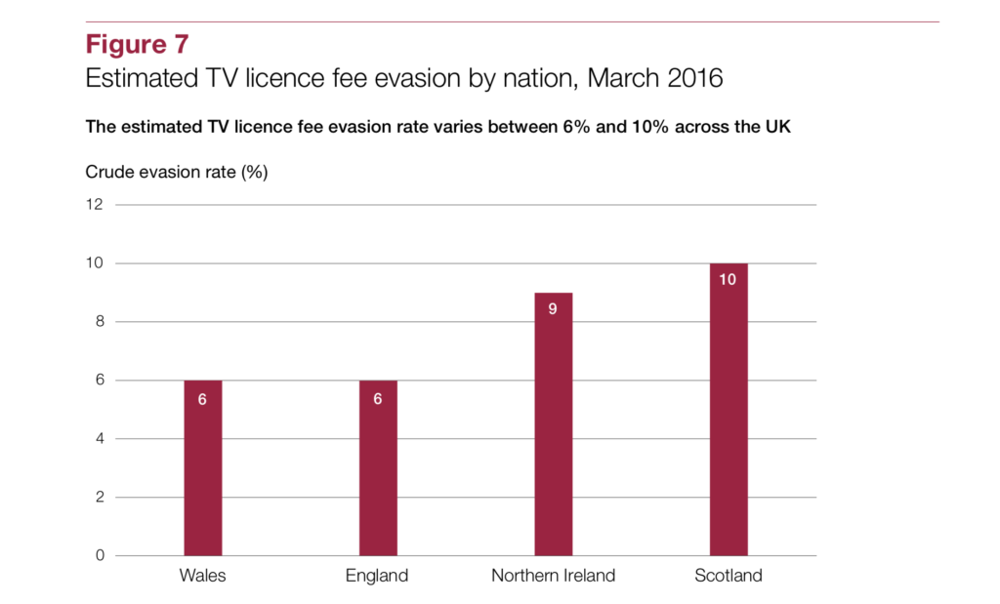
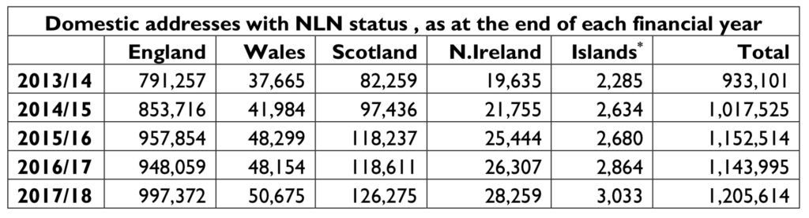
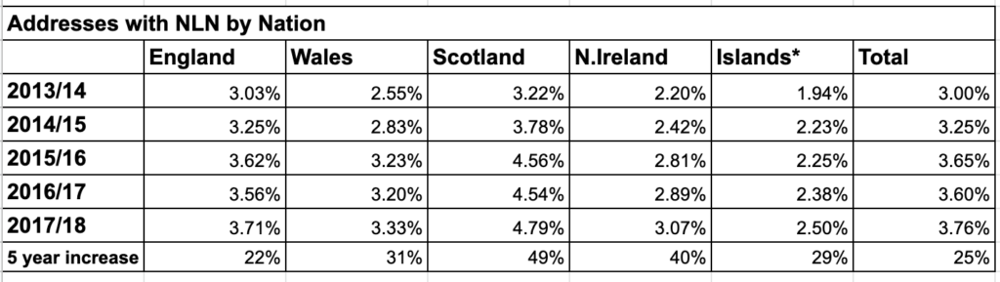
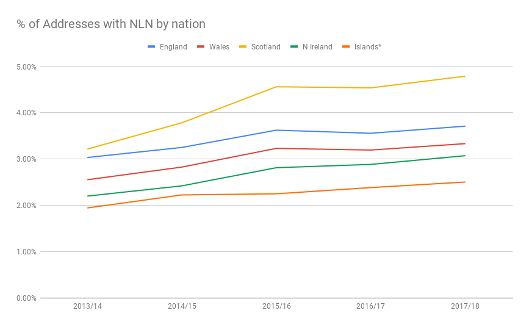

We don't have a TV licence. We have Amazon Prime and Netflix and YouTube and hundreds of DVDs so just don't watch BBC TV programming enough to justify £150 a year.

To be clear you need a TV licence to watch live broadcast programmes in the UK from any channel and you need it to use the BBC iPlayer app to watch BBC TV programmes after they were broadcast. You don't have to have a licence for any other purpose, like watching YouTube or Netflix on your TV shaped device.

The BBC outsource the administration of the licence to various companies, mainly Capita at the moment. These companies have a database of all the addresses in the UK and each address is basically tagged as Licence in Force (LIF), No Licence Needed (NLN) or unknown. Because we don't have a licence our address is NLN.

I know a few people with NLN status and wondered just how many addresses have NLN status. This is interesting because there are many people who boycott BBC programming for political reasons. I can't deny that has become a factor in why I don't have a licence. In an age of open data I thought that information on NLN numbers would be readily available. But it isn't.

There was a house of commons briefing on TV License statistics in January 2019:

[TV Licence Fee Statistics](CBP-8101-1.pdf)[Download](CBP-8101-1.pdf)

This does not mention NLN status at all but does make interesting claims about Scots being the worst evaders in the UK. Apparently Scotland has a 10% evasion rate compared to 6% for England and Wales and 9% for Northern Island.

Snapshot from "TV Licence Fee Statistics"

The source of that claim was by the National Audit Office (NAO) from 2017 (actually completed December 2016):

[BBC TV licence fee collection](BBC-TV-licence-fee-collection.pdf)[Download](BBC-TV-licence-fee-collection.pdf)

Snapshot from "BBC TV Licence fee collection"

The NAO report only mentions NLN in a side box to a diagram and doesn't give any numbers associated with us legal refuseniks. Also note that these are 2016 figures but there is an upward trend in the data from 2014/15 to 2017/18 so the differentiation between the nations may be much greater now.

So at this point my paranoia sets in about why they don't just report the raw statistics and I put a Freedom of Information (FoI) request to the BBC asking for NLN numbers broken down by nation by year. They duly reply within the 20 day time limit.

[RFI20190261 FOI Response](RFI20190261-FOI-Response.pdf)[Download](RFI20190261-FOI-Response.pdf)

I don't want to get into a detailed break down of what I asked for and what they could have given me but instead look at the information they did give me. I'm linking all the data and responses here so you can look into it yourself if you like.

Key results table from FoI

The raw data from the FoI is curious but doesn't account for variation in the size of the different nations. Strangely, although they provide the number of NLN for each nation they claim they couldn't provide the total number of addresses per nation or licences held per nation - the complements of the figures in this table. In order to correct for sizes I therefore used the population shares of the nations to calculate the rates of NLN by nation by year.

For 2017/18 there were 32,065,891 addresses in the licence database for the UK. Working on a population percentage share of 8.22% that means 2,635,816 of these are in Scotland. According to the FoI request 126,275 of these address had NLN status. That is 4.79% of Scottish addresses declared they didn't watch broadcast TV in 2017/18. A number like this out of context doesn't make much sense but in a table or chart it does.

Trends in requests not to have a TV Licence  

Even without access to the full database stats it is clear that:

- There is a trend in addresses declaring they don't need a licence that isn't reflected in the official government reports.
- The trend is much stronger in Scotland and Northern Ireland, the nations that voted Remain in the Brexit referendum and both with large secessionist movements.

The UK is remarkably homogeneous in many ways. The uptake of streaming services which is no doubt behind the general trend in NLN requests is likely to be the same across the nations. Yet if Scotland had the same NLN rate as England, 3.71% as opposed to 4.79%, there would be 97,808 NLN addresses in Scotland rather than 126,275 a difference of 28,467 which equates to £4,284,283 in licence revenue.

I would argue that Scots aren't more dishonest than the English and our legal system isn't less effective at enforcing licence fee collection. The most reasonable explanation is that political action by twenty eight thousand households in Scotland is costing the BBC over £4 million a year in revenue. This is peanuts on a UK scale but is about 12% of the budget for the new [The Nine](https://www.bbc.co.uk/news/uk-scotland-46371501) show so not insignificant in the Scottish perspective.

The really big question is why these figures aren't included in official reports. There has been almost a 50% increase in people rejecting the BBC in Scotland since the independence referendum. That number has been buried either through the English centric perspective of report writers or through malice. The only nod to a difference between the nations in official reports is the implication that the Scots and Irish are more dishonest than the English and Welsh.
