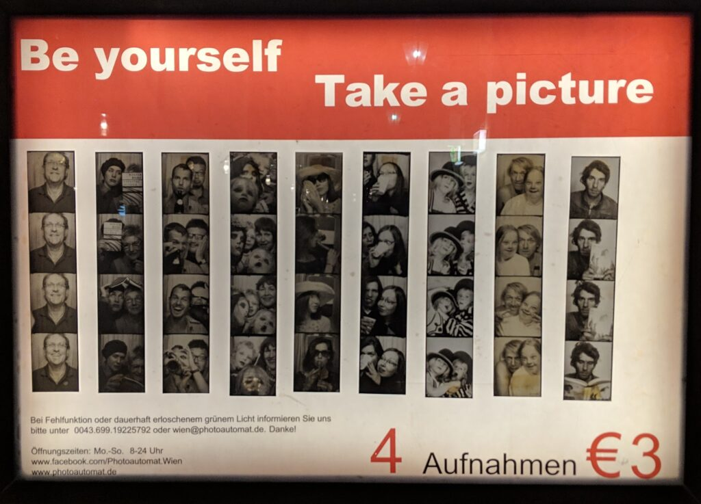

Three months to do one months worth of walking. What a start to the year!

January walking didn't start till 7th because of the way the New Year holiday fell. I walked normally for a week and a half but then came down with a horrible cold. I think it was the one that many at work had had before or at Christmas. I took a couple of days off then tried to go back to work (taking the bus) then had to take another day off so stuck to taking it as easy as possible till it cleared which was by 4th February.

Having had a somewhat interrupted week of walking I left for a work meeting in Vienna on 12th February. On my return I fell really ill with proper influenza. This was very different from my January malaise. I spent the best part of a week in bed or on the sofa. I then went back to work but was really weak and took the bus everywhere. It took till 11th March till I was feeling "normal" again. The last three weeks of March were great. I felt energised after so long under the weather but was taking each Friday off to use up remaining leave before 1st April.

Spiritually it has been an interesting time. Very difficult to practice when your head is so dull.

In doing my four foundations practice - working through body sensations, feelings (+ve, -ve, neutral), mood (smile) and thoughts (where are they?) - I have become fascinated with feelings. What is it I am wanting? What is it I am rejecting? How does this fit with my aspirations or intentions? I need to write this up more fully.

Looking forward to April. The clocks have changed and the sun is out.

\[catlist name="project-marathon-monk" orderby="date" order="ASC" numberposts=100  \]
