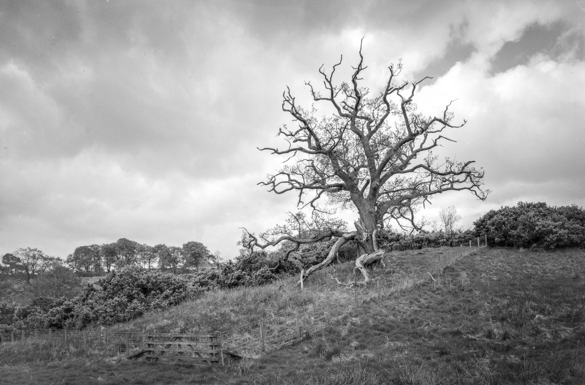
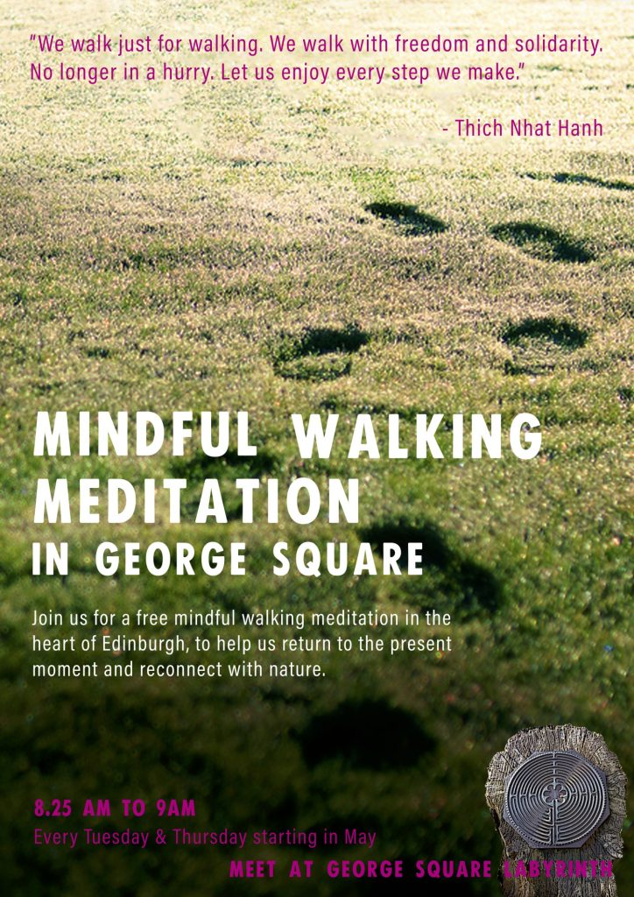

The tree

April was more like a 'normal' month. I've started to feel like I'm in the swing of it again and slowly sinking the well of my practice.

May is going to be a busy month. I'm running my regular workshops at the botanics as well as helping out on Tuesday and Thursday mornings in George Square. The 16th to the 23rd I'm off to Holy Isle for a retreat.

\[catlist name="project-marathon-monk" orderby="date" order="ASC" numberposts=100  \]

